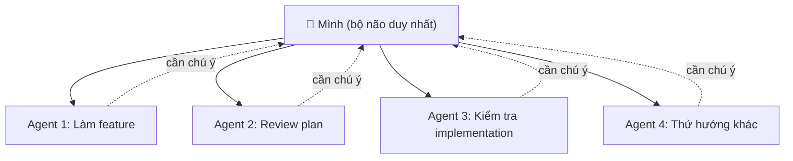
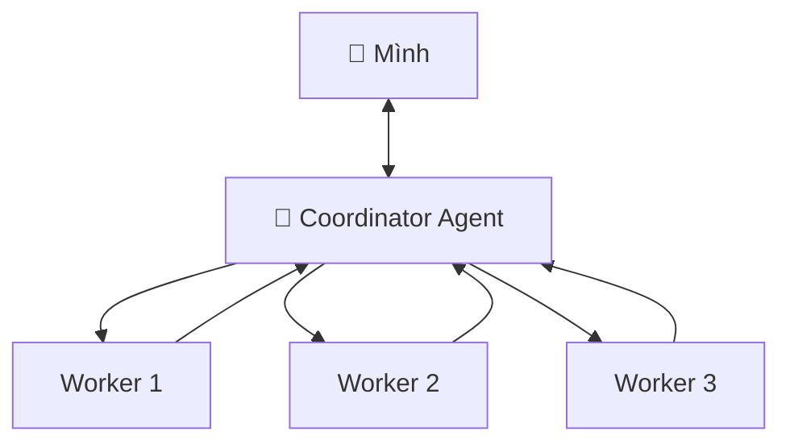
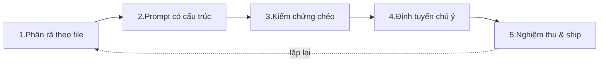

Hầu hết kỹ sư hiện nay vẫn đang học cách dùng **một** AI agent cho thật tốt. Nhưng mình tin kỹ năng đó sẽ sớm trở thành mặt bằng chung. Kỹ năng khó hơn — và sẽ tạo ra khoảng cách giữa các kỹ sư — là **điều phối nhiều agent cùng lúc mà không đánh mất quyền kiểm soát những gì chúng đang xây**.

Bài này mình ghi lại cách nghĩ và quy trình thực chiến mình đang dùng để làm việc với nhiều agent, áp dụng trực tiếp vào chính project portfolio Next.js này.

<!-- truncate -->

## 1. Luận điểm cốt lõi

Phần khó **không phải** là khởi động thêm nhiều agent. Phần khó là **theo kịp chúng**.

Khoảng cách năng suất tiếp theo giữa các kỹ sư sẽ **không** đến từ ai sinh code nhanh hơn nhờ AI. Nó đến từ ai có thể:

- Điều phối (orchestrate) nhiều agent cùng lúc,
- Giữ đủ ngữ cảnh (context) để ra quyết định tốt,
- Và vẫn **làm chủ chất lượng** của sản phẩm cuối được ship ra.

Một câu để ghi nhớ: **sinh ra code ≠ tạo ra phần mềm tốt**.

## 2. Vì sao mình chạy nhiều agent song song?

Mình thường chạy nhiều agent với nhiều vai trò khác nhau cùng một lúc:

- Một agent đang **làm feature**.
- Một agent **review một bản kế hoạch (plan)**.
- Một agent **kiểm tra phần triển khai (implementation)**.
- Đôi khi thêm một agent **thử một hướng tiếp cận khác**.

Mình cũng dùng nhiều công cụ khác nhau (Claude Code, Codex, Gemini CLI) **đồng thời**, vì mỗi công cụ có điểm mạnh và kiểu lỗi (failure mode) riêng. Chạy song song giúp tận dụng năng lực bổ trợ lẫn nhau và giảm chi phí chuyển ngữ cảnh so với làm tuần tự.

Ban đầu, điều này giống như **năng lực miễn phí**: công việc trước đây phải làm nối tiếp nhau, giờ có thể diễn ra cùng lúc.



## 3. Nút thắt thật sự: quản lý ngữ cảnh, không phải chất lượng code

Điều bất ngờ: nút thắt **không** nằm ở chất lượng code, mà ở chỗ **mọi agent cuối cùng đều cần sự chú ý của bạn**.

Khi điều này xảy ra **vài phút một lần**, nút thắt trở thành: bạn **khôi phục ngữ cảnh** nhanh đến đâu, **ra phán đoán tốt** nhanh đến đâu, rồi chuyển sang agent tiếp theo mà **không đánh mất quyền sở hữu**.

Mỗi agent tạo ra một **"open loop"** (vòng lặp mở) đòi hỏi sự chú ý, phán đoán và giám sát tích hợp của con người. "Tab switching" (chuyển qua lại giữa các cửa sổ) không còn là phiền toái nhỏ — nó trở thành chi phí chính.

Hai khái niệm quan trọng cần phân biệt:

| Khái niệm | Ý nghĩa |
|---|---|
| **Output (đầu ra)** | Lượng code được sinh ra |
| **Progress (tiến độ thật)** | Code tích hợp được, tuân theo pattern, giữ tính nhất quán của hệ thống |

Nhiều output **không** đồng nghĩa với tiến độ, nếu các đầu ra không ráp được vào nhau. **Tốc độ mà thiếu vòng phản hồi (feedback loop) đầy đủ chỉ tích luỹ sự bất định, chứ không tạo ra sự tự tin.**

## 4. Vai trò mới: kỹ sư như một người điều phối

Vai trò dịch chuyển từ **người viết code** sang **người quản lý công việc** — gần với kỹ năng của một tech lead:

- Phân rã & giao việc, đặt ranh giới rõ ràng (boundary-setting).
- Theo dõi tiến độ và chọn đúng thời điểm can thiệp.
- Thiết kế vòng kiểm chứng (verification loop).
- Ngăn xung đột giữa các agent chạy song song.

## 5. Hai mô hình điều phối mình đã thử

### Mô hình 1 — Điều phối phân cấp (Hierarchical)

Một **agent điều phối (coordinator)** đóng vai team lead: chia nhỏ công việc, giao việc cho các agent khác, và tổng hợp lại những gì cần con người chú ý.

- **Lợi:** giảm số lần con người bị ngắt quãng trực tiếp.
- **Rủi ro mới:** chất lượng quyết định của coordinator, và nguy cơ **bỏ sót chi tiết**.



### Mô hình 2 — Giao diện kiểu Mission Control

Một **console hợp nhất**: nơi bạn thấy tất cả agent đang chạy, biết agent nào **cần chú ý trước**, điều hướng giữa chúng và nói chuyện trực tiếp với từng agent — **mà không phải nhảy qua lại giữa các phiên terminal**.

Nó giải quyết bài toán **định tuyến sự chú ý (attention routing)**: agent nào nên được con người tập trung vào trước. (Riêng `tmux` thì mình thấy không đủ để quản lý nhiều agent ở mức này.)

## 6. Áp dụng thực tế vào chính project này

Để khỏi nói lý thuyết suông, đây là cách mình áp một phiên làm việc nhiều agent vào một feature có thật của project portfolio Next.js này: **trang Từ điển thuật ngữ (`/glossary`)**. Hiện tại nó gồm một page MUI ở `pages/glossary.tsx` đọc dữ liệu từ mảng `GLOSSARY` trong `constants/glossary.ts`, đã có sẵn ô tìm kiếm, highlight từ khoá và liên kết tới các thuật ngữ liên quan.

Mục tiêu một buổi: **"Mở rộng trang glossary — thêm bộ lọc theo nhóm (category), bổ sung thêm thuật ngữ, và đảm bảo dữ liệu nhất quán."**

### Bước 1 — Phân rã theo ranh giới file để tránh xung đột

Quy tắc số một khi chạy song song: mỗi agent **đụng vào các file khác nhau**. Mình tách mục tiêu thành các đơn vị độc lập:

| Agent | Vai trò | File/Phạm vi chạm tới | Đầu ra mong đợi |
|---|---|---|---|
| **Content** | Bổ sung thuật ngữ mới | `constants/glossary.ts` | Thêm 8–10 mục mới đúng schema `GlossaryTerm` |
| **UI Builder** | Thêm lọc theo `cat` | `pages/glossary.tsx` | Hàng chip lọc nhóm, lọc phía client |
| **Reviewer** | Soát tính nhất quán dữ liệu | `constants/glossary.ts` (chỉ đọc) | Danh sách lỗi: `related` trỏ sai, thiếu "💡 Dễ nhớ:" |
| **Explorer** | Thử "copy deep-link tới 1 term" | `pages/glossary.tsx` (nhánh riêng) | So sánh: anchor `#term` vs query param |

Lưu ý ranh giới: **Content** và **UI Builder** đụng hai file khác nhau nên chạy song song thoải mái. Nhưng **Explorer** cũng sửa `pages/glossary.tsx` giống UI Builder → mình cho Explorer chạy trên một **git worktree/nhánh riêng** để không giẫm chân nhau.

### Bước 2 — Prompt buộc agent trả về thứ kiểm chứng được

Thay vì "làm xong báo mình", mình yêu cầu đầu ra có cấu trúc cố định. Ví dụ prompt cho **UI Builder**:

```text
Nhiệm vụ: Thêm hàng chip lọc theo nhóm (cat) vào pages/glossary.tsx,
đặt cạnh ô tìm kiếm hiện có. Bấm chip thì lọc danh sách theo category đó.
Ràng buộc:
- CHỈ sửa pages/glossary.tsx. Không đụng constants/glossary.ts.
- Lấy danh sách nhóm từ kiểu GlossaryCategory / từ chính mảng GLOSSARY, đừng hard-code.
- Lọc phía client, kết hợp ĐƯỢC với ô search sẵn có (lọc theo cả cat và query).
- Dùng component MUI + theme/màu accent sẵn có, đừng thêm thư viện mới.
Khi xong, trả về đúng format:
1) Tóm tắt thay đổi (3 gạch đầu dòng)
2) File đã sửa
3) Cách mình tự test (lệnh + bước thao tác trên UI)
4) Mức độ chắc chắn (1-5) + điểm còn nghi ngờ
```

Phần "mức độ chắc chắn + điểm nghi ngờ" giúp mình khôi phục ngữ cảnh trong vài giây thay vì đọc lại toàn bộ diff.

### Bước 3 — Vòng kiểm chứng chéo (đừng tin output ngay)

Khi các agent báo xong, mình **không merge ngay**. Mình giao cho **Reviewer** soát dữ liệu mà **Content** vừa thêm, với prompt phản biện:

```text
Đây là mảng GLOSSARY trong constants/glossary.ts. Hãy cố gắng TÌM LỖI, mặc định nghi ngờ:
- Có mục nào trong "related" trỏ tới một term KHÔNG tồn tại trong GLOSSARY không?
- Có "cat" nào nằm ngoài kiểu GlossaryCategory không?
- Có "detail" nào THIẾU câu chốt "💡 Dễ nhớ:" không?
- Có term bị trùng không?
Trả về: bảng [term | loại lỗi | sửa thế nào].
```

Với việc quan trọng, mình cho **2 reviewer độc lập** rồi chỉ chấp nhận khi cả hai không tìm thêm lỗi mới. Đây chính là cách biến *tốc độ* thành *sự tự tin*.

### Bước 4 — Định tuyến sự chú ý

Mỗi lần quay lại bàn phím, mình hỏi: **"Agent nào đang chặn agent khác?"** và xử lý nó trước — chứ không xử lý theo agent nào "kêu" trước. Ví dụ: nếu **UI Builder** cần biết tên các nhóm cuối cùng mà **Content** có thể vừa thêm một `cat` mới, mình xử lý phần dữ liệu của Content trước để UI Builder không build trên thông tin cũ.

### Bước 5 — Tự nghiệm thu trước khi ship

Trước khi gộp, mình luôn chạy vòng kiểm tra cuối ngay trên project:

```bash
npm run lint
npm run build
npm run dev   # mở /glossary: gõ tìm kiếm, bấm chip lọc nhóm, click 1 "related" để nhảy term
```

Và tự hỏi 3 câu giữ quyền sở hữu: *Code này có tích hợp được không? Có theo pattern của hệ thống không? Có giữ tính nhất quán không?*



## 7. Những điều mình rút ra

- **Khởi động agent thì dễ, theo kịp chúng mới khó.** Hãy tối ưu cho việc khôi phục ngữ cảnh nhanh.
- **Output không phải progress.** Đo bằng code ráp được vào hệ thống, không phải số dòng sinh ra.
- **Mình vẫn là người chịu trách nhiệm cuối cùng.** AI nhân bản năng lực, nhưng phán đoán và quyền sở hữu vẫn là của con người.
- **Thiết kế vòng phản hồi quan trọng hơn prompt giỏi.** Tốc độ thiếu kiểm chứng chỉ tích luỹ bất định.
- **Tách việc theo ranh giới file** là mẹo thực tế quan trọng nhất để chạy nhiều agent song song mà không hỗn loạn.

Một câu để khép lại:

> **More agents. Same human brain.** — Nhiều agent hơn, nhưng vẫn chỉ một bộ não người. Người thắng cuộc là người điều phối được nhiều agent, giữ đủ ngữ cảnh để ra quyết định tốt, và vẫn làm chủ chất lượng sản phẩm.

---

## Phụ lục — Cheat-sheet thực hành (Claude Code)

Tóm tắt các kỹ thuật & lệnh mình đã chạy thật trong một phiên multi-agent trên project này, để lần sau làm lại nhanh.

### 1. Fan-out nhiều subagent đọc song song (trong 1 phiên)

Chỉ cần gõ thẳng vào ô chat:

```text
Chạy song song 3 subagent read-only: (1) ..., (2) ..., (3) ...
Mỗi agent trả về 5 gạch đầu dòng.
```

→ Mỗi agent có context riêng, chạy cùng lúc, chỉ trả tóm tắt về. Dùng để khảo sát nhanh nhiều hướng mà không làm rối context chính.

### 2. Custom subagent (vai cố định, tái dùng)

Tạo file `.claude/agents/<ten>.md`:

```markdown
---
name: glossary-reviewer
description: Soát tính nhất quán dữ liệu ... (khi nào dùng)
tools: Read, Grep, Glob          # giới hạn quyền → an toàn, read-only
model: sonnet                    # hoặc haiku/opus
---

<system prompt: nhiệm vụ, quy trình, định dạng output bắt buộc>
```

> ⚠️ Agent mới **chỉ nạp khi khởi động phiên**. Tạo file xong phải mở lại Claude Code mới gọi được bằng tên (`dùng subagent glossary-reviewer`).

### 3. Cô lập bằng git worktree (cho nhiều agent CÓ sửa file)

```bash
git worktree add ../pinit-explorer -b feat/glossary-deeplink   # tạo cây + nhánh riêng
cd ../pinit-explorer && claude                                  # mở phiên Claude thứ 2
git worktree list                                               # xem các worktree

# sau khi xong:
git worktree remove ../pinit-explorer
git branch -d feat/glossary-deeplink
```

> ⚠️ Worktree **không có `node_modules`** (bị gitignore). Phải `yarn install` lại trong worktree, hoặc khai báo `.worktreeinclude` để tự copy.

### 4. Prompt có cấu trúc (buộc output kiểm chứng được)

```text
Nhiệm vụ: <mô tả>
Ràng buộc:
- CHỈ sửa <file>. Không đụng file khác.
- Tuân theo pattern/thư viện sẵn có; không thêm dependency mới.
- An toàn với input không hợp lệ (không crash).
Khi xong, trả về ĐÚNG format:
1) Quyết định + lý do (nếu có lựa chọn)
2) Tóm tắt thay đổi (≤4 gạch đầu dòng)
3) File đã sửa
4) Cách tôi tự test (lệnh + thao tác cụ thể)
5) Mức độ chắc chắn (1-5) + điểm còn nghi ngờ
```

### 5. Vòng kiểm chứng (đừng tin output ngay)

- Cho **reviewer agent** soi output của agent khác, prompt theo hướng **phản biện** ("hãy TÌM LỖI, mặc định nghi ngờ").
- Với việc quan trọng: **2 reviewer độc lập**, chỉ chấp nhận khi cả hai im lặng.
- Tự **xác minh độc lập** bằng tay (`grep`, đọc đúng dòng) trước khi sửa.
- Skill có sẵn: `/code-review` (soi bug code), `verify` (lái trình duyệt/app thật để chứng minh hành vi).

### 6. Nghiệm thu & gộp (giữ quyền sở hữu)

```bash
npm run lint && npm run build        # trong worktree trước khi commit
git add -A && git commit -m "..."    # commit trên nhánh worktree
# rồi ở cây chính:
git merge feat/glossary-deeplink
```

### 7. Mission Control & nâng cao

| Lệnh | Tác dụng |
|---|---|
| `claude agents` | Xem/điều phối nhiều phiên nền từ 1 màn hình (gần "Mission Control" nhất) |
| `claude -p "..." --allowedTools "..."` | Chạy headless để script hoá agent |
| `ultracode: <task>` | Workflow điều phối nhiều agent (cần Claude Code ≥ 2.1.154) |
| `/loop 5m <prompt>` | Lặp một prompt theo chu kỳ |
| Đa công cụ (Claude + Codex + Gemini) | Cần cài thêm `codex`, `gemini` CLI |

### Nguyên tắc vàng

1. **Tách việc theo ranh giới file** → tránh agent giẫm chân nhau.
2. **Prompt buộc output có cấu trúc** → khôi phục ngữ cảnh trong vài giây.
3. **Luôn kiểm chứng trước khi tin** → biến tốc độ thành sự tự tin.
4. **Bạn sở hữu chất lượng cuối** → agent nhân năng lực, không thay phán đoán.
