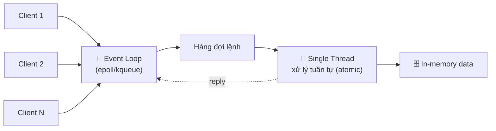
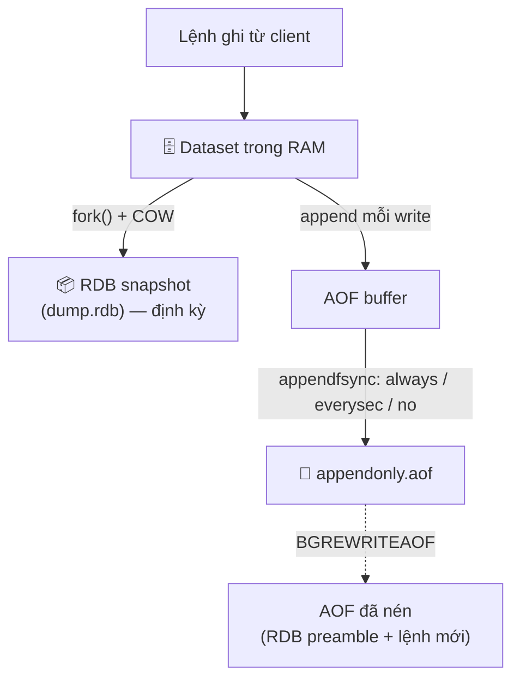
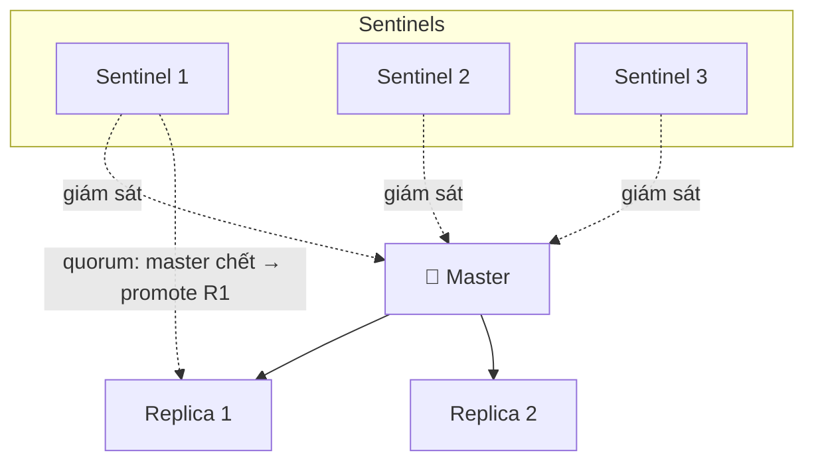
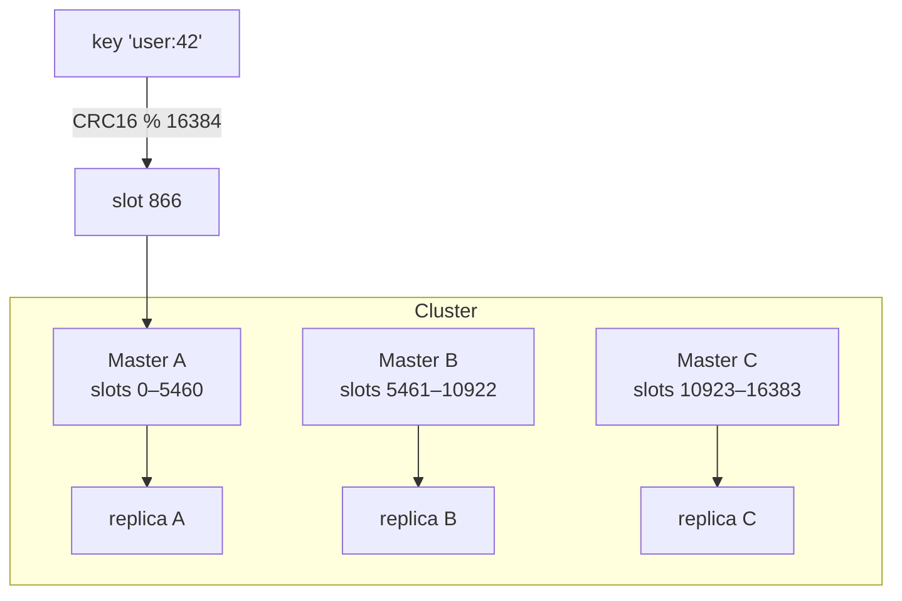
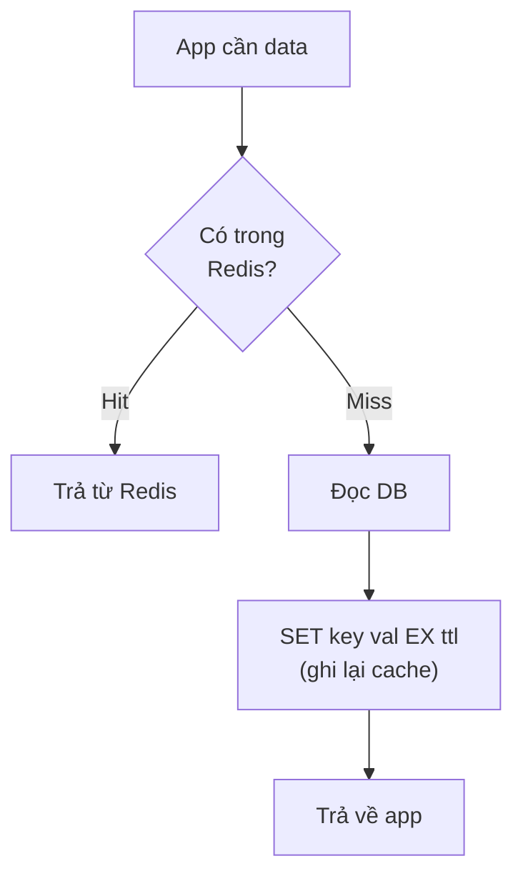
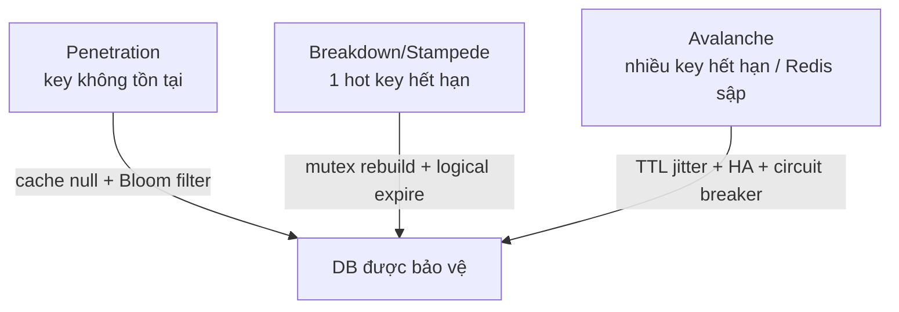

Phần lớn người dùng Redis chỉ chạm tới `GET`/`SET` và coi nó như "một cái cache cho nhanh". Nhưng Redis là một **data structure server** chạy in-memory với một mô hình thực thi rất đặc biệt, và hiểu sâu mô hình đó là khác biệt giữa việc dùng Redis "đỡ tải DB" và việc làm sập cả cụm vì một con **hot key** hay một đợt **cache stampede**.

Bài này mình ghi lại những gì cần biết để dùng Redis ở mức production: kiến trúc single-thread, các kiểu dữ liệu và khi nào dùng, persistence, replication/cluster, eviction, lock phân tán và các cú sập kinh điển.

<!-- truncate -->

## 1. Redis là gì & mô hình single-thread

Redis (REmote DIctionary Server) là một **in-memory data structure store**. Toàn bộ dữ liệu nằm trong RAM, nên độ trễ tính bằng **micro giây** chứ không phải mili giây như DB trên đĩa. Nó không chỉ lưu key-value dạng string mà còn hiểu được nhiều **cấu trúc dữ liệu** (hash, list, set, sorted set, stream...) và thao tác trực tiếp trên chúng phía server.

### Vì sao single-thread mà vẫn nhanh?

Đây là điểm gây hiểu lầm nhất. Phần xử lý **lệnh** của Redis chạy trên **một thread duy nhất** (single-threaded command execution). Lý do nó vẫn cực nhanh:

- **Không có lock, không context switch, không race condition** giữa các lệnh. Mọi lệnh được xử lý **tuần tự**, nên mỗi lệnh là **atomic** một cách tự nhiên — đây cũng là nền tảng cho `INCR`, `SETNX`, Lua script chạy nguyên tử.
- **Tất cả trong RAM** → CPU hiếm khi là bottleneck; nút thắt thường là **network I/O** và **memory bandwidth**.
- **I/O multiplexing** qua event loop (`epoll` trên Linux, `kqueue` trên BSD/macOS). Một thread theo dõi hàng nghìn socket, chỉ xử lý socket nào sẵn sàng.



> Lưu ý: "single-thread" chỉ đúng cho **phần thực thi lệnh**. Từ Redis 6 có **threaded I/O** (đọc/ghi socket, parse) chạy đa luồng; và các tác vụ nền như `BGSAVE`, `BGREWRITEAOF`, giải phóng bộ nhớ lớn (`lazyfree`/`UNLINK`) chạy ở thread/process riêng. Nhưng **logic ghi/đọc dữ liệu vẫn là một thread**.

### Khi nào single-thread là điểm yếu?

Vì mọi lệnh xếp hàng trên một thread, **một lệnh chậm sẽ chặn tất cả lệnh khác**:

- Các lệnh `O(N)` trên collection lớn: `KEYS *`, `SMEMBERS`, `HGETALL`, `LRANGE 0 -1`, `ZRANGE` trên tập khổng lồ, `DEL` một **big key**... có thể block server hàng chục/trăm ms → mọi client khác bị treo.
- Lua script chạy lâu cũng block toàn bộ.
- Cách tránh: dùng `SCAN`/`HSCAN`/`SSCAN` thay cho `KEYS`/`HGETALL`; dùng `UNLINK` thay `DEL` cho key lớn; chia nhỏ big key; tận dụng nhiều core bằng cách chạy nhiều instance / Cluster.

## 2. Các kiểu dữ liệu cốt lõi (và khi nào dùng)

Sức mạnh thật của Redis nằm ở việc chọn đúng cấu trúc dữ liệu cho bài toán.

| Kiểu | Bản chất | Khi nào dùng | Lệnh tiêu biểu |
|---|---|---|---|
| **String** | Mảng byte (tối đa 512MB), có thể là số | Cache object (JSON), counter, flag, bitmap | `SET` `GET` `INCR` `SETEX` `SETNX` |
| **Hash** | Map field→value trong 1 key | Lưu object có nhiều field, update từng field | `HSET` `HGET` `HGETALL` `HINCRBY` |
| **List** | Linked list 2 đầu | Queue/stack, hàng đợi đơn giản, timeline gần nhất | `LPUSH` `RPUSH` `LPOP` `BRPOP` `LRANGE` |
| **Set** | Tập không trùng, không thứ tự | Tag, lọc trùng, quan hệ (bạn chung), unique visitor | `SADD` `SISMEMBER` `SINTER` `SUNION` |
| **Sorted Set (ZSet)** | Set có **score** để sắp xếp | **Leaderboard**, hàng đợi ưu tiên, rate limit theo time window, range theo điểm | `ZADD` `ZRANGE` `ZREVRANGE` `ZRANGEBYSCORE` `ZRANK` |
| **Stream** | Append-only log có ID, consumer group | Message queue bền vững, event sourcing, log có replay | `XADD` `XREAD` `XREADGROUP` `XACK` |

Một số kiểu nâng cao đáng nhớ: **Bitmap** (trên String — đếm DAU/MAU cực gọn), **HyperLogLog** (`PFADD`/`PFCOUNT` — đếm distinct gần đúng với ~12KB), **Geospatial** (`GEOADD`/`GEOSEARCH` — toạ độ, tìm gần).

Ví dụ thao tác:

```bash
# String: cache JSON kèm TTL 300s
SET user:42 '{"name":"Pin","tier":"pro"}' EX 300
INCR page:home:views            # counter atomic

# Hash: object nhiều field, update từng field không ghi đè cả object
HSET order:1001 status paid total 250000
HINCRBY order:1001 retry 1

# Sorted Set: leaderboard
ZADD game:lb 1500 alice 1320 bob 1780 carol
ZREVRANGE game:lb 0 2 WITHSCORES   # top 3
ZREVRANK game:lb bob               # hạng của bob (0-based)
```

## 3. Persistence: RDB vs AOF

Redis in-memory nhưng vẫn có thể **bền dữ liệu** xuống đĩa bằng hai cơ chế, có thể bật riêng hoặc cả hai.

### RDB (Redis Database snapshot)

Chụp **toàn bộ dataset** thành một file nhị phân nén (`dump.rdb`) tại một thời điểm. `BGSAVE` dùng `fork()` để tạo process con; nhờ **copy-on-write** của OS, process con ghi snapshot trong khi process chính vẫn phục vụ.

- **Ưu:** file gọn, khôi phục nhanh, ít ảnh hưởng hiệu năng lúc chạy bình thường, hợp cho backup/disaster recovery.
- **Nhược:** **mất dữ liệu giữa hai lần snapshot** (vd cấu hình `save 900 1` → có thể mất tới ~15 phút data nếu crash ngay trước snapshot). `fork()` trên dataset lớn tốn RAM (copy-on-write) và có thể gây latency spike.

### AOF (Append Only File)

Ghi **mọi lệnh ghi** (write command) vào một log append-only. Khi khởi động lại, Redis replay log để dựng lại trạng thái.

- **Durability** điều khiển bằng `appendfsync`:

| `appendfsync` | Hành vi | Đánh đổi |
|---|---|---|
| `always` | fsync mỗi lệnh ghi | An toàn nhất, **chậm nhất** |
| `everysec` | fsync mỗi giây (mặc định) | Cân bằng — mất tối đa ~1s data khi crash |
| `no` | để OS tự fsync | Nhanh nhất, **rủi ro mất nhiều data nhất** |

- AOF phình to theo thời gian → Redis chạy **AOF rewrite** (`BGREWRITEAOF`) để nén log về trạng thái tối thiểu.
- **Hybrid (khuyến nghị, từ Redis 4+):** `aof-use-rdb-preamble yes` — file AOF mở đầu bằng một snapshot RDB rồi nối tiếp các lệnh sau đó → khôi phục nhanh như RDB + an toàn như AOF.



> Quy tắc thực dụng: cần khôi phục nhanh + ít quan tâm vài phút data → **RDB**. Cần durability cao → **AOF everysec**. Production nghiêm túc → **bật cả hai** (hybrid). Và luôn nhớ: Redis **không đảm bảo zero data loss** trừ khi `always` (mà cái giá là throughput).

## 4. Replication & Sentinel (High Availability)

### Replication

Redis dùng **replication bất đồng bộ** (asynchronous): một **master** (primary) nhận write, đẩy luồng thay đổi xuống một hoặc nhiều **replica** (read-only). Replica dùng để **scale read** và làm dự phòng.

- Vì async, **có độ trễ replication** → đọc trên replica có thể đọc dữ liệu cũ (eventual consistency). Master không chờ replica ack mặc định.
- `WAIT numreplicas timeout` cho phép chờ N replica ack để tăng độ bền, nhưng **không phải** đảm bảo strong consistency tuyệt đối.

### Sentinel

Replication tự nó **không tự động failover**: nếu master chết, phải có ai đó "thăng cấp" một replica lên làm master. **Redis Sentinel** làm việc đó:

- Giám sát master/replica, phát hiện master "chết" (cần đủ số Sentinel đồng thuận — quorum, để tránh false positive).
- **Tự động failover:** chọn một replica, promote thành master, cấu hình lại các replica còn lại trỏ về master mới.
- **Service discovery:** client hỏi Sentinel "master hiện tại là ai?" thay vì hard-code IP.



> Để failover **an toàn**, nên chạy **ít nhất 3 Sentinel** trên các host/AZ khác nhau (quorum lẻ tránh split-brain).

## 5. Redis Cluster & hash slot

Sentinel cho HA nhưng **không sharding** — toàn bộ dataset vẫn nằm trên một master. Khi dữ liệu vượt RAM một node, hoặc write vượt năng lực một node, ta cần **Redis Cluster**.

Cluster chia không gian key thành **16384 hash slot** cố định. Mỗi key được map vào slot bằng:

```
slot = CRC16(key) mod 16384
```

Mỗi master trong cluster "sở hữu" một dải slot (vd node A giữ 0–5460, B giữ 5461–10922, C giữ 10923–16383). Client tính slot của key để biết gửi lệnh tới node nào; nếu gửi nhầm, node trả `MOVED`/`ASK` để redirect.



Điểm cần nhớ khi dùng Cluster:

- **Multi-key op** (như `MGET`, `SINTER`, transaction) chỉ chạy được khi **tất cả key thuộc cùng slot**. Dùng **hash tag** `{...}` để ép cùng slot: `user:{42}:profile` và `user:{42}:cart` cùng hash phần `42` → cùng slot.
- **Resharding** = di chuyển slot giữa các node (có thể làm online). Thêm/bớt node → chỉ chuyển một phần slot, không phải rehash toàn bộ (đây là lợi điểm của slot cố định so với consistent hashing thuần).
- Mỗi master nên có replica để Cluster tự failover (cần quorum master).

## 6. Eviction policies

Khi `maxmemory` đầy, Redis xử lý theo `maxmemory-policy`. Chọn sai policy = mất dữ liệu im lặng hoặc lỗi ghi bất ngờ.

| Policy | Hành vi | Khi nào dùng |
|---|---|---|
| `noeviction` | Từ chối write (trả lỗi), giữ nguyên data | Khi Redis là **DB/nguồn sự thật**, không được mất key |
| `allkeys-lru` | Xoá key ít dùng gần đây nhất (mọi key) | **Cache thuần** — phổ biến nhất |
| `allkeys-lfu` | Xoá key ít được dùng (tần suất) | Cache có pattern truy cập lệch (một số key nóng lâu dài) |
| `volatile-lru` | LRU nhưng **chỉ trên key có TTL** | Vừa cache vừa lưu data bền trong cùng instance |
| `volatile-lfu` | LFU chỉ trên key có TTL | Như trên, theo tần suất |
| `volatile-ttl` | Xoá key có TTL **gần hết hạn nhất** trước | Muốn ưu tiên giữ key còn sống lâu |
| `allkeys-random` / `volatile-random` | Xoá ngẫu nhiên | Hiếm dùng; khi không có pattern rõ |

> Lưu ý: LRU/LFU của Redis là **xấp xỉ** (lấy mẫu ngẫu nhiên `maxmemory-samples` key rồi chọn nạn nhân), không quét toàn bộ — để giữ tốc độ. Với `volatile-*`, nếu **không key nào có TTL**, hành vi sẽ giống `noeviction` (write bị từ chối) → dễ gây sự cố nếu không lường trước.

## 7. Pub/Sub và Streams — khác nhau thế nào?

Cả hai đều "gửi message", nhưng triết lý ngược nhau:

| | **Pub/Sub** | **Stream** |
|---|---|---|
| Lưu trữ | **Không** lưu (fire-and-forget) | **Lưu** message (append-only log) |
| Subscriber offline | Mất hết message lúc offline | Đọc lại được khi online (có ID) |
| Mô hình | Broadcast tới mọi subscriber | Queue + **consumer group** (chia tải, mỗi msg 1 consumer) |
| Ack/redelivery | Không | Có (`XACK`, pending list, `XCLAIM`) |
| Use case | Thông báo realtime tức thời (chat presence, invalidation signal) | Hàng đợi job bền vững, event sourcing |

```bash
# Pub/Sub: ai đang nghe thì nhận, không nghe thì mất
SUBSCRIBE news
PUBLISH news "hello"

# Stream: ghi bền + consumer group chia tải, có ack
XADD orders '*' id 1001 status new
XGROUP CREATE orders workers '$' MKSTREAM
XREADGROUP GROUP workers w1 COUNT 10 STREAMS orders '>'
XACK orders workers 1700000000000-0
```

> Cần "không mất message / xử lý lại được khi consumer chết" → **Stream**. Chỉ cần đẩy tín hiệu realtime và chấp nhận mất nếu không ai nghe → **Pub/Sub**.

## 8. Pipelining & Transaction

### Pipelining

Gửi **nhiều lệnh trong một lần** mà không chờ reply từng lệnh → cắt giảm số **round-trip** mạng (RTT). Đây thường là cải thiện hiệu năng lớn nhất khi latency mạng cao. Pipelining **không** đảm bảo tính nguyên tử — chỉ gộp truyền.

### Transaction (MULTI/EXEC/WATCH)

Redis transaction gom nhiều lệnh chạy **tuần tự, không bị xen** bởi client khác:

```bash
MULTI            # bắt đầu queue lệnh
INCR balance
DECR stock
EXEC             # thực thi toàn bộ nguyên khối
```

Khác biệt quan trọng với RDBMS: **không có rollback** kiểu SQL. Nếu một lệnh lỗi *runtime* (vd sai kiểu dữ liệu), các lệnh khác trong khối **vẫn chạy**. Redis chỉ huỷ cả khối nếu lệnh **sai cú pháp lúc queue**.

`WATCH` cho **optimistic lock** (CAS — check-and-set): theo dõi key, nếu key bị thay đổi bởi ai khác trước `EXEC` thì `EXEC` trả `nil` (transaction huỷ), client retry.

```bash
WATCH stock                 # theo dõi
val = GET stock             # đọc giá trị hiện tại
# ...tính toán phía client...
MULTI
DECR stock
EXEC                        # nil nếu 'stock' đã bị đổi từ lúc WATCH → retry
```

## 9. Use case thực tế

### Cache-aside (lazy loading)

Pattern cache phổ biến nhất: ứng dụng đọc cache trước, miss thì đọc DB rồi ghi cache (kèm TTL).



> Khi update DB: **xoá** cache (`DEL`) thay vì ghi đè, để tránh race ghi giá trị cũ đè giá trị mới. Luôn đặt **TTL** để tự lành dữ liệu lệch.

### Rate limiting

Cách đơn giản — **fixed window** bằng `INCR` + `EXPIRE`:

```bash
# cho key theo user + cửa sổ thời gian
INCR rl:user42:1700000   # tăng đếm
EXPIRE rl:user42:1700000 60   # set TTL lần đầu
# nếu kết quả > limit → chặn
```

Chính xác hơn dùng **sliding window** với ZSet (lưu timestamp request làm score, `ZREMRANGEBYSCORE` dọn ngoài cửa sổ, `ZCARD` đếm), hoặc thuật toán token bucket bằng Lua script cho atomic.

### Leaderboard (ZSet)

ZSet là lựa chọn kinh điển: score = điểm, member = user. `ZINCRBY` cộng điểm, `ZREVRANGE` lấy top N, `ZREVRANK` lấy hạng của một người — tất cả `O(log N)`.

### Distributed lock — cẩn thận!

Khoá phân tán cơ bản: `SET lock:res token NX PX 30000` (NX = chỉ set nếu chưa tồn tại, PX = TTL chống deadlock khi client giữ lock chết). **Mở khoá phải atomic** bằng Lua, chỉ xoá nếu token khớp (tránh xoá nhầm lock của người khác đã chiếm sau khi mình hết hạn):

```bash
SET lock:res $TOKEN NX PX 30000
# unlock atomic:
EVAL "if redis.call('get',KEYS[1])==ARGV[1] then return redis.call('del',KEYS[1]) else return 0 end" 1 lock:res $TOKEN
```

> ⚠️ **Cảnh báo:** `SETNX` lock đơn-node **không an toàn tuyệt đối** khi master failover (lock có thể mất cùng master chưa replicate). **Redlock** (lock trên nhiều master độc lập) được đề xuất cho HA, nhưng vẫn **gây tranh cãi** về tính đúng đắn dưới clock drift / GC pause / network delay (xem tranh luận Kleppmann vs antirez). Nếu cần khoá **strong correctness**, hãy cân nhắc fencing token + một hệ thống có đồng thuận (ZooKeeper/etcd) thay vì chỉ Redis. Đừng dùng Redis lock cho thứ mà "double-execute" gây hậu quả tài chính nghiêm trọng nếu không có fencing.

## 10. Pitfalls production

### Big key

Một key chứa quá nhiều dữ liệu (vd Hash/ZSet hàng triệu phần tử, String vài chục MB). Tác hại: thao tác `O(N)` block thread, `DEL` gây latency spike, phân bố không đều trong cluster.
**Xử lý:** chia nhỏ (sharding key), dùng `UNLINK` (xoá async) thay `DEL`, quét bằng `redis-cli --bigkeys` / `--memkeys`.

### Hot key

Một key bị truy cập với tần suất cực cao (vd sản phẩm flash sale) → dồn hết vào một node/cluster slot, nghẽn.
**Xử lý:** nhân bản key thành nhiều bản (`hotkey:copy1..N`, đọc random); **local cache** (client-side caching, Redis 6 hỗ trợ tracking) trước Redis; tách hot key ra instance riêng.

### Cache penetration (xuyên cache)

Liên tục query **key không tồn tại** (cả cache lẫn DB đều miss) → mọi request đập thẳng DB.
**Xử lý:** cache cả **giá trị rỗng** (null) với TTL ngắn; dùng **Bloom filter** chặn key chắc chắn không tồn tại trước khi chạm DB.

### Cache breakdown / stampede (hot key hết hạn)

Một key nóng **hết hạn cùng lúc** → nhiều request đồng thời cùng miss và cùng rebuild từ DB (thundering herd).
**Xử lý:** **mutex/lock** — chỉ một request được rebuild, số còn lại chờ hoặc trả giá trị cũ (`SET ... NX` làm lock rebuild); **logical expiration** (không để Redis tự xoá, lưu thời điểm hết hạn trong value rồi refresh nền); hoặc refresh-ahead.

### Cache avalanche (tuyết lở)

**Nhiều key hết hạn cùng lúc** hoặc Redis sập → toàn bộ tải dồn xuống DB, DB sập theo dây chuyền.
**Xử lý:** **random hoá TTL** (thêm jitter, vd `ttl + rand(0..300)`) để key không hết hạn đồng loạt; HA cho Redis (Sentinel/Cluster); circuit breaker + rate limit phía DB; multi-layer cache.



---

## Kết

Redis "dễ bắt đầu, khó làm đúng ở quy mô lớn". Vài nguyên tắc để khép lại:

- **Hiểu single-thread:** tránh lệnh `O(N)` trên collection lớn; một lệnh chậm block cả server.
- **Chọn đúng data structure** quan trọng hơn chọn đúng lệnh — ZSet cho leaderboard, Stream cho queue bền, Hash cho object.
- **Persistence là đánh đổi:** không có "an toàn tuyệt đối + nhanh tuyệt đối"; production thường dùng AOF `everysec` + RDB (hybrid).
- **HA và scale là hai bài toán khác nhau:** Sentinel cho failover, Cluster cho sharding (16384 slot).
- **Pitfall giết production không phải code sai, mà là hot key / big key / cache stampede / avalanche** — luôn đặt TTL có jitter, có lock rebuild, có HA.
- **Distributed lock bằng Redis: dùng đúng cách (`SET NX PX` + unlock atomic), và biết giới hạn của nó** trước khi đặt cược những thứ phải tuyệt đối đúng.
