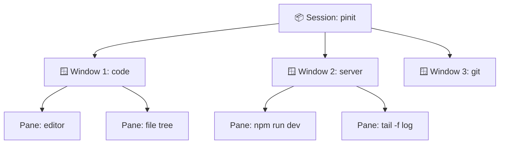
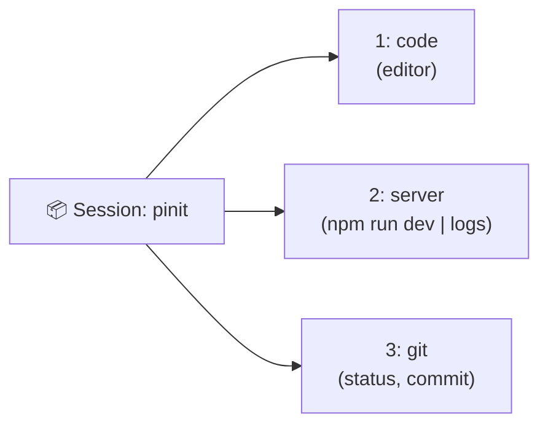

Nếu bạn làm việc nhiều trong terminal, sớm muộn gì cũng gặp cảnh: mở một đống tab cho server, log, editor, git... rồi đóng nhầm cửa sổ là mất sạch. Tệ hơn, đang chạy một lệnh dài trên server qua SSH thì mất mạng — và mọi thứ tan biến. **tmux** sinh ra để giải quyết đúng những nỗi đau đó.

Bài này mình ghi lại cách dùng tmux từ con số 0 tới một workflow thực chiến mà mình áp dụng hằng ngày khi làm dev.

<!-- truncate -->

## 1. tmux là gì & vì sao nên dùng?

**tmux** (terminal multiplexer) là công cụ cho phép bạn chạy **nhiều phiên terminal bên trong một cửa sổ duy nhất**, chia màn hình thành nhiều khung, và quan trọng nhất: **giữ cho các phiên đó tiếp tục chạy ngay cả khi bạn đóng terminal hoặc mất kết nối**.

Vì sao dev nên dùng tmux:

- **Một cửa sổ, nhiều việc:** chạy dev server, xem log, gõ git, mở editor — tất cả trong một terminal, chia khung rõ ràng thay vì lạc giữa hàng chục tab.
- **Phiên không chết:** đóng terminal hay logout, các tiến trình vẫn sống. Mở lại là thấy nguyên trạng.
- **Cứu cánh khi SSH:** đang build/migrate trên server từ xa mà rớt mạng? Tiến trình vẫn chạy bên trong tmux. Kết nối lại rồi `attach` là tiếp tục như chưa có gì xảy ra.
- **Bố cục lặp lại được:** một file cấu hình là dựng lại được layout làm việc cho từng project.

## 2. Cài đặt

Trên **macOS** (dùng Homebrew):

```bash
brew install tmux
```

Trên **Linux** (Debian/Ubuntu):

```bash
sudo apt update
sudo apt install tmux
```

Kiểm tra phiên bản và khởi động một phiên mới:

```bash
tmux -V          # xem phiên bản đã cài
tmux             # mở một phiên tmux mới
```

## 3. Mô hình: Session → Window → Pane

Đây là khái niệm cốt lõi của tmux. Hiểu được mô hình này là dùng được tmux:

- **Session** (phiên): khối lớn nhất, thường gắn với **một project**. Một session sống độc lập, bạn có thể rời (detach) rồi quay lại (attach) bất cứ lúc nào.
- **Window** (cửa sổ): giống như một "tab" bên trong session. Một session có nhiều window, mỗi window thường dành cho một nhóm việc (vd: window `code`, window `server`, window `git`).
- **Pane** (khung): một window có thể chia thành nhiều pane — các ô terminal nằm cạnh nhau trong cùng màn hình.



## 4. Prefix key: Ctrl-b

Gần như **mọi** lệnh của tmux đều bắt đầu bằng một **prefix key**, mặc định là **`Ctrl-b`**. Cách dùng: nhấn `Ctrl-b`, **thả tay ra**, rồi nhấn phím lệnh tiếp theo.

Ví dụ trong bài, `Ctrl-b c` nghĩa là: nhấn `Ctrl-b`, thả ra, rồi nhấn `c`. Prefix giúp tmux phân biệt phím nào là lệnh của nó, phím nào gửi thẳng vào chương trình đang chạy bên trong.

## 5. Các phím tắt & lệnh hay dùng

Tất cả phím tắt dưới đây đều nhấn **sau** prefix `Ctrl-b`:

| Phím tắt | Tác dụng |
|---|---|
| `c` | Tạo window mới |
| `n` / `p` | Chuyển window kế tiếp / trước đó |
| `0`–`9` | Nhảy tới window theo số |
| `w` | Liệt kê & chọn window |
| `,` | Đổi tên window hiện tại |
| `"` | Chia pane theo chiều **ngang** (trên/dưới) |
| `%` | Chia pane theo chiều **dọc** (trái/phải) |
| `o` / `←↑↓→` | Chuyển qua lại giữa các pane |
| `x` | Đóng pane hiện tại |
| `z` | Phóng to/thu nhỏ pane (zoom) |
| `d` | Detach (rời phiên, vẫn chạy nền) |
| `[` | Vào copy mode (cuộn & copy) |
| `?` | Xem toàn bộ phím tắt |

Và một vài lệnh gõ từ shell (ngoài prefix):

```bash
tmux new -s pinit          # tạo session mới đặt tên "pinit"
tmux ls                    # liệt kê các session đang chạy
tmux attach -t pinit       # gắn lại vào session "pinit"
tmux kill-session -t pinit # tắt session "pinit"
```

## 6. Copy mode (cuộn & sao chép)

Mặc định bạn không cuộn terminal trong tmux như bình thường được. Hãy dùng **copy mode**:

- Nhấn `Ctrl-b [` để vào copy mode.
- Dùng phím mũi tên hoặc `PageUp`/`PageDown` để cuộn lại lịch sử output.
- Nhấn `Space` để bắt đầu chọn vùng, di chuyển con trỏ để bôi đen, rồi `Enter` để copy.
- Dán lại nội dung vừa copy bằng `Ctrl-b ]`.
- Nhấn `q` để thoát copy mode.

> 💡 Dễ nhớ: `[` để **vào** (mở dấu ngoặc) đọc/copy, `]` để **dán** (đóng dấu ngoặc).

## 7. Chia pane dọc & ngang

Khi đang trong một window:

```bash
# (sau prefix Ctrl-b)
"   →  chia NGANG: thêm một pane bên dưới
%   →  chia DỌC:   thêm một pane bên phải
```

Một bố cục hay dùng khi code: pane lớn bên trái cho editor, chia dọc (`Ctrl-b %`) ra pane bên phải, rồi chia ngang (`Ctrl-b "`) pane phải thành 2 ô — một ô chạy `npm run dev`, một ô `tail` log. Chuyển giữa các pane bằng `Ctrl-b` + phím mũi tên, và `Ctrl-b z` để zoom một pane khi cần tập trung.

## 8. Detach & Attach — tính năng cứu mạng khi SSH

Đây là lý do nhiều dev "nghiện" tmux.

- **Detach** (`Ctrl-b d`): rời khỏi session nhưng **mọi tiến trình bên trong vẫn tiếp tục chạy nền**. Terminal trở về shell bình thường.
- **Attach** (`tmux attach -t <tên>`): gắn lại vào session đó, thấy đúng trạng thái lúc rời đi.

Vì sao cực hữu ích khi SSH: giả sử bạn SSH vào server, chạy một lệnh build/migrate kéo dài 30 phút. Nếu chạy trực tiếp mà **mất kết nối**, tiến trình thường bị **kill** (SIGHUP) → mất hết. Nhưng nếu bạn chạy **bên trong tmux**, mất mạng chỉ tương đương một lần detach bị động: tiến trình vẫn sống. Khi mạng ổn lại, chỉ cần SSH vào lần nữa và:

```bash
ssh user@server
tmux attach          # hoặc: tmux attach -t <tên session>
```

...là bạn quay lại đúng chỗ đang dở, như chưa hề rớt mạng.

## 9. File ~/.tmux.conf cơ bản

tmux đọc cấu hình từ `~/.tmux.conf`. Đây là một file khởi đầu gọn nhẹ mình hay dùng:

```bash
# Remap prefix từ Ctrl-b sang Ctrl-a (gần phím hơn, quen tay với screen)
unbind C-b
set -g prefix C-a
bind C-a send-prefix

# Bật chuột: click chọn pane/window, kéo viền để resize, cuộn bằng scroll
set -g mouse on

# Đánh số window bắt đầu từ 1 cho dễ bấm
set -g base-index 1
setw -g pane-base-index 1

# Tăng buffer lịch sử cuộn lên 10000 dòng
set -g history-limit 10000

# Phím tắt nạp lại config nhanh: prefix + r
bind r source-file ~/.tmux.conf \; display "Đã nạp lại ~/.tmux.conf"

# Chia pane bằng | và - cho trực quan (vẫn giữ % và " mặc định)
bind | split-window -h
bind - split-window -v
```

Sau khi sửa file, nạp lại bằng `Ctrl-a r` (nếu đã remap prefix) hoặc khởi động lại tmux.

> ⚠️ Lưu ý: sau khi remap prefix sang `Ctrl-a`, mọi phím tắt trong bài giờ nhấn với `Ctrl-a` thay vì `Ctrl-b`.

## 10. Workflow thực tế: một session cho mỗi project

Đây là cách mình dùng tmux hằng ngày với project portfolio Next.js này:

```bash
# Tạo một session riêng cho project, đặt tên theo project
tmux new -s pinit
```

Bên trong session `pinit`, mình dựng 3 window theo từng nhóm việc:



- **Window 1 — `code`:** mở editor (nvim/vim) hoặc đơn giản là nơi gõ lệnh chính.
- **Window 2 — `server`:** chia dọc thành 2 pane — một ô chạy `npm run dev`, một ô `tail` log hoặc chạy test ở chế độ watch.
- **Window 3 — `git`:** dành riêng cho `git status`, `git add`, `git commit`, xem diff.

Cuối ngày mình chỉ cần `Ctrl-b d` để detach — server vẫn chạy nền. Sáng hôm sau mở terminal, gõ `tmux attach -t pinit` là toàn bộ bố cục, server và log hiện ra y nguyên. Không phải dựng lại gì cả.

## 11. Những điều rút ra

- **Hiểu mô hình session → window → pane** là hiểu được 80% tmux.
- **Detach/attach** là tính năng đáng giá nhất: phiên không chết, đặc biệt cứu mạng khi làm việc qua SSH.
- **Một session cho mỗi project** giúp tách bạch ngữ cảnh và quay lại làm việc trong vài giây.
- **Đầu tư cho `~/.tmux.conf`** một lần (remap prefix, bật mouse) là dùng thoải mái về sau.

> **One terminal to rule them all.** — Một terminal, nhiều phiên, và quan trọng nhất: không bao giờ mất việc dở dang chỉ vì rớt mạng hay đóng nhầm cửa sổ.
