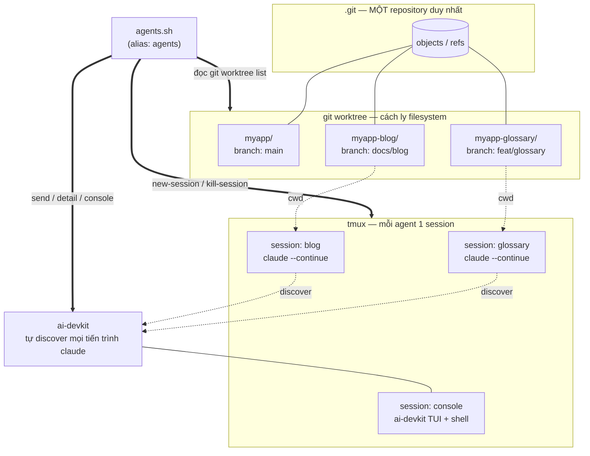

Bài này mô tả một setup đã chạy thực tế: **nhiều agent AI làm việc đồng thời trên cùng một repo**, mỗi agent một nhánh, một thư mục, một phiên terminal riêng — không giẫm chân nhau, và **không mất context** khi bạn tắt máy đi ngủ.

Setup gốc dựng trên macOS. Toàn bộ script trong bài đã được **tổng quát hoá** (bạn chỉ sửa 4 dòng biến ở đầu file) và có **mục riêng cho Ubuntu** ở cuối.

<!-- truncate -->

---

## Mục lục

1. [Vấn đề & động lực](#1-vấn-đề--động-lực)
2. [Kiến trúc](#2-kiến-trúc)
3. [Cài đặt công cụ](#3-cài-đặt-công-cụ)
4. [Dựng worktree](#4-dựng-worktree)
5. [Script `agents.sh` — bản tổng quát](#5-script-agentssh--bản-tổng-quát)
6. [Giải thích từng lệnh con](#6-giải-thích-từng-lệnh-con)
7. [Alias](#7-alias)
8. [Quy trình hằng ngày](#8-quy-trình-hằng-ngày)
9. [Hai hệ tên — chỗ dễ nhầm nhất](#9-hai-hệ-tên--chỗ-dễ-nhầm-nhất)
10. [Quản lý model](#10-quản-lý-model)
11. [Điều hướng tmux tối thiểu](#11-điều-hướng-tmux-tối-thiểu)
12. [ai-devkit console lag & cách né](#12-ai-devkit-console-lag--cách-né)
13. [One-command restore sau khi restart máy](#13-one-command-restore-sau-khi-restart-máy)
14. [Bẫy thường gặp](#14-bẫy-thường-gặp)
15. [Áp dụng trên Ubuntu](#15-áp-dụng-trên-ubuntu)
16. [Checklist & kết luận](#16-checklist--kết-luận)

---

## 1. Vấn đề & động lực

Khi bạn giao cho Claude Code một việc dài (refactor một module, viết docs, sửa pipeline deploy), agent sẽ chiếm lấy repo: nó sửa file, chạy test, tạo commit. Bạn không thể vừa để nó chạy vừa tự làm việc khác trên cùng thư mục — và càng không thể chạy hai agent cùng lúc.

Các cách "thường thấy" đều có vấn đề:

| Cách làm | Vấn đề |
|---|---|
| Một repo, đổi branch qua lại | Agent A checkout branch khác giữa chừng → agent B đang chạy thấy file đổi dưới chân mình |
| Clone repo nhiều lần | Tốn ổ cứng, mỗi clone một `.git` riêng, đồng bộ branch thủ công rất phiền |
| Chạy tuần tự từng agent | Mất hết lợi ích của song song; bạn ngồi chờ |
| Mở nhiều tab terminal thủ công | Restart máy là mất sạch; không biết agent nào đang chạy ở đâu |

Yêu cầu thật sự cần giải quyết:

- **Cách ly filesystem**: mỗi agent một working directory, nhưng dùng chung một `.git`.
- **Bền qua đóng terminal**: agent chạy tiếp dù bạn đóng cửa sổ, đóng nắp laptop.
- **Giữ context**: kill agent rồi bật lại phải nối tiếp cuộc hội thoại cũ, không phải kể lại từ đầu.
- **Quan sát được**: một chỗ nhìn thấy agent nào đang chạy, đang chờ input, đang làm gì.

Ba công cụ giải quyết đúng ba tầng đó:

- **git worktree** → cách ly filesystem
- **tmux** → tiến trình sống sót khi rời terminal
- **ai-devkit** → quan sát và điều khiển tập trung

Và một script mỏng (`agents.sh`) dán chúng lại.

---

## 2. Kiến trúc

### Sơ đồ



### Ba ý tưởng làm setup này hoạt động

**(1) Context của Claude bám theo `cwd`, không bám theo tên agent.**

Đây là điểm quan trọng nhất và cũng phản trực giác nhất. `claude --continue` nối lại **phiên gần nhất của thư mục hiện tại**. Nó không quan tâm bạn đặt tên tmux session là gì, không quan tâm PID cũ là bao nhiêu.

Hệ quả rất thoải mái: **kill một agent rồi tạo lại ở cùng worktree = làm tiếp việc cũ**. Lịch sử hội thoại nằm trên đĩa, `kill` không xoá gì cả. Bạn có thể tắt hết agent trước khi đi ngủ, sáng mai bật lại và mọi agent kể tiếp câu chuyện đang dở.

**(2) ai-devkit tự discover mọi tiến trình `claude` đang chạy.**

Bạn không cần khởi động agent *thông qua* ai-devkit để ai-devkit quản lý được nó. Ta bật agent bằng tmux (nhanh, không lag), và `ai-devkit agent list / console / send` vẫn nhìn thấy đủ. Điều này cho phép tách bạch: **tmux lo vòng đời, ai-devkit lo quan sát**.

**(3) Danh sách agent suy ra từ `git worktree list`.**

Script không có bảng cấu hình liệt kê agent. Nó đọc `git worktree list --porcelain` rồi cắt tiền tố tên project. Thêm một worktree mới → agent mới tự xuất hiện, **không phải sửa script**.

### Quy ước đặt tên

Đây là quy ước duy nhất bạn phải tuân theo để script tự suy được tên:

```
$BASE/                        # thư mục cha
├── myapp/                    # worktree main   → agent tên "main"
├── myapp-glossary/           # worktree feature → agent tên "glossary"
├── myapp-blog/               # worktree feature → agent tên "blog"
└── myapp-api/                # (repo khác cũng để đây được, miễn không là worktree)
```

Thư mục worktree đặt tên `<project>-<tên-agent>`; script cắt tiền tố `<project>-` để ra tên agent sạch. Riêng thư mục trùng đúng tên project được đổi thành `main`.

---

## 3. Cài đặt công cụ

### macOS

```bash
brew install tmux git
npm i -g ai-devkit
# Claude Code — native installer (khuyến nghị)
curl -fsSL https://claude.ai/install.sh | bash
```

### Ubuntu

```bash
sudo apt update && sudo apt install -y tmux git curl
# Node.js: khuyến nghị nvm để tránh bản nodejs quá cũ trong apt
curl -o- https://raw.githubusercontent.com/nvm-sh/nvm/v0.40.1/install.sh | bash
exec "$SHELL" -l
nvm install --lts

npm i -g ai-devkit
curl -fsSL https://claude.ai/install.sh | bash
```

Kiểm tra:

```bash
tmux -V          # ≥ 3.0 là ổn
git --version    # ≥ 2.20 (cần worktree --porcelain)
node -v          # ≥ 18
claude --version
ai-devkit --version
```

> Nếu không muốn cài `ai-devkit` toàn cục, `npx ai-devkit@latest agent list` cũng chạy — nhưng mỗi lần gọi sẽ chậm hơn đáng kể. Với script gọi ai-devkit thường xuyên, cài global đáng hơn.

Ngoài ra: **nên cài một terminal tăng tốc GPU** (Ghostty, kitty, Alacritty, WezTerm). Lý do ở [mục 12](#12-ai-devkit-console-lag--cách-né) — TUI của ai-devkit vẽ lại rất nặng, terminal render bằng CPU (Apple Terminal, gnome-terminal) sẽ lag thấy rõ.

---

## 4. Dựng worktree

Giả sử repo chính đã clone ở `$HOME/projects/myapp-workspace/myapp`:

```bash
export BASE="$HOME/projects/myapp-workspace"
cd "$BASE/myapp"

# Tạo worktree + branch mới cùng lúc
git worktree add -b feat/glossary "$BASE/myapp-glossary" origin/main
git worktree add -b docs/blog     "$BASE/myapp-blog"     origin/main

# Kiểm tra
git worktree list
```

Kết quả mong đợi:

```
/home/you/projects/myapp-workspace/myapp            97f6a49 [main]
/home/you/projects/myapp-workspace/myapp-glossary   97f6a49 [feat/glossary]
/home/you/projects/myapp-workspace/myapp-blog       97f6a49 [docs/blog]
```

Vài điều cần biết về worktree:

- Tất cả dùng chung một `.git` → `git fetch` ở một chỗ là mọi worktree thấy ref mới.
- **Một branch chỉ được checkout ở một worktree tại một thời điểm.** Đây chính là cơ chế bảo vệ chống hai agent cùng sửa một branch.
- Xoá worktree: `git worktree remove <path>`. Nếu đã lỡ `rm -rf` thư mục thì dọn metadata bằng `git worktree prune`.
- `node_modules/` **không** dùng chung — mỗi worktree phải `npm install` riêng.

---

## 5. Script `agents.sh` — bản tổng quát

Lưu vào `~/bin/agents.sh` rồi `chmod +x ~/bin/agents.sh`.

Chỉ cần sửa **khối 4 biến** được đánh dấu ở đầu file; phần còn lại chạy nguyên xi.

```bash
#!/usr/bin/env bash
# agents.sh — quản lý agent Claude theo git worktree (mỗi agent = 1 tmux session)
# Viết theo cú pháp bash 3.2 → chạy được cả macOS (bash cũ) lẫn Ubuntu (bash 5).
#
# Nguyên lý:
#   - Context của Claude gắn với CWD (worktree), KHÔNG gắn với tên agent.
#     `claude --continue` nối lại phiên mới nhất của worktree đó
#     -> kill agent rồi tạo lại (cùng worktree) = làm tiếp việc cũ.
#   - ai-devkit TỰ discover các phiên claude này, nên `ai-devkit agent list/console/send`
#     vẫn quản lý được dù ta bật qua tmux.
#   - Danh sách agent tự suy ra từ `git worktree list` -> thêm worktree không cần sửa script.
#
# Dùng — TẠO agent (thao tác tmux thuần, KHÔNG lag):
#   agents up            # mở lại các agent feature còn thiếu (bỏ qua main)
#   agents new <name>    # tạo/tái tạo 1 agent theo tên (tự --continue)
#   agents open <name>   # attach/nhảy vào 1 agent
#   agents ls            # trạng thái các agent (tmux + ai-devkit)
#   agents kill <name>   # kill 1 agent
#   agents kill-all      # kill tất cả (hỏi xác nhận)
#   agents sync          # rebase origin/main cho mọi worktree
#
# Dùng — DỰ PHÒNG khi ai-devkit console lag (qua CLI, không cần TUI):
#   agents send <name> "lời nhắn"   # gửi tin cho agent (ai-devkit agent send)
#   agents detail <name>            # xem 20 dòng cuối của agent
#   agents console                  # session 'console' riêng (console+shell chia đôi, né lag)

set -euo pipefail

# ─────────── SỬA 4 DÒNG NÀY CHO PROJECT CỦA BẠN ───────────
# Tên project = tên thư mục của worktree main, cũng là tiền tố của các worktree khác.
PROJECT="${AGENTS_PROJECT:-myapp}"
# Thư mục cha chứa TẤT CẢ worktree (main + feature).
BASE="${AGENTS_BASE:-$HOME/projects/$PROJECT-workspace}"
# Worktree main — nơi chạy các lệnh git chung.
MAIN="${AGENTS_MAIN:-$BASE/$PROJECT}"
# Model ép cho mọi agent lúc phóng. Đổi tạm: AGENTS_MODEL=claude-fable-5 agents up
AGENT_MODEL="${AGENTS_MODEL:-claude-opus-5}"
# ───────────────────────────────────────────────────────────

# Tiền tố tên tmux session. Để rỗng nếu chỉ chạy 1 project trên máy;
# đặt "$PROJECT-" nếu chạy nhiều project (mọi project dùng CHUNG một tmux socket).
SESSION_PREFIX="${AGENTS_SESSION_PREFIX:-}"

# Lệnh phóng trong mỗi session. Override để test: AGENTS_CMD='sleep 999'
# --model ép model ngay lúc phóng (default toàn cục KHÔNG áp cho phiên --continue).
CLAUDE_CONT="${AGENTS_CMD:-claude --continue --model $AGENT_MODEL || claude --model $AGENT_MODEL}"

CONSOLE_SESSION="${SESSION_PREFIX}console"

NAMES=()
PATHS=()

# Tên tmux thật sự của một agent (có tiền tố nếu bạn bật SESSION_PREFIX).
tmux_name() { printf '%s%s\n' "$SESSION_PREFIX" "$1"; }

# Suy ra tên agent + đường dẫn từ `git worktree list`.
#   myapp-glossary -> glossary ; myapp-blog -> blog ; myapp (main) -> main
load_agents() {
  NAMES=(); PATHS=()
  local path="" name=""
  # Mỗi entry: dòng "worktree <path>" ... kết thúc bằng một dòng trống.
  while IFS= read -r line; do
    if [ "${line#worktree }" != "$line" ]; then
      path="${line#worktree }"
    elif [ -z "$line" ] && [ -n "$path" ]; then
      name="$(basename "$path")"
      name="${name#$PROJECT-}"
      [ "$name" = "$PROJECT" ] && name="main"
      NAMES+=("$name"); PATHS+=("$path")
      path=""
    fi
  done < <(git -C "$MAIN" worktree list --porcelain)
  # flush entry cuối nếu output không kết bằng dòng trống
  if [ -n "$path" ]; then
    name="$(basename "$path")"; name="${name#$PROJECT-}"
    [ "$name" = "$PROJECT" ] && name="main"
    NAMES+=("$name"); PATHS+=("$path")
  fi
}

path_for() {
  local want="$1" i=0
  while [ $i -lt ${#NAMES[@]} ]; do
    [ "${NAMES[$i]}" = "$want" ] && { printf '%s\n' "${PATHS[$i]}"; return 0; }
    i=$((i+1))
  done
  return 1
}

alive() { tmux has-session -t "$(tmux_name "$1")" 2>/dev/null; }

start_one() {   # tạo nếu chưa có
  local name="$1" path
  if ! path="$(path_for "$name")"; then
    echo "  ✗ không có worktree tên '$name' (xem: agents ls)"; return 1
  fi
  if alive "$name"; then echo "  • $name — đang chạy, bỏ qua"; return 0; fi
  tmux new-session -d -s "$(tmux_name "$name")" -c "$path" "$CLAUDE_CONT"
  echo "  + $name -> $path"
}

cmd_up() {   # bỏ qua 'main' (nơi chạy console/integrator, không cần agent riêng)
  local i=0
  echo "Mở lại agent còn thiếu (bỏ qua 'main'):"
  while [ $i -lt ${#NAMES[@]} ]; do
    if [ "${NAMES[$i]}" = "main" ]; then i=$((i+1)); continue; fi
    start_one "${NAMES[$i]}"
    i=$((i+1))
  done
  echo
  echo "Xong. \`agents ls\` để xem; \`agents open <name>\` để vào."
  echo "(Muốn bật agent cho main: \`agents new main\`)"
}

cmd_new() {     # tái tạo 1 agent (kill session cũ, bật lại --continue)
  local name="${1:?dùng: agents new <name>}"
  path_for "$name" >/dev/null || { echo "✗ không có worktree tên '$name'"; return 1; }
  tmux kill-session -t "$(tmux_name "$name")" 2>/dev/null || true
  start_one "$name"
}

cmd_open() {
  local name="${1:?dùng: agents open <name>}" t
  t="$(tmux_name "$name")"
  alive "$name" || { echo "✗ '$name' chưa chạy — \`agents new $name\`"; return 1; }
  if [ -n "${TMUX:-}" ]; then tmux switch-client -t "$t"; else tmux attach -t "$t"; fi
}

cmd_ls() {
  echo "=== worktree / agent ==="
  local i=0
  while [ $i -lt ${#NAMES[@]} ]; do
    local n="${NAMES[$i]}" st="ngủ"
    alive "$n" && st="chạy"
    printf "  %-12s %-5s %s\n" "$n" "$st" "${PATHS[$i]}"
    i=$((i+1))
  done
  echo
  echo "=== ai-devkit discover ==="
  ai-devkit agent list 2>/dev/null || echo "  (ai-devkit không sẵn sàng)"
}

cmd_sync() {    # đồng bộ với main. Conflict -> DỪNG, không tự resolve.
  git -C "$MAIN" fetch origin
  local i=0
  while [ $i -lt ${#NAMES[@]} ]; do
    local p="${PATHS[$i]}" n="${NAMES[$i]}"
    echo "→ rebase $n ($p)"
    if ! git -C "$p" rebase origin/main; then
      echo "  ! conflict ở '$n' — ĐÃ DỪNG, chưa resolve."
      echo "    Vào $p xử lý tay rồi \`git rebase --continue\` (hoặc --abort)."
    fi
    i=$((i+1))
  done
}

cmd_kill() {
  local name="${1:?dùng: agents kill <name>}"
  ai-devkit agent kill "$name" >/dev/null 2>&1 || true
  if tmux kill-session -t "$(tmux_name "$name")" 2>/dev/null; then
    echo "killed $name"
  else
    echo "'$name' không chạy"
  fi
}

cmd_kill_all() {
  printf "Kill tất cả agent (%s)? (y/N) " "$(IFS=' '; echo "${NAMES[*]}")"
  read -r reply
  case "$reply" in [Yy]*) ;; *) echo "huỷ"; return 1 ;; esac
  local i=0
  while [ $i -lt ${#NAMES[@]} ]; do cmd_kill "${NAMES[$i]}"; i=$((i+1)); done
}

# --- dự phòng khi ai-devkit console lag: gọi CLI trực tiếp ---
# Lưu ý: ai-devkit dùng TÊN RIÊNG của nó (vd myapp-glossary-16713); tên tmux
# 'glossary' thường khớp nhờ so trùng một phần. Không chắc thì xem `agents ls`.
cmd_send() {
  local name="${1:?dùng: agents send <name> \"lời nhắn\"}"; shift
  [ $# -gt 0 ] || { echo "thiếu lời nhắn"; return 1; }
  ai-devkit agent send --id "$name" "$*"
}

cmd_detail() {
  local name="${1:?dùng: agents detail <name>}"
  ai-devkit agent detail --id "$name" --tail 20
}

# Session tmux riêng cho console: pane trên = ai-devkit console, pane dưới = shell.
# Pane nhỏ (50/50) + tmux tiết chế redraw -> né lag. Độc lập với mọi agent session.
cmd_console() {
  local s="$CONSOLE_SESSION"
  if ! tmux has-session -t "$s" 2>/dev/null; then
    tmux new-session -d -s "$s" -c "$BASE" 'ai-devkit agent console'
    tmux split-window -v -t "$s" -c "$BASE"   # pane dưới = shell; thành pane active
    echo "+ tạo session '$s' (console + shell)"
  fi
  if [ -n "${TMUX:-}" ]; then tmux switch-client -t "$s"; else tmux attach -t "$s"; fi
}

usage() {
  sed -n '2,/^set /p' "$0" | grep '^#' | sed 's/^# \{0,1\}//'
}

load_agents
case "${1:-}" in
  up|resume)    cmd_up ;;
  new|recreate) shift; cmd_new "$@" ;;
  open|attach)  shift; cmd_open "$@" ;;
  ls|status)    cmd_ls ;;
  sync)         cmd_sync ;;
  kill)         shift; cmd_kill "$@" ;;
  kill-all)     cmd_kill_all ;;
  send|msg)     shift; cmd_send "$@" ;;
  detail)       shift; cmd_detail "$@" ;;
  console|con)  cmd_console ;;
  ""|-h|--help|help) usage ;;
  *) echo "lệnh lạ: $1"; echo; usage; exit 1 ;;
esac
```

Kiểm cú pháp trước khi dùng:

```bash
bash -n ~/bin/agents.sh && echo OK
```

### Các biến môi trường override (không cần sửa file)

| Biến | Tác dụng |
|---|---|
| `AGENTS_PROJECT` | Tên project / tiền tố worktree |
| `AGENTS_BASE` | Thư mục cha chứa worktree |
| `AGENTS_MAIN` | Đường dẫn worktree main (nếu không theo quy ước) |
| `AGENTS_MODEL` | Model dùng cho agent, vd `AGENTS_MODEL=claude-fable-5 agents up` |
| `AGENTS_SESSION_PREFIX` | Tiền tố tên tmux session, tránh đụng khi chạy nhiều project |
| `AGENTS_CMD` | Lệnh phóng thay cho `claude` — hữu ích khi test: `AGENTS_CMD='sleep 999'` |

Nhờ vậy bạn có thể dùng **một script cho nhiều project**:

```bash
alias agents-a='AGENTS_PROJECT=myapp  AGENTS_BASE=$HOME/projects/a AGENTS_SESSION_PREFIX=a- ~/bin/agents.sh'
alias agents-b='AGENTS_PROJECT=other  AGENTS_BASE=$HOME/projects/b AGENTS_SESSION_PREFIX=b- ~/bin/agents.sh'
```

---

## 6. Giải thích từng lệnh con

### `load_agents` — trái tim của script

```bash
git -C "$MAIN" worktree list --porcelain
```

Output dạng máy đọc:

```
worktree /home/you/projects/myapp-workspace/myapp
HEAD 97f6a49...
branch refs/heads/main
                              ← dòng trống ngăn cách entry
worktree /home/you/projects/myapp-workspace/myapp-glossary
HEAD 97f6a49...
branch refs/heads/feat/glossary
```

Vòng lặp bắt dòng bắt đầu bằng `worktree `, lấy path, chờ dòng trống rồi chốt entry. Tên agent = `basename` cắt tiền tố `$PROJECT-`; nếu bằng đúng `$PROJECT` thì đổi thành `main`.

Hai chi tiết đáng chú ý:

- **`< <(...)` process substitution, không phải pipe.** Nếu viết `git ... | while read`, vòng `while` chạy trong subshell và `NAMES`/`PATHS` gán xong sẽ mất khi subshell kết thúc. Đây là lỗi bash kinh điển.
- **Có nhánh "flush entry cuối"** phòng khi output không kết thúc bằng dòng trống — rẻ, và tránh mất agent cuối cùng một cách âm thầm.

### `agents up` — bật lại mọi thứ

Duyệt danh sách, bỏ qua `main`, gọi `start_one` cho từng agent chưa chạy:

```bash
tmux new-session -d -s "$name" -c "$path" "$CLAUDE_CONT"
```

- `-d`: tạo detached, **không** cướp terminal của bạn. Bật 5 agent trong 1 giây.
- `-c "$path"`: đặt cwd = worktree → đây chính là thứ làm `--continue` nối đúng phiên.
- Lệnh cuối: `claude --continue --model X || claude --model X`. Nếu worktree chưa từng có phiên nào, `--continue` fail → fallback sang `claude` trần. Không có fallback này, agent mới toanh sẽ chết ngay khi bật.

**Vì sao bỏ qua `main`?** Worktree main là chỗ bạn ngồi làm việc: chạy git, merge, xem console. Để một agent chiếm nó thường gây phiền hơn là có ích. Cần thì `agents new main` là có.

### `agents new <name>` — tái tạo

```bash
tmux kill-session -t "$name" 2>/dev/null || true
start_one "$name"
```

Kill rồi bật lại. Vì `--continue` bám cwd, đây là thao tác **an toàn tuyệt đối** với context: dùng khi agent treo, khi bạn vừa đổi `AGENT_MODEL`, hoặc khi cần một cửa sổ sạch.

### `agents open <name>` — vào xem

```bash
if [ -n "${TMUX:-}" ]; then tmux switch-client -t "$t"; else tmux attach -t "$t"; fi
```

Phân biệt "đang ở trong tmux" và "đang ở terminal trần" là bắt buộc: gọi `tmux attach` từ bên trong tmux sẽ bị lỗi *sessions should be nested with care*. Biến `$TMUX` chỉ tồn tại bên trong tmux nên là cờ nhận biết chuẩn.

### `agents ls` — trạng thái kép

In hai bảng: **tmux** (tên sạch, ngủ/chạy, đường dẫn) và **ai-devkit** (tên có PID, trạng thái 🟢 run / 🟡 wait / ⚪ idle, đang làm gì). Bảng thứ hai là chỗ bạn phát hiện agent nào đang **chờ input** — thứ mà tmux không biết.

```
=== worktree / agent ===
  main         ngủ  /home/you/projects/myapp-workspace/myapp
  blog         chạy /home/you/projects/myapp-workspace/myapp-blog
  glossary     chạy /home/you/projects/myapp-workspace/myapp-glossary

=== ai-devkit discover ===
  Agent                 Project         Status   Working On
  myapp-blog-36929      myapp-blog      🟢 run   Viết mục Ubuntu...
  myapp-glossary-62943  myapp-glossary  ⚪ idle  ...
```

### `agents sync` — rebase toàn bộ

```bash
git -C "$MAIN" fetch origin
# rồi với từng worktree:
git -C "$p" rebase origin/main
```

Fetch **một lần** ở main (chung `.git` nên mọi worktree thấy ngay), rồi rebase từng cái.

Điểm thiết kế quan trọng: **conflict thì DỪNG, không tự resolve.** Script in ra đường dẫn và hướng dẫn, rồi đi tiếp worktree khác. Tự động resolve conflict giữa các nhánh do agent viết là công thức tạo ra merge sai một cách âm thầm.

### `agents kill` / `kill-all`

Kill cả hai phía: `ai-devkit agent kill` (bỏ qua lỗi nếu không khớp tên) rồi `tmux kill-session`. `kill-all` hỏi xác nhận vì lý do ở [mục 14](#14-bẫy-thường-gặp).

Nhắc lại cho yên tâm: **kill không mất context.** Lịch sử hội thoại nằm trên đĩa.

### `agents send` / `detail` — điều khiển không cần TUI

```bash
ai-devkit agent send   --id "$name" "$*"
ai-devkit agent detail --id "$name" --tail 20
```

Đây là đường vòng khi console lag hoặc khi bạn muốn script hoá. `--id glossary` khớp được với `myapp-glossary-62943` nhờ **so trùng một phần** — xem mục sau.

Ví dụ dùng thật:

```bash
agents send glossary "chạy npm run lint rồi commit theo Conventional Commits"
agents detail glossary
```

### `agents console`

Tạo session tmux riêng tên `console`, pane trên chạy `ai-devkit agent console`, pane dưới là shell trống, chia 50/50. Lý do chia pane nằm ở [mục 12](#12-ai-devkit-console-lag--cách-né).

### `usage`

```bash
sed -n '2,/^set /p' "$0" | grep '^#' | sed 's/^# \{0,1\}//'
```

In khối comment từ dòng 2 tới dòng `set -euo pipefail`, bỏ dấu `#`. Help luôn khớp với code vì nó **chính là** comment đầu file — không thể quên cập nhật.

---

## 7. Alias

**macOS / zsh** — thêm vào `~/.zshrc`:

```bash
alias agents="~/bin/agents.sh"
alias devsession="~/bin/session.sh"    # xem mục 13
```

**Ubuntu / bash** — thêm vào `~/.bashrc` (Ubuntu mặc định dùng bash, **không** phải zsh):

```bash
alias agents="$HOME/bin/agents.sh"
alias devsession="$HOME/bin/session.sh"
```

Nạp lại:

```bash
source ~/.zshrc     # hoặc: source ~/.bashrc
```

> Nếu `~/bin` chưa nằm trong `PATH`, alias vẫn chạy được vì nó gọi đường dẫn tuyệt đối. Muốn gọi thẳng `agents.sh` thì thêm `export PATH="$HOME/bin:$PATH"`.

---

## 8. Quy trình hằng ngày

### Sáng — bật máy

```bash
agents up          # bật mọi agent feature còn thiếu
agents ls          # xem cái nào chạy, cái nào đang chờ input
```

### Giao việc cho một agent

```bash
agents open glossary       # vào session, gõ prompt như bình thường
# Ctrl-b d để detach — agent vẫn chạy tiếp
```

Hoặc không cần vào:

```bash
agents send glossary "thêm deep-link cho từng thuật ngữ, chạy lint trước khi commit"
```

### Theo dõi nhiều agent cùng lúc

```bash
agents console             # TUI, xem tất cả trong một màn hình
# hoặc rẻ hơn:
watch -n5 'agents ls'
```

### Đồng bộ với main

```bash
agents sync                # fetch + rebase origin/main cho mọi worktree
```

### Thêm một agent mới

```bash
cd "$BASE/myapp"
git worktree add -b feat/search "$BASE/myapp-search" origin/main
agents new search          # script tự thấy worktree mới, không cần sửa gì
```

### Tối — dọn

```bash
agents kill-all            # hoặc cứ để chạy; kill không mất context
```

### Bảng lệnh nhanh

| Lệnh | Việc |
|---|---|
| `agents up` | Bật các agent feature còn thiếu |
| `agents new <name>` | Tạo / tái tạo một agent (giữ context) |
| `agents open <name>` | Vào session của agent |
| `agents ls` | Trạng thái tmux + ai-devkit |
| `agents kill <name>` | Tắt một agent |
| `agents kill-all` | Tắt tất cả (hỏi xác nhận) |
| `agents sync` | `fetch` + `rebase origin/main` mọi worktree |
| `agents send <name> "..."` | Gửi prompt qua CLI |
| `agents detail <name>` | 20 dòng cuối của agent |
| `agents console` | Session console (TUI + shell) |

---

## 9. Hai hệ tên — chỗ dễ nhầm nhất

Cùng một agent có **hai cái tên**, và dùng nhầm là lỗi phổ biến nhất của setup này.

| | Tên tmux | Tên ai-devkit |
|---|---|---|
| Ví dụ | `glossary` | `myapp-glossary-62943` |
| Ai đặt | script (bạn) | ai-devkit tự sinh khi discover |
| Ổn định? | **Cố định** | **Đổi mỗi lần bật lại** (có PID trong tên) |
| Dùng với | `agents open/kill`, `tmux attach -t`, `tmux switch-client -t` | `ai-devkit agent open/send/kill` |
| Độ trễ | Không lag — tmux thuần | Có thể lag — đi qua ai-devkit |

**Vì sao `agents send glossary` vẫn chạy?** Vì `ai-devkit agent send --id glossary` **so trùng một phần** với `myapp-glossary-62943`. Tiện, nhưng nhớ: nếu bạn có hai worktree tên `blog` và `blog-scp` thì `--id blog` có thể khớp nhầm. Khi không chắc, chạy `agents ls` để lấy tên đầy đủ và dùng nguyên tên đó.

**Nguyên tắc thực dụng:** ưu tiên đường tmux (`agents open/new/kill`) cho mọi việc về vòng đời. Chỉ dùng đường ai-devkit khi cần thứ tmux không có — quan sát tập trung, `send` từ script, xem `detail`.

---

## 10. Quản lý model

### Đổi model cho một phiên đang chạy

Gõ ngay trong cửa sổ agent:

```
/model claude-opus-5
```

Giữ nguyên context, có hiệu lực tức thì. `/model` nhận cả **full model ID** (`claude-opus-5`, `claude-opus-4-8`, `claude-fable-5`, `claude-haiku-4-5-20251001`) chứ không chỉ tên rút gọn.

### Cái bẫy: "Set as default" không áp cho `--continue`

Khi bạn chọn model trong `/model` và nó báo *"saved as your default for new sessions"*, chữ **new sessions** rất quan trọng: **phiên resume bằng `claude --continue` giữ nguyên model đã ghi trong phiên cũ**, mặc kệ default toàn cục.

Nên nếu chỉ dựa vào default, một agent bạn tạo từ tuần trước sẽ mãi chạy model cũ.

**Cách xử lý trong script:** ép model ngay lúc phóng bằng cờ `--model`:

```bash
AGENT_MODEL="${AGENTS_MODEL:-claude-opus-5}"
CLAUDE_CONT="${AGENTS_CMD:-claude --continue --model $AGENT_MODEL || claude --model $AGENT_MODEL}"
```

Cờ dòng lệnh thắng default đã ghi → mọi agent luôn chạy đúng model bạn muốn.

### Khi Anthropic ra model mới

```bash
# 1. Cập nhật binary — chạy ở shell riêng, KHÔNG chạy trong session agent
claude update

# 2. Sửa AGENT_MODEL trong ~/bin/agents.sh (hoặc để mặc định rồi override)

# 3. Phóng lại toàn bộ agent
agents kill-all && agents up
```

Muốn thử nhanh không sửa file:

```bash
AGENTS_MODEL=claude-fable-5 agents up
```

> **`claude update` chỉ thay binary trên đĩa.** Tiến trình đang chạy vẫn dùng bản cũ trong bộ nhớ cho tới khi bạn phóng lại. Đây là lý do bước 3 không bỏ được.

### Chọn model nào

| Model | ID | Ghi chú |
|---|---|---|
| **Fable 5** | `claude-fable-5` | Mạnh nhất cho việc khó — nhưng **đắt gấp đôi** Opus 5 |
| **Opus 5** | `claude-opus-5` | Mặc định tốt. Mạnh hơn Opus 4.8 ở **cùng giá** ($5 / $25 per Mtok) |
| **Opus 4.8** | `claude-opus-4-8` | Không còn lý do chọn khi đã có Opus 5 cùng giá |
| **Haiku 4.5** | `claude-haiku-4-5-20251001` | Rẻ, nhanh — hợp việc cơ học |

Thứ bậc năng lực với việc khó: **Fable 5 > Opus 5 > Opus 4.8**.

Chiến lược thực tế: để `AGENT_MODEL=claude-opus-5` làm mặc định cho cả fleet, và khi một agent gặp việc thật sự khó thì gõ `/model claude-fable-5` **riêng cho phiên đó** — trả giá gấp đôi cho đúng chỗ cần, thay vì cho tất cả.

---

## 11. Điều hướng tmux tối thiểu

Prefix mặc định là `Ctrl-b`. Dưới đây là đúng những phím bạn cần cho setup này.

### Session vs pane vs window — đừng lẫn

- **Session** = một agent. Chuyển session = đổi agent.
- **Window** = tab bên trong session.
- **Pane** = ô chia màn hình bên trong window.

| Phím | Việc | Cấp |
|---|---|---|
| `Ctrl-b s` | Danh sách session, chọn bằng mũi tên | session |
| `Ctrl-b (` / `Ctrl-b )` | Session trước / sau | session |
| `Ctrl-b L` | Quay lại **session vừa rời** | session |
| `Ctrl-b d` | Detach (agent vẫn chạy) | — |
| `Ctrl-b ↑ ↓ ← →` | Chuyển pane theo hướng | pane |
| `Ctrl-b o` | Pane kế tiếp | pane |
| `Ctrl-b "` | Chia ngang (pane mới ở dưới) | pane |
| `Ctrl-b %` | Chia dọc | pane |
| `Ctrl-b z` | Zoom pane hiện tại toàn màn hình / bỏ zoom | pane |
| `Ctrl-b [` | Chế độ copy/scroll (`q` để thoát) | pane |

### `tmux attach` không có `-t` là vào đâu?

Vào **session được dùng gần nhất** — không cố định, và đây là nguồn nhầm lẫn thường xuyên ("sao tôi attach lại ra agent khác?"). Muốn chắc chắn, luôn chỉ định:

```bash
tmux attach -t glossary
tmux ls                    # liệt kê session
```

### Từ ai-devkit console nhảy sang agent

Trong console, bấm **`o`** trên một agent → nhảy sang **session tmux** của agent đó. Quay lại console: **`Ctrl-b L`** (về session vừa rời). Cặp `o` + `Ctrl-b L` là vòng lặp làm việc nhanh nhất khi giám sát nhiều agent.

---

## 12. ai-devkit console lag & cách né

`ai-devkit agent console` là một TUI vẽ lại toàn màn hình liên tục. Với nhiều agent đang stream output, nó bơm rất nhiều lệnh vẽ xuống terminal. Kết quả: gõ phím trễ, cuộn giật.

Đã kiểm chứng thực tế, có ba cách né, dùng chung được:

### (1) Đổi sang terminal tăng tốc GPU

Đây là cải thiện lớn nhất, gần như xoá hẳn vấn đề.

- **Chậm:** Apple Terminal (render bằng CPU), gnome-terminal
- **Nhanh:** Ghostty, kitty, Alacritty, WezTerm

Cả bốn cái nhanh đều có bản Linux — xem [mục Ubuntu](#15-áp-dụng-trên-ubuntu).

### (2) Chạy console trong tmux, trong pane nhỏ

Nghe ngược đời (thêm một lớp nữa mà lại nhanh hơn?) nhưng đúng, vì hai lý do:

- tmux **tiết chế redraw** — gộp nhiều lần cập nhật thành một lần vẽ.
- Pane nhỏ = **ít ô chữ phải vẽ lại** mỗi tick. Console chiếm nửa màn hình thì chi phí vẽ giảm khoảng một nửa.

Đó chính xác là việc `agents console` làm: session riêng, pane trên là console, pane dưới là shell, chia 50/50.

```bash
agents console
# pane dưới là shell trống — dùng để chạy git, agents send, xem log
# Ctrl-b ↑ / ↓ chuyển giữa hai pane
```

Bonus: pane dưới cho bạn một shell **ngay cạnh** console, khỏi phải nhảy session chỉ để gõ một lệnh git.

### (3) Đừng "sống" trong console

Console hợp để **liếc qua trạng thái**, không hợp để làm việc cả ngày. Với thao tác cụ thể, CLI vừa nhanh vừa script hoá được:

```bash
agents ls                       # thay cho mở console chỉ để xem trạng thái
agents detail glossary          # thay cho cuộn tìm trong TUI
agents send glossary "..."      # thay cho gõ vào TUI
```

### Thoát console bị kẹt

Nếu console treo và `Ctrl-c` không ăn, từ **cửa sổ khác**:

```bash
pkill -f "ai-devkit.*agent console"
```

**Agent không bị ảnh hưởng** — mỗi agent là một tmux session riêng, hoàn toàn độc lập với tiến trình console. Đây là lợi ích trực tiếp của việc tách vòng đời (tmux) khỏi quan sát (ai-devkit).

---

## 13. One-command restore sau khi restart máy

`agents up` chỉ bật agent. Nếu bạn còn muốn dev server, API server và console cùng bật lại một phát sau khi khởi động máy, dùng script thứ hai: `~/bin/session.sh`.

Khác biệt về mô hình: script này dựng **một session duy nhất, mỗi thứ một window** (tiện xem tổng thể), còn `agents.sh` dựng **mỗi agent một session** (tiện cách ly). Dùng cái nào tuỳ khẩu vị — hoặc dùng `session.sh` lúc khởi động rồi `agents.sh` trong ngày.

```bash
#!/usr/bin/env bash
# session.sh — dựng lại toàn bộ tmux session sau khi khởi động lại máy:
#   dev server + API + mỗi agent một window + console.
#
# Dùng:
#   ./session.sh          # dựng lại (hoặc attach nếu đã có) rồi vào session
#   ./session.sh --resume # dùng `claude --resume` (picker) thay vì --continue
#   ./session.sh --kill   # kill session

set -euo pipefail

# ─────────── SỬA CHO PROJECT CỦA BẠN ───────────
PROJECT="${AGENTS_PROJECT:-myapp}"
SESSION="$PROJECT"
BASE="${AGENTS_BASE:-$HOME/projects/$PROJECT-workspace}"
APP_DIR="$BASE/$PROJECT"              # app chính (worktree main)
API_DIR="$BASE/$PROJECT-api"          # backend, bỏ trống nếu không có

# Danh sách agent: "tên:đường-dẫn-worktree"
# Đường dẫn phải CHÍNH XÁC, vì `claude --continue` resume theo cwd.
AGENTS="
glossary:$BASE/$PROJECT-glossary
blog:$BASE/$PROJECT-blog
"
# ───────────────────────────────────────────────

CLAUDE_CMD="claude --continue"

case "${1:-}" in
  --resume) CLAUDE_CMD="claude --resume" ;;
  --kill)   tmux kill-session -t "$SESSION" 2>/dev/null && echo "killed $SESSION"; exit 0 ;;
esac

# Đã có session -> attach luôn, không dựng lại
if tmux has-session -t "$SESSION" 2>/dev/null; then
  echo "Session '$SESSION' đã tồn tại — attaching."
  exec tmux attach -t "$SESSION"
fi

# --- window 0: main (shell trống để chạy git/ai-devkit) ---
tmux new-session -d -s "$SESSION" -n main -c "$BASE"

# --- window: dev (2 pane: app + api) ---
if [ -d "$APP_DIR" ]; then
  tmux new-window -t "$SESSION" -n dev -c "$APP_DIR"
  tmux send-keys -t "$SESSION:dev" 'npm run dev' C-m
  if [ -d "$API_DIR" ]; then
    tmux split-window -h -t "$SESSION:dev" -c "$API_DIR"
    tmux send-keys -t "$SESSION:dev.1" 'npm start' C-m
  fi
fi

# --- mỗi agent một window riêng ---
echo "$AGENTS" | while IFS= read -r entry; do
  [ -z "$entry" ] && continue
  name="${entry%%:*}"
  path="${entry#*:}"

  if [ ! -d "$path" ]; then
    echo "  ! bỏ qua '$name' — không tìm thấy $path"
    continue
  fi

  tmux new-window -t "$SESSION" -n "$name" -c "$path"
  # --continue fail nếu worktree chưa từng có phiên -> fallback sang claude trần
  tmux send-keys -t "$SESSION:$name" "$CLAUDE_CMD || claude" C-m
  echo "  + $name -> $path"
done

# --- window: console (ai-devkit TUI) ---
tmux new-window -t "$SESSION" -n console -c "$BASE"
tmux send-keys -t "$SESSION:console" 'ai-devkit agent console' C-m

tmux select-window -t "$SESSION:main"
exec tmux attach -t "$SESSION"
```

Vài điểm đáng chú ý:

- **Idempotent**: đã có session thì attach, không dựng chồng.
- **`--resume`** mở picker để chọn phiên cũ cụ thể, thay vì tự lấy phiên mới nhất.
- Ở đây agent liệt kê **thủ công** (khác `agents.sh` tự suy từ git) vì script này còn quản cả dev/API server — những thứ không phải worktree. Có thể gộp lại, nhưng tách ra thì mỗi script làm một việc rõ ràng.

Kiểm cú pháp: `bash -n ~/bin/session.sh && echo OK`

---

## 14. Bẫy thường gặp

### ❌ `ai-devkit agent start` làm **mất context**

Đây là bẫy tốn kém nhất.

`ai-devkit agent start` phóng một tiến trình `claude` **mới tinh, không có `--continue`**. Agent mở ra sạch trơn, không nhớ gì về việc đang làm dở. Nhìn bề ngoài giống hệt agent cũ (đúng thư mục, đúng tên) nên bạn dễ không nhận ra cho tới khi hỏi nó "tiếp tục đi" và nó không hiểu.

✅ **Luôn dùng `agents new <name>`** — nó chạy `claude --continue` nên nối đúng phiên cũ.

### ⚠️ `kill-all` và tmux socket dùng chung

Mọi tmux session của cùng một user chia sẻ **một socket** (`/tmp/tmux-$(id -u)/default` trên Linux, tương tự trên macOS). Nghĩa là `agents kill-all` chạy từ bất kỳ đâu — kể cả từ trong sandbox, từ một project khác — đều nhìn thấy và giết được session của project khác nếu **trùng tên**.

Phòng tránh:

- Đặt `AGENTS_SESSION_PREFIX="$PROJECT-"` khi chạy nhiều project trên một máy.
- Script đã hỏi xác nhận `(y/N)` trước khi `kill-all` — đọc danh sách tên nó in ra trước khi gõ `y`.
- Kiểm tra trước bằng `tmux ls`.

### ⚠️ Hai agent, hai branch, một file

Worktree cách ly *filesystem*, không cách ly *ý định*. Hai agent sửa cùng một file trên hai branch vẫn tạo conflict khi merge.

Cách giảm đau: chia việc theo **module/thư mục**, không theo "tính năng" mơ hồ. Và chạy `agents sync` thường xuyên để conflict nổi lên sớm, khi còn nhỏ.

### ⚠️ `agents sync` gặp conflict

Script **cố tình dừng** và không tự resolve. Xử lý tay:

```bash
cd "$BASE/myapp-glossary"
git status                  # xem file conflict
# sửa file...
git add -A && git rebase --continue
# hoặc bỏ cuộc:
git rebase --abort
```

Nguyên tắc chung: **không rebase branch đã push lên remote** (viết lại lịch sử đã chia sẻ).

### ⚠️ `--continue` fail ở worktree mới

Bình thường — worktree chưa có phiên nào để nối. Fallback `|| claude` trong script lo việc này. Nếu bạn viết lệnh phóng riêng, đừng quên fallback, không thì session vừa tạo đã chết ngay.

### ⚠️ Quên `npm install` ở worktree mới

Worktree dùng chung `.git`, **không** dùng chung `node_modules/`. Worktree mới cần cài lại dependency. Có thể để agent tự làm, nhưng nói trước thì nhanh hơn.

### ⚠️ Agent commit lung tung

Đặt quy ước trong `CLAUDE.md` ở gốc repo — mọi agent đều đọc file này. Ví dụ:

```markdown
## Quy ước commit
Conventional Commits: `<type>(<scope>): <mô tả>`, imperative, ≤72 ký tự, không dấu chấm cuối.
Mỗi commit một thay đổi logic. Chạy `npm run lint` trước khi commit.
Không thêm co-author hay footer quảng cáo tool.

## Tuyệt đối không
Không `git push`, không `--force`, không `git reset --hard`, không sửa lịch sử.
Đồng bộ với main: `git rebase origin/main`, KHÔNG `git merge main`.
```

Với nhiều agent chạy song song, "không tự push" là quy tắc đáng giá nhất: bạn giữ quyền kiểm soát cái gì ra remote.

---

## 15. Áp dụng trên Ubuntu

Setup gốc dựng trên macOS. Chuyển sang Ubuntu gần như không phải sửa gì — dưới đây là toàn bộ khác biệt.

### 15.1 Cài công cụ

```bash
sudo apt update
sudo apt install -y tmux git curl

# Node.js — apt thường có bản quá cũ cho claude/ai-devkit; dùng nvm
curl -o- https://raw.githubusercontent.com/nvm-sh/nvm/v0.40.1/install.sh | bash
exec "$SHELL" -l
nvm install --lts
node -v            # cần ≥ 18

# ai-devkit
npm i -g ai-devkit
# (hoặc không cài global: npx ai-devkit@latest agent list)

# Claude Code — native installer
curl -fsSL https://claude.ai/install.sh | bash
# hoặc qua npm:
npm i -g @anthropic-ai/claude-code
```

> Nếu dùng `apt install nodejs` mà `node -v` < 18, `claude` hoặc `ai-devkit` sẽ báo lỗi khó hiểu. nvm tránh được cả chuyện đó lẫn việc phải `sudo npm i -g`.

### 15.2 Shell mặc định là bash → alias vào `~/.bashrc`

Đây là khác biệt dễ vấp nhất. Ubuntu mặc định **bash**, không phải zsh — bỏ alias vào `~/.zshrc` sẽ không có tác dụng gì.

```bash
cat >> ~/.bashrc <<'EOF'

# --- multi-agent ---
export PATH="$HOME/bin:$PATH"
alias agents="$HOME/bin/agents.sh"
alias devsession="$HOME/bin/session.sh"
EOF

source ~/.bashrc
```

Kiểm tra shell hiện tại: `echo $SHELL`. Nếu bạn đã đổi sang zsh (`chsh -s $(which zsh)`) thì dùng `~/.zshrc` như macOS.

### 15.3 Script không cần sửa cú pháp

Script viết theo cú pháp **bash 3.2** (giới hạn của macOS: không `declare -A`, không `${var^^}`, không `mapfile`). Bash 5 của Ubuntu là superset → chạy nguyên xi.

Kiểm chứng sau khi copy sang:

```bash
bash -n ~/bin/agents.sh  && echo "agents.sh OK"
bash -n ~/bin/session.sh && echo "session.sh OK"
chmod +x ~/bin/agents.sh ~/bin/session.sh
```

Các tiện ích script dùng — `basename`, `sed`, `grep`, `printf`, `pkill` — đều có sẵn trong Ubuntu (GNU coreutils / procps). Script chỉ dùng dạng cú pháp POSIX chung nên **không vướng khác biệt BSD vs GNU** (thứ hay cắn khi dùng `sed -i` hay `date`).

Một lưu ý nhỏ: `#!/usr/bin/env bash` (không phải `#!/bin/sh`) là bắt buộc — trên Ubuntu `/bin/sh` là **dash**, không hiểu mảng bash lẫn process substitution `< <(...)`.

### 15.4 Đường dẫn

macOS hay dùng `~/Desktop/...`; trên Ubuntu chọn chỗ hợp lý hơn và luôn dùng `$HOME` thay vì hardcode `/home/tên`:

```bash
export AGENTS_BASE="$HOME/projects/myapp-workspace"
mkdir -p "$AGENTS_BASE"
```

Hoặc sửa thẳng trong script:

```bash
BASE="${AGENTS_BASE:-$HOME/projects/$PROJECT-workspace}"
```

### 15.5 Terminal tăng tốc GPU trên Ubuntu

`gnome-terminal` mặc định render bằng CPU → console lag y hệt Apple Terminal. Các lựa chọn GPU:

```bash
sudo apt install -y kitty          # có sẵn trong apt
sudo apt install -y alacritty      # có sẵn trong apt (hoặc snap/cargo)
# Ghostty: tải .deb từ trang chủ (có bản Linux)
# WezTerm: tải .deb từ GitHub releases
```

Kết hợp với `agents console` (pane nhỏ trong tmux) là mượt.

### 15.6 tmux socket trên Linux

```
/tmp/tmux-$(id -u)/default
```

Liên quan tới cảnh báo `kill-all`: mọi session của cùng một UID nằm trên **một** socket này. Vài lệnh hữu ích:

```bash
ls -la /tmp/tmux-$(id -u)/          # xem socket
tmux ls                             # liệt kê session trên socket mặc định
tmux -L myproj new -s glossary      # dùng SOCKET RIÊNG tên 'myproj' — cách ly tuyệt đối
pkill -f "ai-devkit.*agent console" # thoát console kẹt (không đụng agent)
```

`tmux -L <tên>` là cách ly triệt để hơn cả `SESSION_PREFIX`: hai project trên hai socket khác nhau thì `kill-all` không thể chạm nhau. Đổi lại, mọi lệnh tmux đều phải kèm `-L` — nếu muốn, thêm vào alias:

```bash
alias agents="AGENTS_SESSION_PREFIX= tmux() { command tmux -L myproj \"\$@\"; }; $HOME/bin/agents.sh"
```

(Thực tế thì `SESSION_PREFIX` đủ dùng cho hầu hết trường hợp; chỉ cần `-L` khi bạn thật sự cần cách ly cứng, ví dụ trên máy chung.)

### 15.7 Chạy trên server không có màn hình

Setup này hoạt động rất tốt qua SSH — đó vốn là lý do tmux tồn tại:

```bash
ssh you@server
agents up
agents ls
# Ctrl-b d rồi thoát SSH — agent vẫn chạy tiếp
```

Vài lưu ý cho server:

- `claude` cần đăng nhập lần đầu; chạy `claude` một lần thủ công để hoàn tất auth.
- Bật giữ kết nối SSH để tmux khỏi đứt giữa chừng: thêm `ServerAliveInterval 60` vào `~/.ssh/config`.
- Muốn agent sống qua reboot server, thêm systemd user service gọi `session.sh`, hoặc đơn giản là SSH vào chạy `agents up` sau mỗi lần reboot.

### 15.8 Tóm tắt khác biệt macOS ↔ Ubuntu

| | macOS | Ubuntu |
|---|---|---|
| Cài tmux/git | `brew install tmux git` | `sudo apt install -y tmux git` |
| Shell mặc định | zsh → `~/.zshrc` | bash → `~/.bashrc` |
| Bash version | 3.2 (`/bin/bash`) | 5.x |
| Đường dẫn quen dùng | `~/Desktop/<project>` | `~/projects/<project>` |
| tmux socket | `/private/tmp/tmux-$(id -u)/default` | `/tmp/tmux-$(id -u)/default` |
| Terminal GPU | Ghostty, kitty, Alacritty, WezTerm | Ghostty, kitty, Alacritty, WezTerm |
| Terminal nên tránh | Apple Terminal | gnome-terminal (mặc định) |
| Node.js | brew / nvm | **nvm** (apt hay quá cũ) |
| Cần sửa script? | — | **Không** |

---

## 16. Checklist & kết luận

### Checklist dựng từ đầu

```
[ ] Cài tmux, git, Node ≥18, claude, ai-devkit
[ ] Cài một terminal GPU (Ghostty / kitty / Alacritty / WezTerm)
[ ] Tạo thư mục BASE, clone repo main vào $BASE/<project>
[ ] Tạo worktree theo quy ước tên: <project>-<agent>
[ ] Lưu agents.sh vào ~/bin, sửa 4 biến ở đầu (PROJECT, BASE, MAIN, AGENT_MODEL)
[ ] chmod +x ~/bin/agents.sh && bash -n ~/bin/agents.sh
[ ] Thêm alias vào ~/.zshrc (macOS) hoặc ~/.bashrc (Ubuntu)
[ ] agents ls  → thấy đủ worktree
[ ] agents up  → agent lên
[ ] agents open <name> → gõ được prompt, Ctrl-b d thoát
[ ] agents console → TUI hiện đủ agent
[ ] (tuỳ chọn) session.sh cho one-command restore sau reboot
[ ] Viết CLAUDE.md ở gốc repo: quy ước commit, cấm push/force
```

### Những điều đáng nhớ nhất

1. **Context bám `cwd`, không bám tên.** `claude --continue` nối lại theo thư mục → kill agent rồi tạo lại ở cùng worktree là làm tiếp việc cũ. Đừng sợ `kill`.
2. **Đừng dùng `ai-devkit agent start`.** Nó phóng phiên mới không `--continue` → mất context. Luôn `agents new`.
3. **Ép model bằng cờ `--model`.** "Set as default" của `/model` không áp cho phiên `--continue`.
4. **tmux lo vòng đời, ai-devkit lo quan sát.** Tách bạch hai vai này khiến console lag hay treo cũng không ảnh hưởng agent.
5. **Console lag thì đổi terminal GPU + chạy trong pane nhỏ.** Và đừng sống trong console — `agents ls/detail/send` nhanh hơn nhiều.
6. **Script tự suy agent từ `git worktree list`.** Thêm worktree là xong, không phải sửa script — đây là lý do setup này không mục theo thời gian.
7. **Conflict thì dừng, không tự resolve.** Với code do agent viết, tự động merge là cách tạo bug âm thầm.

Toàn bộ hạ tầng là **hai script bash, khoảng 200 dòng**, không daemon, không cấu hình YAML, không dịch vụ nền. Tất cả trạng thái đã nằm sẵn ở nơi khác — trong git (worktree), trong tmux (session), trên đĩa (lịch sử hội thoại của Claude). Script chỉ đọc ba nguồn đó rồi nối chúng lại.

Đó cũng là lý do nó portable: chép hai file, sửa bốn dòng biến, chạy được ở project khác, máy khác, hệ điều hành khác.
