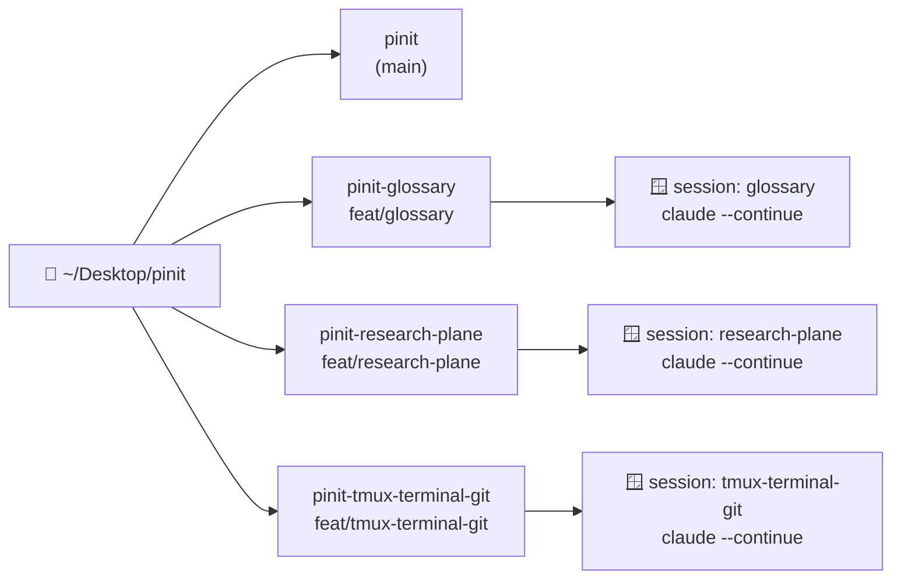

Bài [Chạy nhiều agent Claude Code song song với git worktree + tmux](/blog/multi-agent-claude-code-worktree-tmux) kể chuyện **dựng** setup. Bài này kể chuyện **sống** với nó: sau vài tháng chạy thật, script `agents` đã dày thêm một nắm lệnh và một nắm guard — và gần như mọi guard đều sinh ra từ một lần hỏng cụ thể.

Điểm chung của những lần hỏng đó: **không có gì báo lỗi cả.** `git status` xanh, `claude mcp list` báo `✔ Connected`, process exit 0. Vì vậy script bây giờ thiên về *in cảnh báo rồi từ chối làm* hơn là đoán giúp.

<!-- truncate -->

---

## Mục lục

1. [Mô hình: 1 worktree = 1 branch = 1 session = 1 agent](#1-mô-hình)
2. [Bảng lệnh `agents` — 14 lệnh làm gì](#2-bảng-lệnh-agents)
3. [Vòng đời một task — 9 bước từ worktree tới merge](#3-vòng-đời-một-task)
4. [Mọi lệnh git trong script, gom về một chỗ](#4-mọi-lệnh-git-trong-script)
5. [12 ca lỗi đã gặp và cách khắc phục](#5-12-ca-lỗi-đã-gặp)
6. [Vì sao tmux chứ không phải Terminal](#6-vì-sao-tmux-chứ-không-phải-terminal)
7. [Bẫy vận hành cần nhớ](#7-bẫy-vận-hành-cần-nhớ)

---

## 1. Mô hình

Một câu tóm tắt toàn bộ setup:

> **1 worktree = 1 branch = 1 tmux session = 1 agent.**



Ba điều cần nhớ, vì mọi hành vi lạ của script đều suy ra được từ chúng:

**(1) Context của Claude gắn với CWD, không gắn với tên agent.** `claude --continue` nối lại phiên gần nhất **của thư mục đó**. Hệ quả rất tiện: kill agent rồi tạo lại ở cùng worktree = làm tiếp việc cũ, không mất gì. Đây là lý do `agents new` an toàn còn `ai-devkit agent start` thì không (xem [Ca 12](#ca-12--ai-devkit-start-làm-mất-context)).

**(2) Danh sách agent tự suy ra từ `git worktree list`,** không hard-code ở đâu cả:

```bash
# pinit-glossary  -> glossary
# pinit-blog-scp  -> blog-scp
# pinit (gốc)     -> main
```

Thêm worktree không phải sửa script. Đổi lại, **đặt tên thư mục sai quy ước `pinit-<name>` là hỏng cả dây**, vì tên agent chính là phần còn lại sau khi cắt tiền tố.

**(3) `ai-devkit` tự discover các phiên `claude` này.** Ta bật agent bằng tmux, nhưng `ai-devkit agent list/console/send` vẫn quản lý được — nên bài này có hai hệ tên song song, và đó cũng là một cái bẫy ([Ca 11](#ca-11--senddetail-gọi-sai-tên)).

Đường dẫn gốc: `~/Desktop/pinit`. Worktree `main` ở `~/Desktop/pinit/pinit` — **mọi lệnh git cấp repo đều chạy ở đây** (`git -C "$MAIN" ...`).

---

## 2. Bảng lệnh `agents`

Script là `~/bin/pinit-agents.sh`, gọi qua alias `agents`. 14 lệnh, chia làm 4 nhóm.

### Nhóm 1 — vòng đời agent

```bash
agents create <name> [branch]   # worktree mới từ origin/main + npm install + bật agent
agents up                       # mở lại mọi agent feature còn thiếu (bỏ qua main)
agents new <name>               # tạo/TÁI TẠO 1 agent (tự --continue)
agents open <name>              # attach/nhảy vào 1 agent
agents kill <name>              # kill 1 agent
agents kill-all                 # kill tất cả (hỏi xác nhận)
agents rm <name>                # kill agent + gỡ worktree (branch giữ lại)
```

Bốn lệnh dễ lẫn nhau nhất:

| Lệnh | Worktree | Session tmux | Dùng khi |
|---|---|---|---|
| `create` | **tạo mới** | tạo mới | bắt đầu một mảng việc mới |
| `new` | giữ nguyên | **kill rồi tạo lại** | agent treo, hoặc cần nạp config MCP mới |
| `open` | giữ nguyên | giữ nguyên, chỉ nhảy vào | xem agent đang làm gì |
| `rm` | **gỡ bỏ** | kill | task đã merge, dọn dẹp |

> ⚠️ `new` **kill** session cùng tên trước khi tạo lại. Chạy nó *từ trong chính session đó* là tự sát giữa chừng — xem [Ca 9](#ca-9--agents-new-tự-giết-chính-nó).

### Nhóm 2 — quan sát

```bash
agents ls            # trạng thái worktree + danh sách ai-devkit discover, cạnh nhau
agents detail <name> # 20 dòng cuối của một agent
agents console       # session 'console' chia 2 pane (console trên, shell dưới)
```

`agents ls` in **hai** danh sách chứ không phải một — bảng tmux bên trên, bảng `ai-devkit agent list` bên dưới. Chính là chỗ để đối chiếu khi tên ngắn không khớp tên dài.

### Nhóm 3 — điều khiển & đồng bộ

```bash
agents send <name> "lời nhắn"   # gửi tin cho agent, không cần TUI
agents sync                     # đồng bộ mọi worktree với origin/main
agents mcp-fix                  # vá entry memory trong .mcp.json, mọi worktree
agents help                     # in phần usage
```

`agents send` và `agents detail` là **đường dự phòng khi console lag**: chúng gọi thẳng CLI, không dựng TUI nào cả.

### Alias và biến môi trường

```bash
# alias các lệnh
add=create   resume=up    recreate=new   attach=open
status=ls    remove=rm    msg=send       con=console
```

```bash
PINIT_AGENT_MODEL=claude-fable-5   # đổi model cho mọi agent (mặc định: claude-opus-5)
PINIT_AGENT_CMD='sleep 999'        # override lệnh phóng — tiện để test script
```

`--model` được ép ngay lúc phóng pane là có chủ ý: **default toàn cục không áp cho phiên `--continue`**, phiên cũ nhớ model cũ.

---

## 3. Vòng đời một task

Đây là đường đi đầy đủ của một task, từ lúc chưa có thư mục nào tới lúc branch bị xoá khỏi remote.

<style>
/* embed=1 ẩn toolbar/header/cards và đặt overflow:hidden, nên chiều cao phải đủ —
   thiếu là cắt mất hình chứ không cuộn được. Tỉ lệ đo thật: ~1.37 lần bề rộng khi
   cột ≥ 700px, nhưng mobile lệch hẳn (380px cần 643px) nên tách media query. */
.archify-embed {
  display: block;
  width: 100%;
  aspect-ratio: 852 / 1180;
  border: 1px solid rgba(127, 127, 127, 0.28);
  border-radius: 12px;
}
@media (max-width: 600px) {
  .archify-embed { aspect-ratio: auto; height: 760px; }
}
</style>

<figure style="margin: 2em 0;">
  <iframe
    class="archify-embed"
    src="/diagrams/vong-doi-task.html?embed=1"
    title="Sơ đồ vòng đời một task"
    loading="lazy"
  ></iframe>
  <figcaption style="margin-top: 0.9em; font-size: 0.9em; line-height: 1.6; opacity: 0.78;">
    Mỗi hàng là một người/thứ chịu trách nhiệm, nên đọc theo hàng sẽ thấy ngay
    <strong>chỗ agent dừng lại và người tiếp quản</strong>. Hàng cuối màu đỏ là hai lý do
    <code>agents sync</code> bỏ dở một worktree.
    Muốn bản tương tác — bấm từng ô để soi đường đi lên/xuống, chạy lại hiệu ứng, hay export
    PNG/SVG/WebM — thì
    <a href="/diagrams/vong-doi-task.html" target="_blank" rel="noopener">mở riêng ↗</a>.
  </figcaption>
</figure>

Bốn lằn ranh trong sơ đồ, gom lại cho dễ nhớ — mỗi cái đều là chỗ từng có người (hoặc agent) bước hụt:

- **Agent commit local rồi dừng.** Push là việc của người, không phải của agent.
- **`agents sync` không tự resolve conflict.** Nó dừng và báo, chờ bạn vào xử lý tay.
- **Merge trên GitHub chọn merge commit, không Squash.** Squash gộp mất các commit đã tách bạch.
- **`agents rm` giữ lại branch.** Phải tự `branch -d` và `push origin --delete`.

### Bước 1 — tạo worktree + agent

```bash
agents create glossary                 # branch mặc định: feat/glossary
agents create hotfix fix/login-500     # hoặc chỉ định branch
```

Một lệnh làm 6 việc, và **mỗi việc là một bài học cũ**:

1. `git fetch origin` — lấy code mới nhất.
2. `git worktree add -b <branch> <path> origin/main` — tạo thư mục + branch.
3. `git branch --unset-upstream` — gỡ tracking ([Ca 7](#ca-7--git-push-trần-bắn-thẳng-vào-main)).
4. Vá `.mcp.json` ([Ca 5](#ca-5--npx--symlink-giết-mcp-memory-im-lặng), [Ca 6](#ca-6--ghi-đè-mcpjson-làm-bay-entry-server-khác)).
5. `npm install` theo `.nvmrc` ([Ca 10](#ca-10--worktree-mới-thiếu-node_modules)).
6. Bật agent trong tmux session mới.

### Bước 2 — vào làm việc

```bash
agents open glossary
```

Agent nhận task từ board (Plane), tự chuyển state sang *In Progress* rồi làm.

### Bước 3 — theo dõi nhiều agent cùng lúc

```bash
agents ls                          # ai đang chạy, ai ngủ
agents console                     # 2 pane: console trên, shell dưới
agents send glossary "nhận task đi"
agents detail glossary             # 20 dòng cuối
```

### Bước 4 — agent commit, KHÔNG push

Quy ước trong `CLAUDE.md`: agent chạy `npm run lint`, commit local, comment tóm tắt lên board, chuyển state sang *In Review*. **Push là việc của người.** Lý do đơn giản: push là hành động ra ngoài, và một agent đọc nhầm ngữ cảnh mà push thì không có nút undo nào cho remote.

### Bước 5 — push

```bash
git push -u origin feat/glossary
```

Lần đầu **bắt buộc** có `-u <branch>` — script cố ý gỡ upstream để `git push` trần không bắn nhầm vào `main`. Từ lần thứ hai, `git push` trần là đủ.

### Bước 6 — tạo PR

```bash
gh pr create --base main --head feat/glossary \
  --title "feat(glossary): thêm deep-link cho từng thuật ngữ" \
  --body-file /đường/dẫn/body.md
```

Dùng `--body-file` thay vì `--body "..."` khi mô tả dài: nội dung nhiều dòng, backtick và emoji nhét vào một chuỗi shell là nguồn lỗi quote vô tận.

### Bước 7 — merge

Trên GitHub chọn **"Create a merge commit"** — tương đương `git merge --no-ff`. Đừng chọn *Squash*: nó gộp những commit đã cố tình tách bạch thành một cục, và lịch sử "mỗi commit một thay đổi logic" mất sạch ý nghĩa.

### Bước 8 — đồng bộ mọi worktree

```bash
agents sync
```

Với từng worktree: `main` thì `pull --ff-only`, còn lại thì `rebase origin/main`. Trước khi rebase nó gỡ cờ và trả `.mcp.json` về bản git, xong thì vá lại ([Ca 2](#ca-2--mcpjson-skip-worktree-chặn-rebase)). `package-lock.json` đổi thì tự `npm install` ([Ca 8](#ca-8--package-lockjson-đổi-mà-quên-npm-install)).

Branch **đã push** thì sync **bỏ qua**, không rebase ([Ca 3](#ca-3--rebase-branch-đã-push)), và in ra một trong hai câu:

- `"đã merge vào origin/main — bỏ qua"` → dọn được rồi, sang bước 9.
- `"đã push lên origin/<br> — KHÔNG rebase"` → merge PR trước rồi sync lại, hoặc tự `git merge origin/main` và chấp nhận một merge commit.

Conflict thì sync **DỪNG**, không tự resolve. Vào worktree xử lý tay (`git rebase --continue` hoặc `--abort`) rồi chạy lại. Trong lúc chờ, `.mcp.json` đang ở bản git và chưa có cờ `skip-worktree` — **cố ý** ([Ca 4](#ca-4--vá-mcpjson-giữa-lúc-rebase-còn-dở)).

### Bước 9 — dọn

```bash
agents rm glossary                                    # kill agent + gỡ worktree
git -C ~/Desktop/pinit/pinit branch -d feat/glossary   # xoá branch local
git -C ~/Desktop/pinit/pinit push origin --delete feat/glossary
```

`agents rm` **giữ lại branch** — gỡ worktree và xoá nhánh là hai quyết định khác nhau. Worktree còn thay đổi chưa commit thì nó từ chối và in ra lệnh `--force` để bạn tự quyết, chứ không tự xoá giúp.

---

## 4. Mọi lệnh git trong script

Phần này gom tất cả lệnh git — cả lệnh nằm trong script lẫn lệnh phát sinh khi làm — về một chỗ, kèm câu trả lời cho "vì sao lại cần lệnh này".

### 4.1 Nhóm worktree

| Lệnh | Công dụng |
|---|---|
| `git worktree list --porcelain` | Liệt kê worktree ở định dạng máy đọc được. Script parse ra tên + đường dẫn agent. |
| `git worktree add -b <br> <path> origin/main` | Tạo **thư mục làm việc thứ hai** cho cùng một repo, kèm branch mới tách từ `origin/main`. |
| `git worktree remove <path>` | Gỡ worktree. Từ chối nếu còn thay đổi chưa commit — đó là tính năng, không phải phiền phức. |

`--porcelain` là quy ước của git: bản in cho **script**, ổn định giữa các version, khác với bản in cho **người** (có màu, có căn lề, có thể đổi bất cứ lúc nào). Cứ parse output git trong script là phải hỏi "lệnh này có `--porcelain` không".

Vì sao worktree mà không phải `git clone` nhiều lần: worktree **dùng chung một `.git`**. Fetch một lần là mọi worktree thấy; branch và commit là tài sản chung. Clone nhiều lần thì mỗi bản là một vũ trụ riêng, đồng bộ chéo rất mệt.

### 4.2 Nhóm branch & upstream

```bash
git branch --show-current        # tên branch hiện tại (rỗng nếu detached HEAD)
git branch --unset-upstream      # gỡ liên kết branch local <-> branch remote
git branch -d feat/glossary      # xoá branch local, TỪ CHỐI nếu chưa merge
git push -u origin feat/glossary # push + đặt upstream
git push origin --delete feat/glossary  # xoá branch trên remote
```

Cặp `--unset-upstream` / `push -u` là trung tâm của [Ca 7](#ca-7--git-push-trần-bắn-thẳng-vào-main). Cần hiểu: **upstream là "đích mặc định của `git push` trần"**. `worktree add -b <br> ... origin/main` để lại upstream trỏ về `origin/main` chứ không phải `origin/<br>` — nghĩa là gõ `git push` trên branch feature sẽ đẩy thẳng vào `main`. Gỡ upstream đi thì `git push` trần báo lỗi thay vì làm chuyện tày đình, và lần push đầu buộc phải nói rõ tên.

`branch -d` (chữ thường) từ chối xoá branch chưa merge. `-D` thì xoá bất chấp — trong workflow này gần như không bao giờ cần đến.

### 4.3 Nhóm "hỏi git một câu"

Đây là các lệnh script dùng để **quyết định**, không dùng để thay đổi gì:

```bash
git rev-parse --verify --quiet refs/remotes/origin/$br   # branch này có trên remote chưa?
git merge-base --is-ancestor HEAD origin/main            # HEAD đã nằm trong main chưa?
git hash-object package-lock.json                        # "vân tay" nội dung file
git ls-files --error-unmatch .mcp.json                   # file này git có theo dõi không?
```

- `rev-parse --verify --quiet` trả về mã thoát 0/1 thay vì in lỗi — đúng thứ cần cho `if`.
- `merge-base --is-ancestor A B` hỏi: *A có phải tổ tiên của B không?* Nếu `HEAD` là tổ tiên của `origin/main`, nghĩa là mọi commit của branch này đã có trong main → **đã merge rồi, dọn được**. Đây là cách kiểm tra "đã merge chưa" đáng tin hơn nhiều so với đọc log.
- `hash-object` cho ra SHA của nội dung file. Chụp trước và sau rebase, khác nhau = file đã đổi → cần `npm install`. Rẻ hơn và chắc hơn so với so sánh timestamp.

### 4.4 Nhóm `.mcp.json` — cờ `skip-worktree`

```bash
git update-index --skip-worktree .mcp.json     # bảo git: coi như file này chưa từng đổi
git update-index --no-skip-worktree .mcp.json  # gỡ cờ
git checkout -- .mcp.json                      # trả file về đúng bản trong git
```

Bối cảnh: `.mcp.json` **nằm trong repo**, nhưng mỗi máy cần một đường dẫn tuyệt đối khác nhau cho MCP server memory. Không muốn path riêng của máy lọt vào commit → đặt cờ `skip-worktree`.

Cái giá của cờ này: **git nói dối bạn một cách có hệ thống.** `git status` xanh trong khi file thực sự khác bản git. Và hễ `origin/main` có commit đụng vào chính path đó, checkout sẽ chết:

```
error: Your local changes to the following files would be overwritten by checkout: .mcp.json
error: could not detach HEAD
```

Đây **không phải conflict**: không có rebase nào đang dở để `--continue`, worktree đứng nguyên ở HEAD cũ, mà `git status` vẫn xanh. Nên trình tự bắt buộc là: gỡ cờ → `checkout --` trả file về bản git → rebase → vá lại → đặt cờ lại.

> 💡 Dễ nhớ: `skip-worktree` là "git ơi mặc kệ file này". Mặc kệ được lúc bình thường, nhưng lúc git cần ghi đè file đó thì nó không mặc kệ nữa.

### 4.5 Nhóm đồng bộ

```bash
git fetch origin                 # tải commit mới về, KHÔNG đụng working tree
git pull --ff-only origin main   # dùng cho worktree main
git rebase origin/main           # dùng cho worktree feature
git merge --no-ff                # dùng khi merge feature về main
```

Bốn lệnh này chia việc rất rạch ròi:

- **`fetch`** chỉ cập nhật `origin/*` ở local. An toàn tuyệt đối, chạy lúc nào cũng được. Mọi lệnh trong script bắt đầu bằng `fetch` là vì thế.
- **`pull --ff-only`** ở `main`: chỉ chấp nhận tua thẳng. Nếu `main` local đã lệch (có commit lạ) thì nó **báo lỗi thay vì tạo merge commit** — đúng thứ ta muốn, vì `main` local không nên có commit riêng bao giờ.
- **`rebase origin/main`** ở branch feature: chép commit của mình lên đỉnh main mới nhất, lịch sử thẳng, không có merge commit rác. Đổi lại nó **viết lại SHA** — nên chỉ an toàn khi branch chưa push.
- **`merge --no-ff`** khi đưa feature về main: ép tạo một merge commit ngay cả khi fast-forward được. Merge commit đó là cái mốc "đây là một feature", đọc `git log --first-parent` ra đúng danh sách feature đã vào.

> ⚠️ Ba lệnh bị cấm trong workflow này: `git push --force`, `git reset --hard`, và mọi thứ sửa lịch sử đã push. Guard trong `agents sync` sinh ra chính vì rebase một branch đã push sẽ đẩy bạn vào thế **chỉ còn `--force` mới chữa được** — mà `--force` thì bị cấm. Cách thoát duy nhất là đừng bước vào.

### 4.6 Lệnh phát sinh khi làm

Không nằm trong script, nhưng gặp mỗi ngày:

```bash
git status                       # trước commit, và sau npm install (kiểm lock file)
git rebase --continue            # sau khi resolve conflict
git rebase --abort               # bỏ cuộc, trả worktree về trạng thái trước rebase
git log --oneline -5             # lấy SHA ngắn để dán vào comment trên board
gh pr create --base main --head <br> --title ... --body-file ...
```

`git rebase --abort` là nút thoát hiểm đáng nhớ nhất: đang rebase dở, rối quá, không hiểu gì nữa → `--abort` đưa mọi thứ về đúng lúc trước khi gõ `rebase`. Không mất commit nào.

---

## 5. 12 ca lỗi đã gặp

Mỗi ca dưới đây từng làm hỏng việc thật. Xếp theo mức độ hay gặp.

### Ca 1 — MCP plane trả 403, mà health check vẫn ✔

**Triệu chứng:** `HTTP 403 Given API token is not valid`, trong khi `claude mcp list` báo `✔ Connected`.

**Nguyên nhân:** tmux chạy command của pane qua `sh -c`, **không** qua zsh → `~/.zshrc` không bao giờ được đọc → agent thừa kế env của **tmux server**. Server tạo từ lâu thì thiếu mọi biến khai sau đó, nên `PLANE_API_KEY` rỗng và MCP nhận nguyên chuỗi literal `${PLANE_API_KEY}`.

Vì sao health check không bắt được: server chỉ kiểm biến **rỗng hay không**. Chuỗi literal `${PLANE_API_KEY}` thì không rỗng nên lọt qua.

**Sửa** — helper bọc lệnh phóng pane:

```bash
login_cmd() {
  local q="'\\''"            # thay mỗi ' trong cmd thành '\'' cho vừa dấu nháy đơn
  printf "zsh -ic '%s'" "${1//\'/$q}"
}
```

🔑 Phải là `-ic`, **không** phải `-lc`. Export nằm trong `~/.zshrc`, mà zsh chỉ source file này khi **interactive**. Số đo thật, gõ ngay trong pane:

```bash
zsh -lc 'echo ${#PLANE_API_KEY}'   # -> 0    ← login nhưng không interactive: vẫn rỗng
zsh -ic 'echo ${#PLANE_API_KEY}'   # -> 42   ← đúng
sh  -c  'echo ${#PLANE_API_KEY}'   # -> 0    ← hành vi cũ, trước khi vá
```

**Bài học chung:** env hỏng nằm ở **server**, không ở pane — nên mở pane mới không cứu được. Kiểm chứng:

```bash
tmux show-environment -g | grep PLANE_API_KEY   # rỗng = server thiếu biến
```

Chữa tạm không cần restart agent, gõ từ một pane đã có biến:

```bash
tmux set-environment -g PLANE_API_KEY "$PLANE_API_KEY"
```

Giới hạn: chỉ áp cho session tạo **sau** đó. Process đang chạy không nhận env mới.

> 💡 Muốn test tầng auth thì gọi một tool đọc bất kỳ, đừng nhìn health check. Health check trả lời câu "server có sống không", không trả lời câu "token có đúng không".

### Ca 2 — `.mcp.json` skip-worktree chặn rebase

**Triệu chứng:** `error: could not detach HEAD`, `git status` vẫn xanh, worktree đứng nguyên tại HEAD cũ.

**Sửa:** `sync_one` gỡ cờ và `checkout -- .mcp.json` **trước** khi rebase, vá lại workaround **sau**. Chi tiết cơ chế ở [mục 4.4](#44-nhóm-mcpjson--cờ-skip-worktree).

### Ca 3 — rebase branch đã push

**Nguyên nhân:** rebase làm local lệch `origin/<branch>`, mà chữa lệch thì chỉ còn `--force` — cũng bị cấm nốt. Vào thế kẹt.

**Sửa:** guard trong `sync_one`, và đặt **trước** đoạn gỡ cờ `.mcp.json`. Bỏ qua sớm thì không đụng vào file đó chút nào, khỏi phải vá lại — thứ tự của hai guard cũng là một quyết định.

### Ca 4 — vá `.mcp.json` giữa lúc rebase còn dở

**Nguyên nhân:** rebase lỗi mà vá lại `.mcp.json` ngay thì chính bản vá đó chặn `git rebase --continue`.

**Sửa:** khi rebase fail, **cố ý** để nguyên `.mcp.json` ở bản git và chưa set cờ, kèm cảnh báo in ra màn hình. Nghĩa là trong lúc đó MCP memory đang chạy bản `npx` (chết im lặng trên Node ≥ 26) — chấp nhận đánh đổi cho tới khi rebase xong.

### Ca 5 — `npx` + symlink giết MCP memory im lặng

**Triệu chứng:** MCP báo `-32000`, server exit 0, không một dòng log.

**Nguyên nhân:** `npx` chạy bin qua symlink, nên guard `argv[1] === import.meta.url` trong `dist/index.js` không khớp trên Node ≥ 26 → server tự thoát, tưởng mình "không phải entry point".

**Sửa:** trỏ `node` thẳng vào file `dist/index.js` thật, và phải chạy qua `realpath` — path còn sót symlink thì guard lại gãy y hệt.

### Ca 6 — ghi đè `.mcp.json` làm bay entry server khác

**Nguyên nhân:** repo đã commit thêm một server khác (`agentic-mermaid`) vào `.mcp.json`, mà file thì đang `skip-worktree` — clobber cả file một phát là entry đó bay mất và **git không hé một lời**.

**Sửa:** chỉ patch đúng `.mcpServers.memory` bằng `jq`, không ghi đè cả file:

```bash
jq --arg e "$entry" '.mcpServers.memory = {command:"node", args:[$e]}' "$file" > "$tmp"
```

Không có `jq` → **từ chối sửa**, in hướng dẫn sửa tay. File không parse được → giữ nguyên, không đụng vào. Nguyên tắc: thà không làm gì còn hơn làm hỏng im lặng.

### Ca 7 — `git push` trần bắn thẳng vào main

**Nguyên nhân:** `git worktree add -b <br> <path> origin/main` để lại upstream = `origin/main`.

**Sửa:** `git branch --unset-upstream` ngay sau khi tạo worktree. Chi tiết ở [mục 4.2](#42-nhóm-branch--upstream).

### Ca 8 — `package-lock.json` đổi mà quên `npm install`

**Nguyên nhân:** rebase kéo về lock file mới, dependency chưa cài → MCP chết im lặng.

**Sửa:** chụp `git hash-object package-lock.json` trước và sau rebase, khác nhau thì cài lại.

### Ca 9 — `agents new` tự giết chính nó

**Nguyên nhân:** `cmd_new` gọi `tmux kill-session` cho session cùng tên trước khi tạo lại. Chạy nó từ **trong chính session đó** thì tự sát giữa chừng.

**Sửa:** luôn chạy `agents new <name>` từ một session tmux khác:

```
prefix + s        # chọn session khác (console, research-plane...)
agents new <name>
agents open <name>
```

### Ca 10 — worktree mới thiếu `node_modules`

**Triệu chứng:** `npm run lint` chết với `sh: next: command not found`. Vì lint là bước bắt buộc trước commit, agent kẹt ngay từ task đầu tiên.

**Nguyên nhân:** git không theo dõi `node_modules` nên worktree mới luôn trống. Kèm một bẫy phụ: repo pin node 22 qua `.nvmrc` còn shell mặc định là v26 — cài sai version thì `package-lock.json` bị viết lại.

**Sửa:** helper `npm_install_at()` gọi ngay trong `agents create` và dùng lại trong `sync_one`. Nó tự `nvm use` theo `.nvmrc` của worktree, chạy trong subshell với `set +u` (`nvm.sh` đụng biến chưa khai, gặp `set -u` là chết ngay). Chạy tay khi cần:

```bash
export NVM_DIR="$HOME/.nvm"; . "$NVM_DIR/nvm.sh"
nvm use 22
npm install --no-audit --no-fund
```

Cài xong kiểm `git status` — **`package-lock.json` không được đổi**. Nếu đổi thì node/npm đang sai version, đừng commit lock file đó.

### Ca 11 — `send`/`detail` gọi sai tên

**Nguyên nhân:** hai hệ tên khác nhau — tmux dùng tên ngắn (`glossary`), ai-devkit dùng tên dài (`pinit-glossary-16713`).

**Sửa:** tên ngắn thường khớp nhờ so trùng một phần (`--id glossary`). Không chắc thì `agents ls` — nó in cả hai danh sách cạnh nhau.

### Ca 12 — `ai-devkit start` làm mất context

**Sửa:** dùng `agents new <name>`, nó chạy `claude --continue` nên nối lại phiên cũ của worktree.

---

## 6. Vì sao tmux chứ không phải Terminal

Câu hỏi hợp lý: macOS đã có Terminal, iTerm2 có tab và split pane sẵn — sao còn thêm một lớp tmux nữa?

Vì setup này cần **bốn** thứ mà tab của terminal app không cho:

### 6.1 Phiên sống độc lập với cửa sổ

Agent chạy `claude` là process dài hơi. Với tab của Terminal, **đóng cửa sổ là process chết** (SIGHUP). Với tmux, cửa sổ chỉ là *client* — session sống trong tmux server. Đóng terminal, đăng xuất, đổi từ iTerm sang Ghostty: agent vẫn đang gõ.

Đây không phải chuyện tiện tay. Bốn agent đang làm dở bốn task, đóng nhầm một cửa sổ mà mất cả bốn là mất hàng giờ context.

### 6.2 Tạo và điều khiển được bằng script

Đây mới là lý do quyết định. Cả script `agents` đứng được là nhờ đúng một khả năng: **tmux tạo được session không cần giao diện**.

```bash
tmux new-session -d -s glossary -c /path/to/worktree "claude --continue"
```

Cờ `-d` = detached: session được tạo và chạy nền, không cần ai nhìn vào nó. Terminal.app không có API tương đương — muốn tự động hoá thì phải nhờ AppleScript giả lập gõ phím, vốn mong manh và phụ thuộc giao diện đang hiện.

Từ khả năng đó mới có tiếp:

```bash
tmux has-session -t glossary        # agent này còn sống không?  -> agents ls
tmux kill-session -t glossary       # tắt một agent               -> agents kill
tmux switch-client -t glossary      # nhảy sang agent khác        -> agents open
tmux split-window -v                # dựng layout 2 pane          -> agents console
```

Toàn bộ `agents ls / new / open / kill / console` chỉ là những lệnh này khoác thêm cái tên dễ nhớ. Không có tmux thì mỗi lệnh đó phải làm bằng tay, và "bật lại 4 agent sau khi restart máy" biến từ một dòng thành mười phút click.

### 6.3 Một không gian tên phẳng cho agent

tmux có **session được đặt tên**, tra cứu bằng tên. Nhờ vậy `tên tmux session = tên thư mục worktree bỏ tiền tố` là một ánh xạ đủ dùng, và script không cần lưu bảng trạng thái nào cả — cứ hỏi tmux và hỏi git là ra.

Tab của terminal app thì chỉ có thứ tự và tiêu đề, không phải định danh để tra. Muốn biết "agent glossary đang ở tab nào" là phải tự nhớ.

### 6.4 Tách bạch renderer và phiên

TUI của `ai-devkit agent console` vẽ lại màn hình liên tục và **lag nặng** trên terminal chậm. Vì tmux tách client khỏi session, ta chữa được bằng cách đổi client: mở tmux từ một terminal tăng tốc GPU (Ghostty, WezTerm, kitty), giữ nguyên mọi session. Đổi renderer mà không đụng gì vào việc đang chạy.

Cộng thêm hai mẹo nhỏ nhưng hiệu quả: cho console vào **pane nhỏ** (ít pixel phải vẽ hơn), và khi lag quá thì **bỏ TUI hẳn** — `agents send` với `agents detail` làm được cùng việc qua CLI.

### Khi nào Terminal là đủ

Công bằng mà nói: một project, một dev, ngồi một máy, không cần tự động hoá — thì tab của iTerm2 là đủ và nhẹ đầu hơn. tmux đáng giá khi bạn cần **nhiều phiên sống lâu, được script điều khiển, tra bằng tên**. Setup nhiều agent này chạm cả ba điều kiện cùng lúc.

> Nói ngắn: Terminal cho bạn **cửa sổ**. tmux cho bạn **phiên** — và script chỉ điều khiển được phiên.

---

## 7. Bẫy vận hành cần nhớ

- `agents up` **bỏ qua `main`** — worktree main là nơi chạy console/integrator, không cần agent riêng. Muốn bật thì `agents new main`.
- `agents new` khác `agents open`: `new` kill rồi tạo lại, `open` chỉ nhảy vào.
- Sau `agents mcp-fix` phải `agents new` từng agent đang chạy, vì **config MCP chỉ đọc lúc khởi động**.
- `agents rm` **không xoá branch** — phải tự `branch -d` và `push origin --delete`.
- Đặt tên worktree đúng quy ước `pinit-<name>`, vì tên agent suy ra bằng cách cắt tiền tố đó.
- Console lag quá thì bỏ TUI, dùng `agents send` + `agents detail`.

### Điều đáng nhớ nhất

Nhìn lại 12 ca ở mục 5, gần như tất cả đều **hỏng im lặng**: git báo sạch, health check báo xanh, process exit 0. Không ca nào bị bắt bởi một dòng lỗi đỏ.

Đó là lý do script bây giờ đầy những đoạn *kiểm tra rồi từ chối làm*: không có `jq` thì không sửa `.mcp.json`; branch đã push thì không rebase; rebase lỗi thì dừng chứ không tự resolve. Một script tự động hoá tốt không phải là script làm được nhiều nhất, mà là script **biết chỗ nào nó không nên đoán**.
