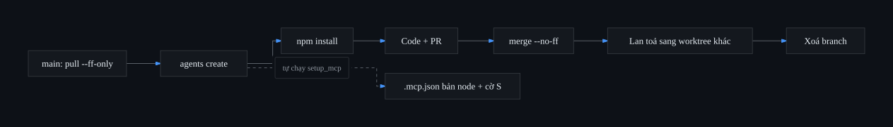
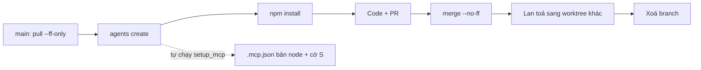

# Playbook: worktree mới + thêm skill/MCP

Đúc từ phiên 2026-08-22 (cài `agentic-mermaid`, chuyển 42 sơ đồ sang pre-render SVG, PR #15 + #16). Mọi con số và lệnh trong đây đã được kiểm chứng trên máy, không phải suy đoán.

---

## Vòng đời một feature



<details><summary>Mã nguồn sơ đồ</summary>



</details>

---

## 3 nguyên tắc gốc

Nhớ ba cái này là suy ra được cả quy trình.

**1 — Config có hai tầng, không bao giờ trộn trong một thao tác.**
Tầng *shareable* (skill, entry MCP mới, devDependency) đi vào git. Tầng *machine-specific* (workaround trỏ `memory` vào đường dẫn `dist` thật) apply lại ở local, **sau cùng**.

**2 — File `skip-worktree` thì thay đổi shareable phải đi qua git trước.**
Đúng điệu: gỡ cờ → lấy bản git sạch → sửa → commit → vá local → set lại cờ. Làm ngược là đẩy đường dẫn `/opt/homebrew/...` riêng của máy vào repo public.

**3 — Không để tool nào clobber cả file config.**
`init-agent`, `mcp-fix`, hay bất cứ script nào: chỉ patch đúng key cần patch, và chạy chúng **sau** khi cây làm việc đã có bản mới nhất.

---

## A. Tạo worktree cho feature

```bash
cd ~/Desktop/pinit/pinit
git pull --ff-only origin main        # main mới nhất TRƯỚC khi tách nhánh

agents create <ten-feature>           # tạo worktree từ origin/main + bật agent
cd ../pinit-<ten-feature>
npm install                           # node_modules KHÔNG đi theo worktree
```

> **Không phải `agents new`.** `agents new` chỉ *tái tạo agent* cho worktree **đã tồn tại** — chạy với tên chưa có nó báo `✗ không có worktree tên '<name>'`. Lệnh tạo worktree là `agents create <name> [branch]`, mặc định branch là `feat/<name>`.

> **Không cần `agents mcp-fix` ở bước này.** `cmd_create` đã gọi `setup_mcp` ngay sau `git worktree add` (`pinit-agents.sh:211`) — `.mcp.json` đã là bản node và đã mang cờ `S` trước khi agent chạy.

---

## B. Nếu feature này thêm skill hoặc MCP

Làm **ngay trong worktree feature**, và **commit riêng**, tách khỏi commit code.

### Skill

Đặt ở `.claude/skills/<tên>/SKILL.md`. **Không phải `skills/` ở root** — Claude Code không đọc chỗ đó.

Tool có lệnh init (kiểu `npx agentic-mermaid init-agent`) thì cứ chạy thẳng trong repo: nó tự phát hiện `.mcp.json` đã tồn tại và bỏ qua (`skipped (exists)`), còn `AGENTS.md` thì merge non-clobbering. Việc duy nhất phải làm thêm là `mv skills/<tên> .claude/skills/` rồi sửa dòng pointer trong `AGENTS.md`.

### MCP — điệu skip-worktree

```bash
git update-index --no-skip-worktree .mcp.json
git checkout -- .mcp.json                       # về bản git sạch (memory = npx)

jq '.mcpServers["<tên-mới>"] = {command:"node", args:["./node_modules/<pkg>/dist/server.js"]}' \
  .mcp.json > t && mv t .mcp.json

npm i -D <package>                              # bắt buộc nếu entry trỏ ./node_modules

git add .claude/skills/ .mcp.json AGENTS.md package.json package-lock.json
git commit -m "chore(<scope>): thêm skill <tên>"

agents mcp-fix                                  # vá memory về dist + set lại cờ S
git ls-files -v .mcp.json                       # verify: S .mcp.json
git status --short                              # verify: .mcp.json KHÔNG xuất hiện
```

Dùng **đường dẫn tương đối** `./node_modules/...` cho server mới — mọi worktree và mọi máy clone về đều chạy được.

Mở Claude Code **tại worktree này** rồi kiểm `/skills` và `/mcp` thấy tool mới.

---

## C. Code feature → PR → merge

Bình thường. Commit tool config đã tách riêng ở bước B nên diff review sạch, và sau này `git log -- .mcp.json` truy được ngay.

---

## D. Sau merge: lan toả sang các worktree khác


<details><summary>Mã nguồn sơ đồ</summary>


</details>

**Cách nhanh:** `agents sync` giờ đã gói trọn mục này cho mọi worktree — xem cuối tài liệu. Phần dưới là những gì nó làm, cần khi phải xử lý tay một worktree lẻ.

Ở **mỗi** worktree còn lại, đúng thứ tự:

```bash
git update-index --no-skip-worktree .mcp.json
git checkout -- .mcp.json
git pull --ff-only origin main

agents mcp-fix                          # SAU pull
npm install                             # deps mới

jq -r '.mcpServers|keys[]' .mcp.json    # verify đủ server
git ls-files -v .mcp.json               # verify: S
git status --short                      # verify: .mcp.json không dirty
```

**Bỏ được hai dòng đầu** nếu PR không đụng `.mcp.json` — lúc đó `git pull --ff-only` chạy thẳng.

---

## E. Dọn

```bash
git push origin --delete <branch>
git fetch origin --prune
git branch -d <branch>                  # -d chứ không -D, để git tự chặn nếu chưa merge thật
agents rm <ten-feature>                 # nếu xong hẳn; branch vẫn được giữ lại
```

Rà nhánh nào đã nằm trọn trong main:

```bash
for b in $(git for-each-ref --format='%(refname:short)' refs/remotes/origin | sed 's|^origin/||' | grep -vx -e main -e HEAD); do
  n=$(git rev-list --count "origin/$b" ^origin/main)
  [ "$n" = "0" ] && echo "  $b — đã merge, xoá được" || echo "  $b — CÒN $n commit riêng"
done
```

`git rev-list --count <branch> ^origin/main` trả `0` là bằng chứng mạnh nhất: không một commit nào của nhánh nằm ngoài main.

> **Đừng xoá `develop`.** Nó cũng ahead=0 nên nhìn y hệt một feature branch bỏ quên, nhưng `deploy.yml:7` trigger trên `[main, develop]` và `develop → staging` deploy tự động. Đây là nhánh môi trường sống.

---

## Bẫy đã trả học phí

| # | Bẫy | Triệu chứng | Cách tránh |
|---|---|---|---|
| 1 | Skill để ở `skills/` root | Claude Code không thấy skill, không báo lỗi gì | Đặt ở `.claude/skills/`. Chạy lại `init-agent` sẽ đẻ lại `skills/` root — xoá đi là xong |
| 2 | Sửa file `skip-worktree` rồi `git add` | Đường dẫn riêng của máy lọt vào repo public | Điệu ở mục B |
| 3 | Script `cat >` ghi đè cả `.mcp.json` | Entry MCP khác **biến mất im lặng** — git không báo vì file đang skip-worktree | Đã vá `setup_mcp` sang `jq`, chỉ patch key `memory` |
| 4 | `mcp-fix` **trước** khi pull | Vá bản cũ, công cốc — script chỉ giữ entry đã có, không bịa entry mới | Luôn pull trước |
| 5 | Quên `npm install` sau khi pull | MCP server **chết im lặng**, Claude Code chỉ thấy thiếu tool | `npm install` ở mỗi worktree sau pull |
| 6 | `git add -A` | Build artifact lọt vào commit — `tsconfig.tsbuildinfo` dính vào `9e0bb62` đúng kiểu này | `git add` từng file |
| 7 | `.gitignore` thiếu newline | `.env` + `MEMORY.md` dính thành `.envMEMORY.md`, **cả hai đều không được ignore** | `git check-ignore -v <file>` để kiểm, đừng đọc mắt thường |

---

## `agents sync` — đã vá, giờ gói trọn mục D

Bản cũ chỉ chạy `git rebase origin/main` cho từng worktree, **không đụng gì tới `.mcp.json`**. Tái hiện được lỗi trong sandbox:

```
error: Your local changes to the following files would be overwritten
       by checkout: .mcp.json
error: could not detach HEAD                                    rc=1
```

Worktree đứng nguyên ở HEAD cũ, mà `git status` vẫn báo **sạch** — nên nhìn vào không hiểu vì sao. Tệ hơn: thông điệp cũ khuyên `git rebase --continue`, trong khi **không có conflict và cũng chẳng có rebase nào đang dở**.

Bản mới (`sync_one` + `cmd_sync`) làm đúng trình tự mục D cho từng worktree:

1. gỡ cờ `skip-worktree` → `git checkout -- .mcp.json`
2. worktree `main` thì `pull --ff-only`, worktree feature thì `rebase origin/main`
3. `setup_mcp` vá lại `memory → dist` và set lại cờ `S`
4. so hash `package-lock.json` trước/sau — đổi thì tự `npm install`

Conflict thật thì dừng, **không tự resolve** (theo CLAUDE.md), và báo rõ rằng `.mcp.json` đang tạm ở bản git chưa có cờ — cố ý, vì vá lại lúc đó sẽ chặn chính `git rebase --continue`.

Playbook nhờ vậy rút còn:

```
agents create  →  làm  →  PR  →  merge  →  agents sync
```

Vẫn cần biết mục D làm gì: khi phải xử lý tay một worktree lẻ, hoặc khi `sync` dừng giữa chừng.

---

## Đính chính so với bản gợi ý ban đầu

| Gợi ý nói | Thực tế |
|---|---|
| `agents new <feature>` tạo worktree | Sai — `agents new` tái tạo agent cho worktree đã có. Lệnh đúng: `agents create` |
| Sau `agents create` phải chạy `agents mcp-fix` | Thừa — `cmd_create` đã gọi `setup_mcp` ở `pinit-agents.sh:211` |
| Chạy `init-agent` ở `/tmp` rồi copy sang | Không cần — chạy thẳng trong repo an toàn, nó tự skip `.mcp.json` và merge `AGENTS.md` non-clobbering |
| Còn 3 việc chờ: xoá remote branch, số phận worktree, dọn `tsbuildinfo` | Chỉ còn 1 — `tsbuildinfo` đã dọn ở PR #16 (merged), 14 remote branch đã xoá sạch. Còn mỗi số phận worktree `learn-system-design` |
| "Repo công ty cũng từng skip-worktree loại file này" | Không kiểm chứng được từ đây — không có dữ liệu |

Phần **nguyên tắc** (hai tầng config, skip-worktree đi qua git trước, không clobber) và **thứ tự mục D** thì đúng hoàn toàn.

---

*Repo này public — đã cân nhắc và giữ nguyên. Tài liệu có nhắc đường dẫn local (`~/Desktop/pinit/...`, `/opt/homebrew/...`) nhưng không chứa IP, hostname, token hay secret nào. Nếu sau này bổ sung, đừng đưa mấy thứ đó vào đây: chúng thuộc về Actions Secrets/Variables.*

*Đừng chuyển repo sang private để "giấu" tài liệu nội bộ: environment `production` đang có cổng duyệt `required_reviewers`, mà GitHub Free bỏ qua mọi protection rule ở repo private — merge vào `main` sẽ deploy thẳng lên prod không hỏi ai.*
