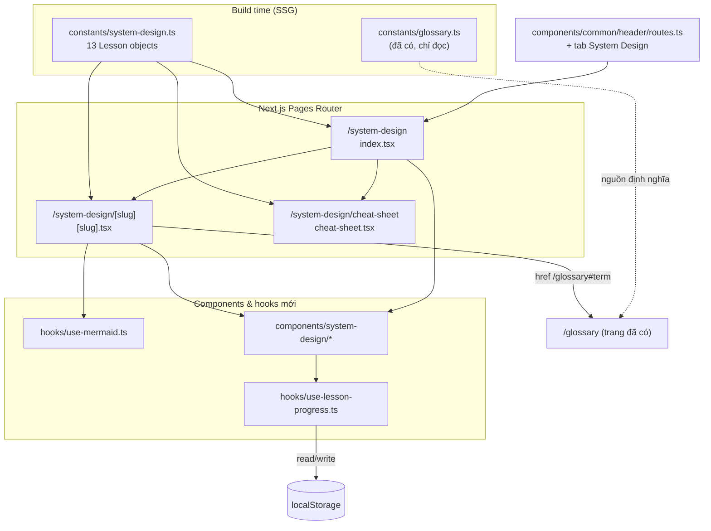

# System Design & Architecture — Feature `system-design`

> Lưu ý đọc: tài liệu này mô tả kiến trúc **của trang web dạy System Design**, không phải nội dung System Design được dạy trong đó.

## Architecture Overview
**What is the high-level system structure?**

Toàn bộ feature là **static frontend**: dữ liệu nằm trong repo dưới dạng TypeScript typed, Next.js pre-render ra HTML tại build time, không có backend/API/database. Trạng thái duy nhất ở runtime là tiến độ học lưu `localStorage`.



### Key components & responsibilities

| Thành phần | Trách nhiệm |
|---|---|
| `constants/system-design.ts` | Nguồn sự thật duy nhất: 13 lesson, mỗi lesson gồm metadata + nội dung có cấu trúc + flashcard + diagram |
| `constants/cheat-sheet.ts` *(hoặc field trong file trên)* | Dữ liệu cheat sheet: latency numbers, bảng chọn DB, khung 6 bước |
| `pages/system-design/index.tsx` | Lộ trình 13 buổi, thanh % tiến độ, ô search |
| `pages/system-design/[slug].tsx` | Render 1 buổi: sections, diagram, bảng, flashcard, nút đánh dấu hoàn thành |
| `pages/system-design/cheat-sheet.tsx` | Trang ôn gấp |
| `hooks/use-lesson-progress.ts` | Đọc/ghi tiến độ `localStorage`, an toàn với SSR |
| `hooks/use-mermaid.ts` | Render mermaid client-side, dynamic import |
| `components/system-design/*` | `LessonCard`, `Flashcard`, `ProgressBar`, `LessonSection`, `TermLink` |

### Technology stack & rationale
- **Next.js Pages Router + SSG**: khớp với phần còn lại của repo; nội dung tĩnh nên không cần SSR/ISR.
- **TypeScript typed constants** thay vì markdown/API: giữ đúng pattern `constants/glossary.ts` đang chạy tốt, type-check bắt lỗi thiếu field ngay lúc build, không phụ thuộc repo API `json-server-blog`.
- **MUI v5 + Emotion**: đồng bộ với toàn site, có sẵn theme sáng/tối.
- **`mermaid` dynamic import**: thư viện nặng và chỉ chạy được ở browser.

## Data Models
**What data do we need to manage?**

Đặt tại `constants/system-design.ts`.

```ts
/** Nhóm buổi học — dùng để tô màu và gom nhóm ở trang lộ trình. */
export type LessonTrack = 'Nền tảng' | 'Kiến thức lõi' | 'Framework' | 'Case study' | 'Luyện tập'

/** Một khối nội dung trong bài. */
export interface LessonSection {
  heading: string
  /** Các đoạn văn tiếng Việt. Thuật ngữ bọc trong [[Term]] để tự động link sang /glossary. */
  body: string[]
  /** Bảng so sánh / đánh đổi (tùy chọn). */
  table?: { headers: string[]; rows: string[][] }
  /** Mã mermaid; render client-side. */
  diagram?: string
  /** Ý cần nhớ, hiện dưới dạng callout. */
  callout?: string
}

/** Thẻ tự kiểm tra: câu hỏi phỏng vấn + gợi ý trả lời. */
export interface Flashcard {
  question: string
  answer: string
  /** Bẫy thường gặp khi trả lời câu này (tùy chọn). */
  pitfall?: string
}

export interface Lesson {
  /** Số thứ tự buổi 1..13 — quyết định thứ tự hiển thị. */
  order: number
  /** Slug URL, kebab-case. KHÔNG được là 'cheat-sheet' (đụng route tĩnh). */
  slug: string
  title: string
  /** Một câu mô tả cho trang lộ trình. */
  summary: string
  track: LessonTrack
  /** Từ khóa phục vụ search ở trang index. */
  keywords: string[]
  /** Ước lượng thời gian ôn, phút. */
  readingMinutes: number
  sections: LessonSection[]
  flashcards: Flashcard[]
  /** Một dòng chốt, dùng lại ở trang cheat-sheet. */
  keyTakeaway: string
  /** Thuật ngữ liên quan, link sang /glossary#term. */
  relatedTerms?: string[]
}

export const LESSONS: Lesson[] = [/* 13 mục */]
```

### Model cho cheat sheet

```ts
export interface CheatSheetTable {
  title: string
  headers: string[]
  rows: string[][]
}

export interface InterviewStep {
  order: number
  name: string
  /** Phút nên dành cho bước này trong buổi 45 phút. */
  minutes: number
  checklist: string[]
}
```

### Model cho trang tự luyện (buổi 13)

```ts
export interface MockPrompt {
  title: string
  /** Yêu cầu đề bài. */
  requirements: string[]
  /** Tiêu chí tự chấm sau khi trình bày. */
  rubric: string[]
}
```

### Trạng thái runtime

| Key | Nơi lưu | Kiểu | Ghi chú |
|---|---|---|---|
| `pinit:system-design:progress` | `localStorage` | `string[]` (mảng slug đã hoàn thành) | Lưu slug thay vì index để không vỡ khi đổi thứ tự buổi |

### Data flow
1. Build time: `LESSONS` được import trực tiếp vào page → `getStaticProps` / `getStaticPaths` sinh 13 trang tĩnh.
2. Client mount: `use-lesson-progress` đọc `localStorage` → set state → thanh % render.
3. Người dùng tick → ghi lại `localStorage` → state cập nhật → % đổi.
4. Client mount trang chi tiết: `use-mermaid` dynamic import `mermaid`, tìm node `.mermaid`, render SVG.

## API Design
**How do components communicate?**

**Không có API.** Feature hoàn toàn static, không gọi mạng, không cần authentication/authorization. Đây là quyết định có chủ đích (xem Design Decisions).

### Internal interfaces

```ts
// hooks/use-lesson-progress.ts
function useLessonProgress(): {
  /** Set các slug đã hoàn thành. Luôn rỗng ở lần render đầu (SSR-safe). */
  completed: Set<string>
  /** true sau khi đã đọc xong localStorage — dùng để tránh nháy 0%. */
  hydrated: boolean
  toggle: (slug: string) => void
  isCompleted: (slug: string) => boolean
  /** Số nguyên 0..100. */
  percent: number
  reset: () => void
}

// hooks/use-mermaid.ts
/** Render mọi node .mermaid bên trong containerRef. Chạy lại khi deps đổi. */
function useMermaid(containerRef: RefObject<HTMLElement>, deps?: unknown[]): void
```

### Route contract

| Route | File | Render | Ghi chú |
|---|---|---|---|
| `/system-design` | `pages/system-design/index.tsx` | SSG | Trang lộ trình |
| `/system-design/cheat-sheet` | `pages/system-design/cheat-sheet.tsx` | SSG | **File tĩnh thắng `[slug]`** — cấm lesson dùng slug này |
| `/system-design/[slug]` | `pages/system-design/[slug].tsx` | SSG + `getStaticPaths` | 13 slug; `fallback: false` → slug lạ ra 404 |

## Component Breakdown
**What are the major building blocks?**

### Frontend components mới (`components/system-design/`)

| Component | Vai trò | Ghi chú |
|---|---|---|
| `RoadmapProgress` | Thanh % + "x/13 buổi đã ôn" + nút reset | Chỉ render số sau khi `hydrated` |
| `LessonCard` | 1 hàng trong lộ trình: số buổi, tiêu đề, summary, track chip, thời lượng, checkbox | Checkbox `stopPropagation` để không kích hoạt link |
| `LessonSectionView` | Render 1 `LessonSection`: heading, body, table, diagram, callout | Parse `[[Term]]` thành `TermLink` |
| `Flashcard` | Thẻ lật: mặt trước câu hỏi, mặt sau gợi ý + pitfall | State cục bộ, không lưu |
| `FlashcardDeck` | Bộ thẻ của một buổi + nút "lật tất cả" | |
| `TermLink` | `<Link href="/glossary#Term">` | Phải `encodeURIComponent` term |
| `MockInterviewTimer` | Khung 45 phút chia bước cho buổi 13 | v1 chỉ là bảng tĩnh, không đếm ngược |

### Files sẽ tạo/sửa

**Tạo mới**
- `constants/system-design.ts`
- `hooks/use-lesson-progress.ts`
- `hooks/use-mermaid.ts`
- `components/system-design/*` (+ `index.ts`)
- `pages/system-design/index.tsx`
- `pages/system-design/[slug].tsx`
- `pages/system-design/cheat-sheet.tsx`
- `models/system-design.ts` *(nếu tách type khỏi constants theo pattern `models/`)*

**Sửa (tối thiểu)**
- `components/common/header/routes.ts` — thêm 1 mục
- `constants/index.ts` — export thêm
- `hooks/index.ts`, `models/index.ts` — export thêm

**Không đụng**: `pages/glossary.tsx`, `pages/glossary/muc-luc.tsx`, `pages/blog/*`, `pages/works/*`, `components/mermaid/MermaidFlowchart.tsx`.

### Storage layer
`localStorage` với 1 key duy nhất. Mọi truy cập bọc `try/catch` (Safari private mode ném `QuotaExceededError`; một số cấu hình chặn hẳn `localStorage`).

### Third-party
Chỉ `mermaid@11.12.0` — đã có sẵn trong `package.json`, **không thêm dependency mới**.

## Design Decisions
**Why did we choose this approach?**

### 1. Typed constants thay vì markdown hay API
- **Chọn**: `constants/system-design.ts`.
- **Loại**: markdown trong `blog/` (tái dùng pipeline nhưng nội dung sẽ lẫn vào danh sách blog, và cấu trúc flashcard/table khó biểu diễn bằng frontmatter); API `json-server-blog` (trang học chết khi API down, thêm phụ thuộc repo ngoài).
- **Đánh đổi**: viết nội dung dài trong string TypeScript kém thoải mái hơn markdown; bù lại có type-check và zero-dependency.

### 2. Lưu tiến độ bằng slug, không phải index
Nếu lưu `[0,2,5]` thì chèn thêm một buổi vào giữa sẽ làm lệch toàn bộ tiến độ đã tick. Lưu `['cap-microservices', 'load-balancer-database']` thì bền với việc sắp xếp lại.

### 3. `hydrated` flag thay vì đọc localStorage lúc render
Đọc `localStorage` trong thân component gây **hydration mismatch** (server render 0%, client render 40%). Giải pháp: state khởi tạo rỗng, `useEffect` đọc rồi set, và chỉ hiện số sau khi `hydrated === true`.

### 4. Hook mermaid mới, không refactor 2 trang cũ
- **Chọn**: viết `hooks/use-mermaid.ts` từ pattern đang chạy ở `pages/blog/[slug].tsx:72`, chỉ trang mới dùng.
- **Loại**: refactor luôn `blog/[slug].tsx` + `works/details.tsx` (sạch hơn nhưng rủi ro regression 2 trang đang ổn, nằm ngoài scope feature); copy-paste lần 3 (nợ kỹ thuật tăng).
- **Đánh đổi**: tạm thời tồn tại 3 chỗ code mermaid — nhưng chỗ mới đã ở dạng tái dùng được, việc dọn 2 chỗ cũ ghi vào open items.
- `components/mermaid/MermaidFlowchart.tsx` là stub chết → không dùng, cũng không sửa trong feature này.

### 5. Cú pháp `[[Term]]` cho cross-link glossary
Nhúng link ngay trong text tiếng Việt bằng marker thay vì viết JSX rối trong data. Parser tách chuỗi theo regex `\[\[([^\]]+)\]\]` rồi map thành `TermLink`. Term phải `encodeURIComponent` — `Token / JWT` và `C/C++` sẽ hỏng href nếu không encode (lỗi đã gặp ở feature `glossary-index`).

### 6. `cheat-sheet` là file tĩnh, không phải một lesson
Trong Pages Router, `pages/system-design/cheat-sheet.tsx` được ưu tiên hơn `[slug].tsx`. Do đó **cấm** bất kỳ lesson nào dùng slug `cheat-sheet` — nếu vi phạm, trang lesson đó sẽ vĩnh viễn không truy cập được. Ghi thành test case.

### 7. Buổi 13 là trang tự luyện, không phải bài giảng
Buổi gốc là mock interview 1-1 với giảng viên — không có nội dung tĩnh để đưa lên web. Chuyển thành công cụ tự luyện (khung thời gian + đề bài + rubric tự chấm) để mục này có giá trị thật thay vì một dòng mô tả.

### Patterns áp dụng
- Data-driven UI: thêm buổi = thêm object, không sửa component.
- Tách hook cho mọi side-effect (localStorage, mermaid) — khớp thư mục `hooks/` sẵn có.
- Tái dùng `MainLayout` + `BackgroundFx` + `Seo` như `/glossary`.

## Non-Functional Requirements
**How should the system perform?**

### Performance
- 15 trang tĩnh (index + 13 lesson + cheat sheet), 0 network call khi đọc.
- `mermaid` **phải** dynamic import trong `useEffect` → không vào bundle trang index.
- Search ở index chạy trên mảng 13 phần tử → lọc trực tiếp bằng `useMemo`, không cần debounce.

### Scalability
- Thêm buổi thứ 14 = thêm 1 object vào `LESSONS`; không sửa page/component.
- Nếu nội dung vượt ~5000 dòng trong một file, tách `constants/system-design/` thành thư mục 1 file/lesson + `index.ts` gom lại.

### Security
- Không nhận input người dùng ngoài ô search (chỉ dùng để lọc mảng in-memory) → không có XSS surface từ user.
- **Không dùng `dangerouslySetInnerHTML`** cho nội dung bài; render qua JSX.
- Ngoại lệ: mermaid ghi SVG vào DOM. Dùng `securityLevel: 'strict'` (không phải `'loose'`) vì nội dung diagram do repo kiểm soát và không cần click handler.
- Không lưu dữ liệu nhạy cảm trong `localStorage` — chỉ là mảng slug.

### Reliability
- `localStorage` bị chặn → `try/catch` nuốt lỗi, tiến độ về 0%, phần đọc nội dung vẫn nguyên vẹn.
- Mermaid render lỗi → `catch` + `console.error`, không làm vỡ trang (đúng cách `pages/blog/[slug].tsx` đang xử lý).
- Slug lạ → `fallback: false` → 404 chuẩn của Next.
- Không JS → nội dung 13 buổi vẫn đọc được vì là HTML tĩnh.

### Accessibility
- Flashcard lật được bằng bàn phím (`role="button"`, `tabIndex={0}`, Enter/Space), có `aria-expanded`.
- Checkbox tiến độ có `aria-label` rõ ("Đánh dấu đã ôn xong buổi 3").
- Thanh % dùng `role="progressbar"` + `aria-valuenow`.
- Tương phản màu đạt WCAG AA ở **cả** theme sáng và tối.
