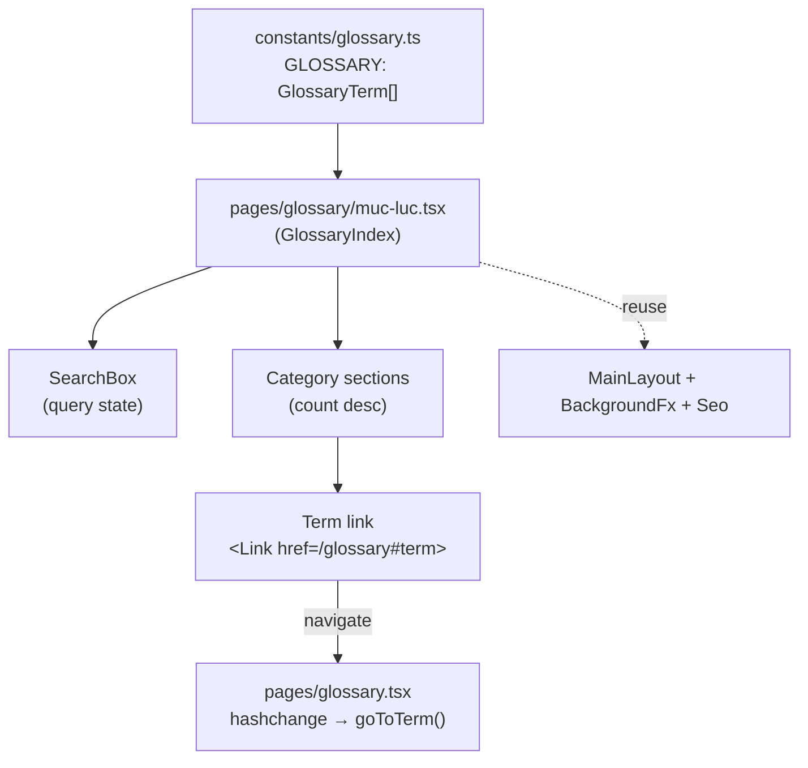

# System Design & Architecture — Glossary Index (Mục lục)

## Architecture Overview
**What is the high-level system structure?**

Trang tĩnh (SSG) trong Next.js Pages Router, đọc dữ liệu build-time từ hằng số `GLOSSARY`, render danh sách nhóm theo category. Không gọi API, không server-side data.



- **Key components & responsibilities**
  - `GlossaryIndex` (page): quản lý state `query`, tính `filtered` + `grouped`, render.
  - `SearchBox`: input + clear; Ctrl/Cmd+F focus (đồng nhất trang chi tiết).
  - Category section: heading `Tên category (count)` + danh sách link thuật ngữ.
  - Term link: `next/link` tới `/glossary#<encodeURIComponent(term)>`.
- **Tech stack & rationale**: Next.js Pages Router (đồng bộ codebase), MUI + Emotion (đã dùng toàn dự án), SSG (dữ liệu tĩnh, tối ưu SEO + tốc độ).

## Data Models
**What data do we need to manage?**

Tái dùng nguyên trạng, KHÔNG thay đổi:

```ts
// constants/glossary.ts (đã tồn tại)
export type GlossaryCategory =
  | 'AI' | 'Messaging' | 'DevOps' | 'Web' | 'General'
  | 'Database' | 'Cloud' | 'Security' | 'Mobile' | 'Blockchain'

export interface GlossaryTerm {
  term: string
  cat: GlossaryCategory
  short: string
  detail: string
  related?: string[]
}
export const GLOSSARY: GlossaryTerm[] = [ /* 109 items */ ]
```

Cấu trúc dẫn xuất trong page (build/runtime, không persist):

```ts
type CategoryGroup = {
  cat: GlossaryCategory
  count: number          // số term trong nhóm (sau filter)
  terms: GlossaryTerm[]  // đã sort theo term (alpha)
}
// groups: CategoryGroup[] sắp theo count desc, rồi cat alpha khi bằng
```

- **Data flow**: `GLOSSARY` → filter theo `query` → group theo `cat` → sort group (count desc) + sort term (alpha) → render.

## API Design
**How do components communicate?**

- Không có API mới. Trang thuần client-derived từ hằng số.
- **Giao tiếp giữa 2 trang qua URL hash**: mục lục tạo href `/glossary#<term>`; trang `/glossary` đã có `useEffect` bắt `hashchange`/mount, gọi `goToTerm(decoded)` để cuộn + mở + flash. Không cần sửa trang chi tiết cho luồng này.
- **Hợp đồng ngầm cần giữ**: giá trị hash = `encodeURIComponent(term)`, và `term` phải khớp chính xác một `GLOSSARY[].term` (trang chi tiết `decodeURIComponent` rồi so khớp `x.term === decoded`).

## Component Breakdown
**What are the major building blocks?**

- **Frontend (mới)** — `pages/glossary/muc-luc.tsx`:
  - `GlossaryIndex: NextPageWithLayout` với `.Layout = MainLayout`.
  - State: `const [query, setQuery] = useState('')`.
  - `filtered = useMemo(...)`: lọc theo `term/short/detail.toLowerCase().includes(q)`.
  - `groups = useMemo(...)`: gom theo `cat`, sort term alpha, sort nhóm theo `count` desc → `cat` alpha.
  - Sub-blocks: Header (Seo + tiêu đề), SearchBox, count line, danh sách category section, empty state, cross-link về `/glossary` và trang chủ.
  - Mỗi category section: heading `Cat (count)` + các term là link **inline, ngăn bằng dấu `·`**, tự wrap xuống dòng (compact directory). KHÔNG grid/không mỗi term một dòng.
  - **Không highlight** đoạn khớp trong tên term: search chỉ lọc danh sách. Trang **self-contained**, chỉ reuse `Seo`, `BackgroundFx`, `MainLayout`; KHÔNG phụ thuộc `Highlight` (hàm này local trong `glossary.tsx`, không export) → không đụng file trang chi tiết cho việc render.
- **Frontend (sửa nhẹ)** — `pages/glossary.tsx`: thêm 1 link/nút trỏ tới `/glossary/muc-luc` (cross-link chiều ngược). Thay đổi tối thiểu, không đụng logic.
- **Backend / storage**: không có.
- **Third-party**: không có.

## Design Decisions
**Why did we choose this approach?**

- **Trang mới thay vì toggle/replace trang cũ**: giữ trang chi tiết A-Z nguyên vẹn (không regression deep-link/A-Z jump), tách rõ 2 nhu cầu "tra cứu 1 từ" vs "quét theo chủ đề". Đơn giản, ít rủi ro.
- **Route `/glossary/muc-luc`** (không `/glossary/index.tsx`): tránh trùng route với `pages/glossary.tsx` trong Pages Router; tên tiếng Việt rõ nghĩa; `/glossary` giữ nguyên URL.
- **Compact directory thay vì card đầy đủ**: quét nhanh 109 từ, nhẹ, không lặp lại UI card của trang chi tiết; chi tiết đã có sẵn qua deep-link.
- **Link `/glossary#term` thay vì render chi tiết tại chỗ**: tái dùng deep-link + flash sẵn có, một nguồn sự thật cho phần chi tiết.
- **Category sắp theo count desc**: nhóm lớn (AI, Messaging) lên trước, phản ánh trọng tâm nội dung.
- **Alternatives đã cân nhắc**: (a) toggle A-Z/Category trên trang cũ — phức tạp hơn, đụng logic hiện có; (b) replace grouping — mất A-Z jump; (c) render card theo category — nặng, trùng lặp. Đều bị loại theo xác nhận của user.
- **Highlight (đã chốt Phase 3)**: KHÔNG highlight đoạn khớp ở mục lục. Lý do: giữ trang self-contained, tránh sửa/refactor `glossary.tsx` đang chạy ổn (Highlight là hàm local, không export). Alternatives loại: (a) tách Highlight ra shared component — phải sửa trang chi tiết; (b) nhân bản helper — trùng code. Nếu sau này cần dùng highlight ở nhiều nơi mới tách shared.
- **Trình bày list (đã chốt Phase 3)**: term dạng link **inline ngăn bằng `·`**, tự wrap. Lý do: gọn nhất, quét nhanh cả nhóm lớn (AI=30) mà không tốn chiều cao. Alternatives loại: grid nhiều cột (cao hơn, giống card) và list dọc (quá dài với 109 từ).

## Non-Functional Requirements
**How should the system perform?**

- **Performance**: SSG, dữ liệu tĩnh 109 item — render tức thì; filter/group bằng `useMemo`, chi phí không đáng kể. Không ảnh hưởng bundle đáng kể (chỉ thêm 1 page).
- **Accessibility**: input search có label/aria; link thuật ngữ là `<a>` thật (tab được, mở tab mới được); tương phản màu đạt ở cả theme sáng/tối.
- **SEO**: `Seo` với title/description/url riêng cho `/glossary/muc-luc`; nội dung render tĩnh nên crawl được; là trang liệt kê nội bộ giúp internal linking tới các thuật ngữ.
- **Reliability**: term có ký tự đặc biệt (`Token / JWT`) phải `encodeURIComponent`; nếu term trong mục lục không khớp trang chi tiết thì hash bị bỏ qua — đảm bảo dùng chung nguồn `GLOSSARY` nên luôn khớp.
- **Responsive**: layout co giãn (grid/flex) đẹp trên mobile & desktop, giống trang chi tiết.
