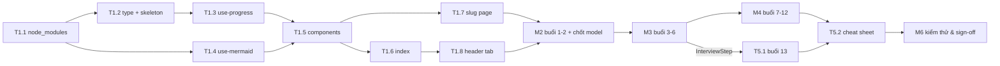

# Project Planning & Task Breakdown — Feature `system-design`

## Nguyên tắc sắp xếp

**Hạ tầng trước, nội dung sau, và chốt khuôn mẫu bằng 2 buổi mẫu trước khi viết 11 buổi còn lại.**

Lý do: rủi ro lớn nhất của feature này không phải code (UI khá thẳng), mà là **viết 13 bài × ~1000 từ rồi mới phát hiện cấu trúc `LessonSection` thiếu field, hoặc marker `[[Term]]` không parse được ký tự đặc biệt** — lúc đó phải sửa lại cả 13 bài. Vertical slice ở M2 mua bảo hiểm cho việc đó với chi phí 2 bài.

**Commit**: mỗi task = 1 commit (theo `CLAUDE.md`: mỗi commit một thay đổi logic). Riêng M3/M4 mỗi buổi nội dung là 1 commit.

## Milestones
**What are the major checkpoints?**

- [x] **M1 — Hạ tầng & khung dữ liệu**: đi được từ header → lộ trình → trang chi tiết (nội dung rỗng), tiến độ lưu được ✅ **xong 2026-07-26**
- [ ] **M2 — Vertical slice nội dung (buổi 1–2)**: chốt khuôn mẫu nội dung; mermaid, flashcard, cross-link đều chạy thật
- [ ] **M3 — Kiến thức lõi (buổi 3–6)**
- [ ] **M4 — Case study (buổi 7–12)**
- [ ] **M5 — Buổi 13 tự luyện + cheat sheet**
- [ ] **M6 — Kiểm thử, a11y, regression, sign-off**

**Cổng chặn**: không sang M3 khi M2 chưa qua toàn bộ validation — đây là điểm quyết định có phải sửa lại data model hay không.

## Task Breakdown
**What specific work needs to be done?**

Ký hiệu: **[ACn]** = acceptance criteria số n trong `requirements`. Tên mục test dẫn về `testing`.

---

### M1 — Hạ tầng & khung dữ liệu

#### T1.1 — Cài `node_modules` trong worktree
- **Outcome**: `npm run lint` và `npm run build` chạy được trong worktree `pinit-design-system-learning`
- **Depends**: không
- **Validation**: `npm run lint` trả về kết quả (không còn `sh: next: command not found`)
- **Test scenarios**: — (điều kiện tiên quyết cho mọi validation sau)
- **Ghi chú**: worktree mới không kế thừa `node_modules`; đây là lý do commit docs trước đó không lint được. Không commit gì (`node_modules` đã trong `.gitignore`).

#### T1.2 — Định nghĩa type + skeleton 13 lesson
- **Outcome**: `models/system-design.ts` (type) + `constants/system-design.ts` chứa **13 object đủ metadata** (`order`, `slug`, `title`, `summary`, `track`, `keywords`, `readingMinutes`, `keyTakeaway`), `sections: []` và `flashcards: []` còn rỗng. Export qua `models/index.ts`, `constants/index.ts`
- **Depends**: T1.1
- **Validation**: `npm run build` type-check pass; đối chiếu 13 tiêu đề với bảng ánh xạ trong `requirements` **[AC2]**
- **Test scenarios**: *Toàn vẹn dữ liệu* — đúng 13 lesson, `order` 1..13 không trùng, slug không trùng, **không slug nào là `cheat-sheet`**, slug kebab-case, `keyTakeaway` không rỗng, `track` hợp lệ
- **Rủi ro**: quên ràng buộc slug `cheat-sheet` → trang đó chết vĩnh viễn. Kiểm ngay ở task này, không đợi M6.

#### T1.3 — `hooks/use-lesson-progress.ts`
- **Outcome**: hook đọc/ghi `localStorage` key `pinit:system-design:progress` (mảng slug), có cờ `hydrated`, `toggle`, `isCompleted`, `percent`, `reset`; mọi truy cập bọc `try/catch`; lọc bỏ slug không còn trong `LESSONS`
- **Depends**: T1.2
- **Validation**: chạy tay trong browser — tick, reload, mở private mode, sửa giá trị `localStorage` thành rác
- **Test scenarios**: toàn bộ mục *Unit — `use-lesson-progress`* (10 ca, gồm 4 ca edge: đọc lỗi, ghi lỗi, giá trị hỏng, slug mồ côi) **[AC6]**
- **Rủi ro**: hydration mismatch nếu đọc `localStorage` trong thân render → bắt buộc dùng `useEffect` + `hydrated`

#### T1.4 — `hooks/use-mermaid.ts`
- **Outcome**: hook render mọi node `.mermaid` trong container, dynamic `import('mermaid')` trong `useEffect`, `securityLevel: 'strict'`, `catch` + `console.error`
- **Depends**: T1.1
- **Validation**: gắn tạm 1 diagram vào trang chi tiết, xác nhận SVG hiện; thử cú pháp sai → trang vẫn sống
- **Test scenarios**: mục *Unit — `use-mermaid`* (5 ca)
- **Ghi chú**: viết mới từ pattern ở `pages/blog/[slug].tsx:72`. **Không** sửa `blog/[slug].tsx`, `works/details.tsx`, hay stub chết `components/mermaid/MermaidFlowchart.tsx` — non-goal đã chốt

#### T1.5 — Component library `components/system-design/`
- **Outcome**: `TermLink`, `LessonSectionView` (kèm parser `[[Term]]`), `Flashcard`, `FlashcardDeck`, `LessonCard`, `RoadmapProgress`, + `index.ts`
- **Depends**: T1.2, T1.3, T1.4
- **Validation**: render thử với dữ liệu giả; kiểm bàn phím và `aria-*`
- **Test scenarios**: mục *Unit — parser `[[Term]]`* (8 ca, gồm `Token / JWT` và `C/C++`), *Unit — `Flashcard`* (4 ca), *Unit — `LessonCard`* (3 ca)
- **Rủi ro**: quên `encodeURIComponent` → href vỡ với term chứa `/`. Đây là lỗi **đã từng xảy ra** ở feature `glossary-index`

#### T1.6 — `pages/system-design/index.tsx`
- **Outcome**: trang lộ trình — 13 card theo `order`, `RoadmapProgress`, ô search lọc theo `title`/`summary`/`keywords`, đếm kết quả, empty state; `MainLayout` + `BackgroundFx` + `Seo`
- **Depends**: T1.5
- **Validation**: render đủ 13 card đúng thứ tự **[AC2]**; search hoạt động **[AC7]**
- **Test scenarios**: *Integration* — index đọc `LESSONS` render đủ 13; *E2E Luồng 4* (tìm nhanh)

#### T1.7 — `pages/system-design/[slug].tsx`
- **Outcome**: trang chi tiết — `getStaticPaths` (13 slug, `fallback: false`) + `getStaticProps`, render `sections`, `FlashcardDeck`, nút "đã ôn xong", link prev/next buổi
- **Depends**: T1.5
- **Validation**: 13 slug trả 200; slug bịa trả 404
- **Test scenarios**: *Integration* — `getStaticPaths` sinh đúng 13 path, slug lạ → 404; đồng bộ tiến độ index ↔ chi tiết

#### T1.8 — Thêm tab vào header
- **Outcome**: 1 mục `{ label: 'System Design', path: '/system-design' }` trong `components/common/header/routes.ts`
- **Depends**: T1.6
- **Validation**: tab hiện ở **cả** desktop và mobile, kể cả khi chưa đăng nhập **[AC1]**
- **Test scenarios**: *Integration* — render ở `header-desktop.tsx` + `header-mobile.tsx`; không có `requireLogin`; *E2E Luồng 1*
- **Ghi chú**: `header-desktop.tsx:14` lọc theo `requireLogin` — để `undefined` là đúng

**Cổng M1**: từ trang chủ click tab → thấy 13 buổi → mở 1 buổi → tick → reload → tiến độ còn.

---

### M2 — Vertical slice nội dung (cổng chặn)

#### T2.1 — Nội dung buổi 1: SDI + CAP + Microservices
- **Outcome**: `sections` (≥3 khối, ≥800 từ), ≥1 mermaid, ≥1 bảng đánh đổi, ≥4 flashcard kèm `pitfall`, ≥3 marker `[[Term]]`
- **Depends**: cổng M1
- **Validation**: đếm từ; diagram render; flashcard lật; cross-link tới đúng `/glossary#term`
- **Test scenarios**: *Toàn vẹn dữ liệu* (word count, diagram, flashcard ≥4); *E2E Luồng 2, Luồng 7* **[AC3, AC8]**

#### T2.2 — Nội dung buổi 2: Load balancer + Database
- **Outcome**: như T2.1, nội dung LB, distributed storage, chọn DB, replication, sharding
- **Depends**: T2.1
- **Validation**: như T2.1

#### T2.3 — Rà soát khuôn mẫu & chốt data model
- **Outcome**: xác nhận `LessonSection`/`Flashcard` đủ dùng cho cả bài lý thuyết (buổi 1) lẫn bài nhiều bảng (buổi 2); **nếu thiếu field thì sửa model NGAY tại đây**
- **Depends**: T2.2
- **Validation**: kiểm a11y (bàn phím, `aria-expanded`, `role="progressbar"`), kiểm mermaid ở **theme tối** (SVG nền trắng dễ chói), kiểm bảng dài scroll ngang trong khung riêng
- **Test scenarios**: *Manual — UI/UX* + *Accessibility*
- **Đây là cổng chặn**: sửa model ở đây tốn 2 bài; sửa ở M4 tốn 12 bài

---

### M3 — Kiến thức lõi (buổi 3–6)

Mỗi task cùng definition-of-done như T2.1 (≥800 từ, ≥1 diagram, ≥4 flashcard, có `[[Term]]`), mỗi task 1 commit.

- [ ] **T3.1** — Buổi 3: Networking (HTTPS, REST, polling, WebSocket, gRPC, GraphQL, DNS)
- [ ] **T3.2** — Buổi 4: Caching + message queue/pub-sub + monitoring
- [ ] **T3.3** — Buổi 5: CDN, blobstore, distributed search, distributed logging
- [ ] **T3.4** — Buổi 6: Framework trả lời SDI — **task này sinh ra `InterviewStep[]` dùng lại ở cheat sheet (T5.2)**, làm trước M5

- **Depends**: cổng M2 (T2.3)
- **Validation mỗi task**: `npm run build` pass; đếm từ; diagram render; ≥4 flashcard
- **Test scenarios**: *Toàn vẹn dữ liệu* **[AC3]**

---

### M4 — Case study (buổi 7–12)

Cùng definition-of-done. Mỗi case study nên có: yêu cầu chức năng/phi chức năng → ước lượng quy mô → API → data model → sơ đồ kiến trúc → điểm nghẽn & đánh đổi.

- [ ] **T4.1** — Buổi 7: TinyURL
- [ ] **T4.2** — Buổi 8: YouTube (storage video, search, like/comment)
- [ ] **T4.3** — Buổi 9: Social media (newsfeed, follow, post, GraphDB)
- [ ] **T4.4** — Buổi 10: Typeahead (trie, ranking)
- [ ] **T4.5** — Buổi 11: Taxi booking (geo-index, matching, realtime) — ⚠️ **đầu mục là giả định**, ảnh gốc chỉ ghi "Toggle Content"; cần chủ site đối chiếu
- [ ] **T4.6** — Buổi 12: Messaging app

- **Depends**: M3 (buổi 7 nên viết sau buổi 6 để tái dùng khung trả lời)
- **Test scenarios**: *Toàn vẹn dữ liệu*; *Manual — nội dung* (đối chiếu buổi 11)

---

### M5 — Buổi 13 & cheat sheet

#### T5.1 — Buổi 13: trang tự luyện mock interview
- **Outcome**: model `MockPrompt`, component `MockInterviewTimer` (bảng tĩnh khung 45 phút chia bước), ≥5 đề bài kèm `rubric` tự chấm
- **Depends**: T3.4 (dùng lại `InterviewStep`)
- **Validation**: có khung 45 phút, ≥5 đề, checklist tiêu chí **[AC4]**
- **Test scenarios**: *E2E Luồng 6*

#### T5.2 — Trang cheat sheet
- **Outcome**: `pages/system-design/cheat-sheet.tsx` + dữ liệu: bảng latency numbers, bảng chọn DB theo tình huống, khung các bước SDI, và **13 dòng `keyTakeaway`** đọc từ `LESSONS`
- **Depends**: M4 (cần đủ 13 `keyTakeaway`), T3.4
- **Validation**: `/system-design/cheat-sheet` trả 200, **không bị `[slug]` nuốt**; đủ 13 dòng chốt **[AC5]**
- **Test scenarios**: *Integration* — cheat sheet đọc `keyTakeaway` không thiếu dòng; *E2E Luồng 5*; *Smoke test*

---

### M6 — Kiểm thử & sign-off

- [ ] **T6.1** — Chạy toàn bộ checklist *Toàn vẹn dữ liệu* (13 ca), gồm đếm ≥15 marker `[[Term]]` **[AC8]** và đối chiếu `relatedTerms` với `constants/glossary.ts`
- [ ] **T6.2** — Chạy *E2E* 7 luồng + critical path (tick hết 13 buổi → 100%)
- [ ] **T6.3** — **Regression**: `/glossary`, `/glossary/muc-luc`, `/blog/[slug]` (mermaid vẫn render), `/works/[workId]/details` (mermaid vẫn render), header 3 tab cũ giữ nguyên query string **[AC9]**
- [ ] **T6.4** — `npm run lint` 0 error + `npm run build` pass; đọc output build xác nhận **`mermaid` không nằm trong first-load JS của `/system-design`** **[AC10]**
- [ ] **T6.5** — *Manual*: a11y (VoiceOver, focus ring, thứ tự tab), theme sáng/tối, 360px, Safari private mode, Chrome/Safari/mobile
- [ ] **T6.6** — **Chủ site review độ chính xác kỹ thuật** nội dung 13 buổi + xác nhận không sao chép slide độc quyền — *open item từ requirements, chặn merge*
- [ ] **T6.7** — Điền `docs/ai/implementation/2026-07-26-feature-system-design.md`: kết quả checklist, lệch so với thiết kế, việc hoãn sang v2

- **Depends**: M5

## Dependencies
**What needs to happen in what order?**

### Ràng buộc thứ tự đáng lưu ý
- **T1.1 chặn tất cả** — chưa có `node_modules` thì không validate được gì.
- **T2.3 là cổng chặn thật**, không phải thủ tục. Sửa data model sau M4 tốn gấp 6 lần.
- **T3.4 (buổi 6) trước T5.1 và T5.2** — cả hai tái dùng `InterviewStep[]`.
- **T5.2 sau M4** — cheat sheet cần đủ 13 `keyTakeaway`.
- **T1.2 phải chốt slug sớm** — slug vào URL, đổi sau sẽ hỏng bookmark và tiến độ đã lưu trong `localStorage` của chính người dùng.

### External dependencies
- Không có API, không database, **không thêm npm package nào** (`mermaid@11.12.0` đã có sẵn).
- Phụ thuộc **con người**: T6.6 cần chủ site review nội dung — không tự động hóa được.

## Timeline & Estimates
**When will things be done?**

Ước lượng theo **phiên làm việc** (không đặt ngày cụ thể — đây là project cá nhân, nhịp không cố định).

| Milestone | Khối lượng | Ước lượng |
|---|---|---|
| M1 (8 task) | ~7 file mới, ~600 dòng code | 1–2 phiên |
| M2 (3 task) | 2 bài × ~1000 từ + rà soát | 1 phiên |
| M3 (4 task) | 4 bài | 1–2 phiên |
| M4 (6 task) | 6 bài, dày nhất (case study cần diagram + ước lượng quy mô) | 2–3 phiên |
| M5 (2 task) | 1 trang + 1 trang dữ liệu | 1 phiên |
| M6 (7 task) | kiểm thử thủ công + review nội dung | 1 phiên + thời gian review của chủ site |
| **Tổng** | | **7–10 phiên** |

**Buffer cho ẩn số**: M2 có thể phát sinh sửa data model (+0.5 phiên). M4 buổi 11 có thể phải viết lại nếu đối chiếu với bài học thật cho kết quả khác (+0.5 phiên).

**Đề xuất nhịp giao**: có thể merge về `main` sau **M2** (đã có 2 buổi dùng được thật) thay vì đợi hết M6 — người dùng chính là chủ site nên nội dung dở dang không gây hại, và 11 buổi còn lại hiện đúng trong lộ trình với nhãn "sắp có".

## Risks & Mitigation
**What could go wrong?**

| # | Rủi ro | Mức | Giảm thiểu |
|---|---|---|---|
| R1 | Viết xong nhiều bài mới phát hiện `LessonSection` thiếu field → sửa lại toàn bộ | **Cao** | Cổng T2.3: chốt model sau đúng 2 bài |
| R2 | Một lesson vô tình mang slug `cheat-sheet` → trang đó không bao giờ truy cập được | Trung bình | Kiểm ngay ở T1.2, không đợi M6; ghi thành test case bắt buộc |
| R3 | Hydration mismatch do đọc `localStorage` lúc render | Trung bình | Cờ `hydrated`, chỉ hiện số sau mount (T1.3) |
| R4 | `encodeURIComponent` bị quên → link `Token / JWT`, `C/C++` vỡ | Trung bình | Lỗi đã gặp ở `glossary-index`; test case riêng ở T1.5 |
| R5 | Mermaid SVG nền trắng chói ở theme tối | Trung bình | Kiểm ở T2.3 khi mới có 2 bài, cấu hình theme mermaid theo `palette.mode` |
| R6 | Nội dung AI soạn sai kiến thức → tài liệu ôn thi phản tác dụng | **Cao** | T6.6 chặn merge; lỗi loại "nội dung" không để AI tự sửa sau khi đã review |
| R7 | Buổi 11 (Taxi Booking) suy đoán sai so với bài học thật | Trung bình | Đánh dấu giả định trong requirements + T4.5; chủ site đối chiếu |
| R8 | 13 bài dài làm phình một file `constants/system-design.ts` | Thấp | Nếu vượt ~5000 dòng thì tách `constants/system-design/` 1 file/lesson (đã ghi trong design) |
| R9 | Không có test framework → hồi quy lọt lưới | Trung bình | Checklist thủ công ở M6 là bắt buộc, không bỏ qua; `npm run build` bắt lỗi type |
| R10 | Vô tình sửa `blog/[slug].tsx` hay `works/details.tsx` khi làm mermaid | Thấp | Non-goal đã ghi rõ; T6.3 kiểm mermaid 2 trang cũ vẫn render |

### Blocker hiện tại
- **Không có blocker chặn bắt đầu.** T1.1 (`npm install`) là việc đầu tiên.

## Resources Needed
**What do we need to succeed?**

- **Người**: 1 người thực hiện (AI agent) + chủ site review nội dung ở T6.6 và đối chiếu buổi 11 ở T4.5
- **Công cụ**: Node (worktree cần `npm install`), trình duyệt Chrome/Safari + iOS/Android để kiểm thử thủ công, VoiceOver cho a11y, Lighthouse
- **Không cần**: dependency mới, tài khoản dịch vụ, hạ tầng, database
- **Kiến thức tham chiếu**: `requirements` (bảng ánh xạ 13 buổi, 10 acceptance criteria), `design` (data model, 7 design decision), `testing` (~90 checkbox), `constants/glossary.ts` (109 thuật ngữ để cross-link), `pages/glossary.tsx` (khuôn mẫu UI để bám theo)

## Đối chiếu phủ test → task

Xác nhận **mọi mục trong `testing` đều có ít nhất một task**:

| Mục trong testing | Task phủ |
|---|---|
| Unit — `use-lesson-progress` (10 ca) | T1.3 |
| Unit — parser `[[Term]]` (8 ca) | T1.5 |
| Unit — `use-mermaid` (5 ca) | T1.4 |
| Unit — Toàn vẹn dữ liệu (13 ca) | T1.2 (ca cấu trúc), T6.1 (ca nội dung) |
| Unit — `Flashcard` (4 ca) | T1.5 |
| Unit — `LessonCard` (3 ca) | T1.5 |
| Integration (11 ca) | T1.6, T1.7, T1.8, T5.2, T6.2 |
| E2E Luồng 1–7 + critical path | T6.2 (Luồng 2/7 kiểm sớm ở T2.1) |
| E2E Regression (5 ca) | T6.3 |
| Manual — UI/UX, a11y | T2.3 (sớm), T6.5 (đầy đủ) |
| Manual — Browser/device | T6.5 |
| Manual — Nội dung (5 ca) | T4.5, T6.6 |
| Manual — Smoke test | T5.2, T6.4 |
| Performance (4 ca) | T6.4 |
| Bug tracking | T6.7 |

Không có mục test nào không được phủ.

## Trạng thái hiện tại

**Cập nhật 2026-07-26 — M1 hoàn tất (8/8 task).**

| Task | Trạng thái | Commit |
|---|---|---|
| T1.1 cài `node_modules` | ✅ done | — (không commit) |
| **T1.1b thiết lập vitest** | ✅ done — **task phát sinh** | `93f30ec` |
| T1.2 type + skeleton 13 lesson | ✅ done | `8a4ce7a` |
| T1.3 `use-lesson-progress` | ✅ done | `ccb4994` |
| T1.4 `use-mermaid` | ✅ done | `ae5044c` |
| T1.5 component library | ✅ done | `9578ac7`, `364a1ba` (fix es5) |
| T1.6 trang lộ trình | ✅ done | `74ed6d7` |
| T1.7 trang chi tiết | ✅ done | `347b57b` |
| T1.8 tab header | ✅ done | `ad8769b` |

**Bằng chứng**: `npm test` 35/35 pass · `npm run lint` 0 error, không thêm warning so với baseline · `npm run build` pass, sinh đủ 13 static path · `/system-design` 4.05 kB / 298 kB first-load, mermaid không trong bundle.

### Thay đổi phạm vi so với kế hoạch ban đầu
- **[Thêm]** T1.1b — thiết lập `vitest` (chỉ logic thuần, không jsdom). Kế hoạch gốc giả định không có test runner; skill `dev-implementation` yêu cầu TDD nên user đã duyệt bổ sung. Không làm đổi ước lượng milestone.
- **[Bỏ khỏi M1]** CTA sang cheat sheet trên trang lộ trình — dời sang T5.2 vì trang đích chưa tồn tại, không ship link 404.
- **[Chia nhỏ]** Ca kiểm thử toàn vẹn dữ liệu tách làm hai: **cấu trúc** (tự động ngay ở T1.2, 10 ca pass) và **nội dung** (viết ở M2, chạy ở M6) — vì `sections`/`flashcards` còn rỗng theo thiết kế nên ca nội dung sẽ fail đến hết M4.

### Blocker
Không có.

### Cập nhật M2 (đang làm)

| Task | Trạng thái | Commit |
|---|---|---|
| T2.1 nội dung buổi 1 | ✅ done — đã kiểm trên trình duyệt | `244110b` |
| T2.2 nội dung buổi 2 | ⬜ tiếp theo | |
| T2.3 cổng chặn: chốt data model | ⬜ | |

**Thay đổi phạm vi**: `constants/system-design-content.test.ts` viết ngay ở T2.1 thay vì đợi T2.3, dùng danh sách `SLUGS_DA_VIET` mở rộng dần nên không bị vướng chuyện "ca fail đến hết M4". T2.3 giờ chỉ còn việc rà soát model + a11y + màn hình hẹp.

**Kết quả T2.1**: mermaid render thật và **vẽ lại đúng khi đổi theme** (cơ chế `data-mermaid-src` hoạt động — đây là lỗi hai trang cũ đang mắc). Cross-link, bảng, callout, flashcard đều đúng.

### 3 việc tiếp theo
1. **T2.2** — nội dung buổi 2 (Load balancer + Database, replication, sharding)
2. **T2.3** — cổng chặn: rà soát `LessonSection` có đủ field cho bài nhiều bảng, kiểm 360px, kiểm a11y bàn phím
3. **T3.1** — nội dung buổi 3 (Networking) sau khi cổng M2 mở

### Vùng cần chú ý sau T2.1
- Sơ đồ CAP cao 720px, mermaid tự đặt `max-width` inline đè lên rule của container. Khung cha có `overflowX: auto` nên không vỡ layout, nhưng **phải kiểm ở 360px** ở T2.3.
- Buổi 2 có nhiều bảng hơn buổi 1 — đây đúng là ca kiểm tra `LessonSection` mà cổng T2.3 cần.

### Vùng rủi ro cần chú ý ở M2
- **R1 vẫn là rủi ro lớn nhất**: nếu `LessonSection` thiếu field thì phải sửa ở T2.3, không được để lọt sang M3.
- **Mermaid ở theme tối** chưa từng được kiểm — M1 chưa có diagram thật nào để nhìn. T2.1 là lần đầu chạy thật.
- **Bài học M1**: `npm test` xanh **không** thay thế `npm run build`. Lỗi `matchAll`/es5 lọt qua 35 ca test và chỉ lộ ở build. Mỗi task phải chạy cả hai.
