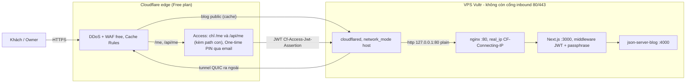

# Cloudflare trước nipit.pro

Mục tiêu: che khu private `/me` bằng một lớp danh tính ở **edge** (Cloudflare Access),
và cắt hẳn đường vào thẳng origin bằng **Cloudflare Tunnel** — không còn cổng inbound
80/443 trên VPS. Blog public và flow deploy hiện tại không đổi hành vi.

Chỉ dùng **Free zone plan** + **Zero Trust Free** (≤ 50 user). Mọi thứ cần
Pro/Business/Enterprise hoặc tính theo lượng dùng đều không bật — xem *Giới hạn free
plan* ở cuối.

**Access KHÔNG thay thế passphrase.** Lớp bcrypt + cookie HMAC trong `utils/owner-*.ts`
giữ nguyên. Access trả lời "đúng người giữ email này", passphrase trả lời "biết bí mật".
Mất một lớp vẫn còn lớp kia. Chi tiết khu `/me`: [docs/private-area.md](private-area.md).

## Kiến trúc



Bốn lớp chặn cho `/me`, từ ngoài vào trong — mỗi lớp chặn một thứ khác nhau:

| Lớp | Ở đâu | Chặn gì | Qua được nếu |
|---|---|---|---|
| Access policy | Cloudflare edge | người không có email trong policy | chiếm được hộp mail owner |
| Verify JWT | `middleware.ts` (origin) | request vào **thẳng** origin, hoặc Access app bị xoá/sửa trên dashboard | — |
| Passphrase bcrypt | `utils/owner-login.ts` | người qua được Access mà không biết passphrase | biết passphrase |
| Cookie HMAC | `utils/owner-session.ts` | cookie giả | lộ `SESSION_SECRET` |

### Vì sao hop trong máy là plain HTTP

`cloudflared → nginx` đi bằng `http://127.0.0.1:80`, không TLS. Lý do: **tunnel đã mã
hoá đoạn edge ↔ origin bằng chính nó** (QUIC, cloudflared tự xác thực bằng token), nên
bọc TLS thêm trên loopback không thêm gì về đường truyền.

Đổi lại còn gỡ được một cái bẫy: `docs/CICD.md` ghi nginx chấm dứt TLS bằng **Let's
Encrypt**, mà Let's Encrypt gia hạn qua HTTP-01 cần **cổng 80 mở từ internet**. Đóng
80/443 ở bước *Khoá origin* là HTTP-01 chết — không phải ngay, mà ~60 ngày sau, im lặng.
Bỏ TLS ở hop nội bộ thì không còn cert nào phải gia hạn.

> **SSL/TLS encryption mode của zone không áp cho traffic qua tunnel.** Đặt "Full
> (strict)" hay "Flexible" đều không ảnh hưởng đoạn cloudflared → nginx. Mode đó chỉ
> có nghĩa khi edge kết nối tới origin bằng IP qua A record. Vẫn nên đặt **Full
> (strict)** để nếu sau này có hostname trỏ bằng A record thì không rơi về Flexible.

Hệ quả cần biết: sau khi đóng cổng, muốn dựng lại một hostname trỏ thẳng IP thì phải
dựng lại cert. Lúc đó dùng **Cloudflare Origin CA** (free, hạn 15 năm, chỉ Cloudflare
tin — đủ cho Full strict) thay vì quay lại Let's Encrypt.

## Thao tác tay trên dashboard

Phần này **owner tự làm**, agent không có quyền. Làm đúng thứ tự: bước 6 trở đi mới
ảnh hưởng tới người đang truy cập.

### 1. Thêm zone

1. Dashboard → *Add a site* → `nipit.pro` → chọn **Free**.
2. Cloudflare quét DNS hiện có. **Đối chiếu từng record** trước khi sang bước sau —
   thiếu record MX là mất email, và lỗi này chỉ lộ ra nhiều ngày sau.
3. Đổi nameserver ở nhà đăng ký tên miền sang hai NS Cloudflare đưa ra.
4. Chờ zone sang trạng thái *Active* (thường vài phút tới vài giờ).

Giai đoạn này traffic vẫn vào origin theo A record cũ, chưa có gì thay đổi với người dùng.

### 2. SSL/TLS

- *SSL/TLS* → *Overview* → **Full (strict)**.
  Không chọn Flexible (edge → origin thành HTTP trần, và dễ gây vòng lặp redirect).
- *Edge Certificates* → bật **Always Use HTTPS**.
- *Edge Certificates* → **HSTS**: bật sau khi đã chắc mọi thứ chạy qua HTTPS.
  HSTS có thời hạn cam kết; bật sớm rồi phát hiện lỗi thì trình duyệt đã nhớ, không
  rút lại ngay được.

### 3. Cache Rules — bắt buộc trước khi mở Access

*Caching* → *Cache Rules* → tạo hai rule, **đặt trước** mọi rule khác:

| Thứ tự | Khi | Thì |
|---|---|---|
| 1 | `URI Path` starts with `/me` | *Bypass cache* |
| 2 | `URI Path` starts with `/api` | *Bypass cache* |

Vì sao làm trước: nếu một trang `/me` bị cache ở edge, nó được phục vụ cho **bất kỳ ai**
hỏi cùng URL, kể cả khi Access đã chặn. Mặc định Cloudflare không cache HTML, nên rủi ro
thấp — nhưng đây là loại lỗi mà hậu quả là lộ content, không phải chậm trang.

Blog public **vẫn được cache**: hai rule trên chỉ khớp `/me` và `/api`.

### 4. Zero Trust + Tunnel

1. Dashboard → *Zero Trust*. Lần đầu sẽ hỏi chọn **team domain** →
   `<team>.cloudflareaccess.com`. Tên này đi vào `CF_ACCESS_TEAM_DOMAIN`, nhớ lại.
   Chọn plan **Free** (50 user).
2. *Networks* → *Tunnels* → *Create a tunnel* → loại **Cloudflared** → đặt tên
   (vd `nipit-vps`).
3. Cloudflare hiện câu lệnh cài kèm **token**. Không chạy câu lệnh đó — ta chạy
   cloudflared bằng Docker Compose. Chỉ **copy token** (chuỗi dài sau `--token`).
4. Dán token vào `/opt/learn-nextjs/.env.private` trên VPS dưới tên `TUNNEL_TOKEN`,
   rồi bật service — xem *Chạy cloudflared trên VPS*.
5. Quay lại tunnel → tab *Public Hostname* → *Add a public hostname*:

   | Hostname | Service |
   |---|---|
   | `nipit.pro` | `HTTP` → `127.0.0.1:80` |
   | `www.nipit.pro` (nếu đang dùng) | `HTTP` → `127.0.0.1:80` |

   Cloudflare **tự tạo/ghi đè DNS record** thành CNAME tới `<tunnel-id>.cfargotunnel.com`.

6. *DNS* → *Records*: **xoá A record trỏ tới IP VPS** nếu còn sót.
   Còn A record thì IP origin vẫn lộ ra ngoài, và đó chính là thứ bước *Khoá origin*
   muốn bịt.

### 5. Access application cho `/me`

*Zero Trust* → *Access* → *Applications* → *Add an application* → **Self-hosted**.

- **Application name**: `pinit /me`
- **Session Duration**: 24 giờ (hoặc ngắn hơn)
- **Application domain** — thêm **hai** entry vào cùng một application:

  | Domain | Path |
  |---|---|
  | `nipit.pro` | `me` |
  | `nipit.pro` | `api/me` |

  > **Phải có cả `api/me`.** Spec ban đầu chỉ ghi `/me*`. Nhưng `/api/me/*`
  > (practice, check-denylist) là path khác, Access không tự suy ra. Thiếu entry này
  > thì edge không chèn header `Cf-Access-Jwt-Assertion` cho các API đó — chúng chỉ
  > còn được che bởi cookie `CF_Authorization` mà trình duyệt tự gửi, tức là mất lớp
  > edge đúng ở chỗ gọi tới Anthropic API (chỗ tốn tiền).

- **Policy**: *Allow*
  - Selector **Emails** → `<EMAIL-OWNER>`
  - Không cần IdP: phần *Login methods* giữ **One-time PIN**. Cloudflare gửi mã 6 số
    vào email, không qua Google/GitHub.
- Sau khi tạo: vào application → *Overview* → copy **Application Audience (AUD) Tag**.
  Chuỗi này đi vào `CF_ACCESS_AUD`.

### 6. Staging dưới `staging.nipit.pro`

1. Thêm public hostname vào cùng tunnel:

   | Hostname | Service |
   |---|---|
   | `staging.nipit.pro` | `HTTP` → `127.0.0.1:3001` |

2. Tạo Access application thứ hai: *Self-hosted*, domain `staging.nipit.pro`,
   **không có path** (che toàn bộ hostname, không chỉ `/me`), policy allow
   `<EMAIL-OWNER>` qua One-time PIN.
3. Kiểm `https://staging.nipit.pro` đòi OTP và vào được, **rồi mới** đóng cổng 3001
   công khai (xem *Đóng :3001 của staging*).

Khu `/me` ở staging vẫn tắt (404) vì `.env.private` rỗng — Access ở đây là để che
**toàn bộ** staging, không phải để mở `/me`.

## Chạy cloudflared trên VPS

Service đã có trong `docker-compose.yml`, nằm sau `profiles: ['tunnel']`. Chạy tay
từng lệnh dưới đây trên VPS (user `pin`):

```bash
# 1. Token vào .env.private (chmod 600, cùng chỗ với secrets của /me)
cd /opt/learn-nextjs
sudo -n true 2>/dev/null; printf 'TUNNEL_TOKEN=%s\n' '<token-tu-dashboard>' >> .env.private
chmod 600 .env.private
grep -c TUNNEL_TOKEN .env.private      # phải là 1, không phải 2

# 2. Bật profile tunnel. $DIR/.env là file deploy.yml KHÔNG đụng tới,
#    nên một lần deploy quên biến cũng không kéo tunnel xuống.
grep -q '^COMPOSE_PROFILES=' .env 2>/dev/null \
  && echo 'đã có COMPOSE_PROFILES, sửa tay' \
  || echo 'COMPOSE_PROFILES=tunnel' >> .env

# 3. Khởi động (chỉ cloudflared, không đụng web)
IMAGE=$(docker inspect -f '{{.Config.Image}}' learn-nextjs) docker compose up -d cloudflared

# 4. Kiểm
docker logs cloudflared 2>&1 | tail -20          # phải thấy "Registered tunnel connection" x4
curl -fsS http://127.0.0.1:20241/ready && echo   # metrics: tunnel đã sẵn sàng
```

`IMAGE=...` ở bước 3 là để compose không rơi về `:latest` cho service `web`
(deploy.yml export biến này qua ssh, shell của bạn thì không) — cùng lý do như mục
*Xoay passphrase* trong `docs/private-area.md`.

Vì sao `network_mode: host`: **nginx chạy trên host, không trong Docker.** Container ở
bridge network không thấy loopback của host, nên không tới được `127.0.0.1:80`. Dùng host
network còn làm `$remote_addr` mà nginx thấy là `127.0.0.1` — đúng cái mà snippet real_ip
bên dưới trông đợi.

Ghim version sau khi đã chạy ổn:

```bash
docker exec cloudflared cloudflared --version
echo 'CLOUDFLARED_IMAGE=cloudflare/cloudflared:<version>' >> /opt/learn-nextjs/.env
```

**Rollback:** `docker compose stop cloudflared` (tunnel xuống, site vẫn vào được qua
A record / IP nếu chưa đóng ufw), hoặc xoá dòng `COMPOSE_PROFILES=tunnel` khỏi `.env`
rồi `docker compose up -d --remove-orphans`.

## nginx: real_ip

Chạy trên VPS:

```bash
cd /path/to/pinit        # worktree của repo trên VPS, hoặc scp riêng file script
sudo scripts/cloudflare-realip.sh -o /etc/nginx/conf.d/cloudflare-realip.conf
sudo nginx -t && sudo systemctl reload nginx
```

`/etc/nginx/conf.d/` được `include` ở scope `http` nên snippet áp cho mọi vhost. Nếu
cấu trúc nginx khác, `include` nó trong `server {}` của `nipit.pro`.

**Vì sao bắt buộc.** Rate limit đăng nhập `/me` đếm theo IP, và `getClientIp()` lấy
**phần tử cuối** của `X-Forwarded-For` — phần nginx tự nối vào:

```
$proxy_add_x_forwarded_for = $http_x_forwarded_for + ", " + $remote_addr
```

| Cấu hình | `$remote_addr` nginx thấy | XFF gửi tới app | Phần tử cuối | Rate limit |
|---|---|---|---|---|
| Qua tunnel, **không** real_ip | `127.0.0.1` | `<IP-khách>, 127.0.0.1` | `127.0.0.1` | ✗ mọi khách một bucket |
| Qua tunnel, **có** real_ip | `<IP-khách>` | `<IP-khách>, <IP-khách>` | `<IP-khách>` | ✓ |

Hỏng kiểu này không có log, không có lỗi — chỉ là 5 lần sai của **bất kỳ ai** khoá
đăng nhập của tất cả, và fail2ban ban một IP vô nghĩa.

> **Cái bẫy chính:** công thức `set_real_ip_from` + dải IP public của Cloudflare là
> công thức cho topology **A record proxied** (edge kết nối tới `origin:443`). Qua
> **tunnel** thì kết nối tới nginx đến từ cloudflared cùng máy, nên dải public
> **không bao giờ khớp** — real_ip im lặng không áp dụng. Script sinh **cả hai** nhóm:
> loopback (cho tunnel) và dải public (cho giai đoạn chuyển tiếp, khi 443 còn mở).

Dải IP Cloudflare đổi theo thời gian → chạy lại script định kỳ. Script **không ghi gì**
nếu tải về không hợp lệ (ít hơn 5 dải v4 / 3 dải v6, hoặc có dòng không phải CIDR) —
cố ý, vì nginx là đường vào duy nhất sau khi đóng cổng, một dòng rác là sập toàn site.

`TRUST_PROXY=1` **giữ nguyên**, không phải sửa — nhưng chỉ còn đúng khi có snippet
real_ip. Hai thứ này đi kèm nhau, đừng tách.

Kiểm lại sau khi đổi vhost (như `docs/private-area.md` đã dặn):

```bash
sudo nginx -T 2>/dev/null | grep -n 'proxy_pass\|X-Forwarded-For\|real_ip'
```

## Verify JWT ở origin

`middleware.ts` kiểm JWT Access **trước** lớp passphrase, cho mọi path trong matcher
(`/me/:path*`, `/api/me/:path*`) — kể cả `/me/login`.

Hai biến trong `.env.private`:

| Biến | Lấy ở đâu | Dạng |
|---|---|---|
| `CF_ACCESS_TEAM_DOMAIN` | team domain lúc dựng Zero Trust | `<team>.cloudflareaccess.com` — chỉ host; dán cả `https://` hay `/` cuối cũng được, code tự chuẩn hoá |
| `CF_ACCESS_AUD` | Access app → *Overview* → *Application Audience (AUD) Tag* | hex dài |

```bash
cd /opt/learn-nextjs
# sửa .env.private, rồi TẠO LẠI container — restart KHÔNG đủ (env_file chỉ đọc lúc tạo)
IMAGE=$(docker inspect -f '{{.Config.Image}}' learn-nextjs) \
  docker compose up -d --force-recreate web
docker logs learn-nextjs 2>&1 | grep -E '\[me\]|\[cf-access\]'   # phải rỗng
```

Hành vi:

| Trạng thái env | Lớp Access | Dùng cho |
|---|---|---|
| cả hai rỗng | **bỏ qua** | local, staging — bật ở đó là tự khoá mình ra ngoài |
| cả hai có | bật | prod |
| chỉ một biến | **bỏ qua** + log `[cf-access] ...` lúc khởi động | cấu hình sai, phải sửa |

Ca "chỉ một biến" là ca nguy hiểm nhất: owner tưởng `/me` đã có Access che, thực tế
check bị bỏ qua hoàn toàn. Nên nó hét lên trong log thay vì im.

Chi tiết thiết kế:

- Verify bằng `jose` (`jwtVerify` + `createRemoteJWKSet`), không tự giải chữ ký.
- Kiểm đủ **ba** thứ: chữ ký khớp JWKS của team, `iss` = team domain, `aud` = AUD tag.
  Thiếu `aud` thì JWT của *bất kỳ* app nào trong cùng team cũng qua được.
- Token đọc từ header `Cf-Access-Jwt-Assertion`, không có thì tới cookie `CF_Authorization`.
- JWKS lấy không được → **false** (fail closed). JWKS được cache sau lần đầu.
- Không có/sai JWT → **403**, không redirect: trang login của Access nằm ở edge, origin
  không có gì để redirect tới. Cũng không trả 404 vì 404 đã mang nghĩa "khu `/me` tắt" —
  owner cần phân biệt được hai ca này khi chẩn lỗi.
- Khu `/me` tắt (thiếu `OWNER_PASSWORD_HASH`/`SESSION_SECRET`) thì **404 thắng 403**:
  không tiết lộ là có lớp Access phía sau.

Hệ quả vận hành: khi phiên Access hết hạn giữa lúc đang dùng `/me/practice`, XHR nhận
redirect về login của Access và fetch fail. **Tải lại trang** để qua OTP lần nữa.

## Khoá origin

Làm **sau khi tunnel chạy ổn ≥ 1 ngày**, không làm cùng ngày bật tunnel: cần biết
tunnel sống qua reboot, qua deploy, qua một đêm.

Điều kiện vào bước này:

- [ ] `curl -fsS http://127.0.0.1:20241/ready` trên VPS trả OK
- [ ] `docker logs cloudflared` không có `ERR` trong 24h qua
- [ ] `https://nipit.pro` vào được, `https://staging.nipit.pro` đòi OTP
- [ ] DNS không còn A record nào trỏ IP VPS
- [ ] **ssh (22) vẫn mở** — đây là đường duy nhất còn lại để sửa nếu sai

```bash
# Trên VPS. ufw status trước, để biết đang xoá đúng rule nào.
sudo ufw status numbered

sudo ufw delete allow 80/tcp
sudo ufw delete allow 443/tcp
sudo ufw status            # còn 22/tcp; KHÔNG được xoá dòng này
```

**Rollback** (nếu site không vào được):

```bash
sudo ufw allow 80/tcp
sudo ufw allow 443/tcp
```

Rồi tạo lại A record `nipit.pro` → IP VPS (proxied) trên dashboard DNS. Hai thứ này
phải làm **cả hai** mới quay lại được trạng thái cũ.

### Đóng :3001 của staging

Cổng 3001 **không nằm trong ufw** nhưng vẫn public: Docker publish port bằng cách ghi
iptables vào chain `DOCKER`, **đi vòng qua ufw**. Nên `ufw status` không hề nhắc 3001 mà
`http://<IP-VPS>:3001` vẫn vào được từ ngoài. Đóng bằng cách đổi bind address, không
bằng ufw:

```diff
--- a/.github/workflows/deploy.yml
+++ b/.github/workflows/deploy.yml
             DIR=/opt/learn-nextjs-staging; CON=learn-nextjs-staging; PORT=3001; API=http://json-server-blog-staging:4000
-            BIND=0.0.0.0; LOG_MODE=ro
+            BIND=127.0.0.1; LOG_MODE=ro
```

**Thay đổi này CHƯA áp dụng** — cố ý. Áp trước khi `staging.nipit.pro` chạy được là mất
hẳn đường vào staging. Thứ tự: dựng public hostname + Access cho staging → kiểm vào
được → mới commit dòng trên → deploy `develop`.

Rollback: đổi lại `0.0.0.0`, deploy lại `develop`.

## Nghiệm thu

Theo thứ tự, bước nào hỏng thì dừng ở đó. `<team>` và `<EMAIL-OWNER>` thay bằng giá trị thật.

| # | Kiểm | Đạt khi |
|---|---|---|
| 1 | `curl -sI https://nipit.pro` | `200`, có header `cf-cache-status` và `server: cloudflare` |
| 2 | Blog public cache được: `curl -sI https://nipit.pro/_next/static/... ` hai lần | lần 2 `cf-cache-status: HIT` |
| 3 | `curl -sI https://nipit.pro/blog` | `cf-cache-status` có mặt; trang hiện đúng bài |
| 4 | `curl -sI https://nipit.pro/me` | `302`/`303` tới `<team>.cloudflareaccess.com` — **không** phải `307` tới `/me/login` |
| 5 | Mở `https://nipit.pro/me` trên trình duyệt | hỏi email → OTP 6 số vào `<EMAIL-OWNER>` → **rồi mới** thấy form passphrase |
| 6 | `curl -sI https://nipit.pro/api/me/practice/generate` | `302` tới Access, không phải `401` của app |
| 7 | Đăng nhập passphrase → `/me/roadmap`, `/me/learn`, `/me/case-studies` | hiện content thật |
| 8 | `/me/practice`: *Sinh 5 câu hỏi* + *Chấm* một câu | không 502; `sudo wc -l /srv/pinit-private/practice-log/practice-log.jsonl` tăng 6 dòng |
| 9 | `https://staging.nipit.pro` | đòi OTP; qua rồi thì vào được; `/me` ở staging vẫn `404` |
| 10 | `curl -sS --max-time 5 http://<IP-VPS>:3001` từ máy ngoài | timeout / refused |
| 11 | `curl -sS --max-time 5 https://<IP-VPS>` và `http://<IP-VPS>` từ máy ngoài | timeout / refused (ufw đã đóng) |
| 12 | Rate limit thấy IP thật: 6 lần sai passphrase từ máy A, rồi thử máy B | máy B **vẫn đăng nhập được** (nếu bị khoá luôn ⇒ thiếu snippet real_ip) |
| 13 | `docker logs learn-nextjs 2>&1 \| grep -E '\[me\]\|\[cf-access\]\|\[practice\]'` | rỗng |
| 14 | Deploy `develop` một lần | job xanh, không fail vì thiếu `TUNNEL_TOKEN` ở staging |
| 15 | Deploy `main` một lần | job xanh; `docker ps` vẫn thấy `cloudflared` đang chạy |

Bước 12 là bước duy nhất kiểm được real_ip từ ngoài, và cũng là thứ dễ bỏ qua nhất vì
nó không hỏng gì nhìn thấy được.

Bước 15 quan trọng vì nó chứng minh `--remove-orphans` trong `deploy.yml` không kéo
tunnel xuống — điều kiện đó dựa vào `COMPOSE_PROFILES=tunnel` nằm trong `$DIR/.env`.

## Giới hạn free plan

Đã dùng, đều $0:

| Thứ | Plan | Hạn mức |
|---|---|---|
| Zone plan | Free | — |
| DDoS protection (L3/4/7) | Free | không giới hạn |
| Universal SSL | Free | — |
| Cache Rules | Free | 2/10 rule đã dùng |
| Cloudflare Tunnel | Free | không giới hạn băng thông |
| Zero Trust (Access + One-time PIN) | Free | 2 application; ≤ 50 user, đang dùng 1 |
| Always Use HTTPS, HSTS | Free | — |

Có thể bật thêm, vẫn $0 — nhưng chưa cần:

- **WAF custom rules**: Free cho 5 rule. Hữu ích nếu muốn chặn theo quốc gia.
- **Rate limiting rule**: Free cho 1 rule, tuỳ chọn hạn chế.
- **Bot Fight Mode**: Free (bản cơ bản).
- **Web Analytics**, **Turnstile**: Free.

**Tuyệt đối không bật** — mất phí ngay hoặc đòi nâng plan:

| Mục | Vì sao |
|---|---|
| Argo Smart Routing | tính theo GB |
| Load Balancing | tính theo origin/pool |
| Advanced Certificate Manager | $10/tháng |
| Polish, Mirage, Image Resizing / Transformations | Pro+ hoặc tính theo lượng |
| Cloudflare Images, Stream, R2 | tính theo lượng dùng |
| Advanced Rate Limiting | Business+ |
| Super Bot Fight Mode (Pro) / Bot Management (Ent) | nâng plan |
| Logpush | Enterprise |
| Spectrum | Enterprise |
| Cache Reserve | tính theo lượng lưu |
| Workers Paid, Durable Objects | $5/tháng + lượng dùng |
| Zero Trust: Browser Isolation, DLP, CASB, Email Security | add-on trả tiền, **không** nằm trong Zero Trust Free |

Nguyên tắc khi đứng trước một toggle lạ: trong dashboard, mục cần trả tiền có badge
plan (`Pro`, `Business`, `Enterprise`) hoặc nút kiểu *Add to cart* / *Subscribe*.
Hạn mức free đổi theo thời gian — **đọc badge trên màn hình**, đừng tin bảng này là
vĩnh viễn.

> Zero Trust Free có thể hỏi **phương thức thanh toán** lúc đăng ký lần đầu, kể cả khi
> hoá đơn là $0. Xác nhận trên màn hình là *Free — 50 users* trước khi bấm tiếp.

## Rollback toàn bộ

Theo thứ tự ngược lại. Mỗi bước độc lập, dừng ở bước nào cũng được.

| # | Bước | Lệnh / thao tác |
|---|---|---|
| 1 | Mở lại cổng | `sudo ufw allow 80/tcp && sudo ufw allow 443/tcp` |
| 2 | DNS về origin | tạo A record `nipit.pro` → IP VPS (proxied) |
| 3 | Tắt lớp Access ở origin | xoá `CF_ACCESS_*` khỏi `.env.private` → `docker compose up -d --force-recreate web` |
| 4 | Tắt tunnel | xoá `COMPOSE_PROFILES=tunnel` khỏi `$DIR/.env` → `docker compose up -d --remove-orphans` |
| 5 | Bỏ real_ip | `sudo rm /etc/nginx/conf.d/cloudflare-realip.conf && sudo nginx -t && sudo systemctl reload nginx` |
| 6 | Mở lại staging :3001 | `BIND=0.0.0.0` trong `deploy.yml`, deploy `develop` |
| 7 | Bỏ Cloudflare hẳn | đổi nameserver về nhà đăng ký cũ; **dựng lại cert Let's Encrypt** (bước 1 phải xong trước, HTTP-01 cần cổng 80) |

Bước 7 là bước duy nhất không thuận nghịch trong vài phút: cert cũ có thể đã hết hạn.
