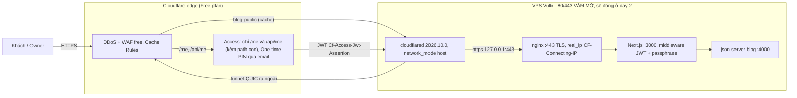

# Cloudflare trước nipit.pro

Che khu private `/me` bằng một lớp danh tính ở **edge** (Cloudflare Access) và đưa traffic
qua **Cloudflare Tunnel**. Chỉ dùng **Free zone plan** + **Zero Trust Free** (≤ 50 user).

**Access KHÔNG thay thế passphrase.** Lớp bcrypt + cookie HMAC trong `utils/owner-*.ts`
giữ nguyên. Access trả lời "đúng người giữ email này", passphrase trả lời "biết bí mật".
Chi tiết khu `/me`: [docs/private-area.md](private-area.md).

> **Trạng thái 06/10/2026 — đã chạy trên prod.** Zone, tunnel, Access, real_ip đều xong;
> nghiệm thu từ ngoài đã đạt (xem *Nghiệm thu*). **Chưa làm:** đóng ufw 80/443, bỏ certbot,
> staging qua `staging.nipit.pro`. Các bước đó có runbook riêng kèm lệnh + rollback:
> [docs/cloudflare-day2.md](cloudflare-day2.md).
>
> ⚠️ **Hạn chót có thật: cert Let's Encrypt hết hạn 27/12/2026.** Đóng cổng 80 làm HTTP-01
> không gia hạn được. Phải xử lý cert **trước** ngày đó — day-2 lo việc này.

## Kiến trúc



Bốn lớp chặn cho `/me`, từ ngoài vào trong — mỗi lớp chặn một thứ khác nhau:

| Lớp | Ở đâu | Chặn gì | Qua được nếu |
|---|---|---|---|
| Access policy | Cloudflare edge | người không có email trong policy | chiếm được hộp mail owner |
| Verify JWT | `middleware.ts` (origin) | request vào **thẳng** origin, hoặc Access app bị xoá/sửa trên dashboard | — |
| Passphrase bcrypt | `utils/owner-login.ts` | người qua được Access mà không biết passphrase | biết passphrase |
| Cookie HMAC | `utils/owner-session.ts` | cookie giả | lộ `SESSION_SECRET` |

### Hop trong máy hiện là HTTPS, không phải plain HTTP

Thiết kế ban đầu chốt `cloudflared → nginx` bằng `http://127.0.0.1:80`. Thực tế dựng xong
lại là **`https://localhost:443`** kèm *Origin Server Name* = `nipit.pro`, vì vhost TLS có
sẵn nên đi đường đó nhanh hơn. Hệ quả:

- **Không mất gì về bảo mật** — tunnel đã mã hoá đoạn edge ↔ origin bằng chính nó; lớp TLS
  trên loopback là dư, không phải thiếu.
- **Nhưng vẫn còn phụ thuộc certbot**, và đó là lý do có hạn chót 27/12/2026 ở trên.

> **SSL/TLS encryption mode của zone không áp cho traffic qua tunnel.** "Full (strict)" hay
> "Flexible" đều không ảnh hưởng đoạn cloudflared → nginx. Mode đó chỉ có nghĩa khi edge
> kết nối tới origin bằng IP qua A record. Vẫn đặt **Full (strict)** để nếu sau này có
> hostname trỏ bằng A record thì không rơi về Flexible.

**Chốt cách gỡ: Cloudflare Origin CA** (free, 15 năm) — giữ route `https://localhost:443`,
chỉ thay hai file cert. Đường plain HTTP `:80` đã cân nhắc và loại vì đo được rủi ro vòng
lặp redirect. Lệnh + rollback: [docs/cloudflare-day2.md](cloudflare-day2.md), bước 1.

## Đã cấu hình gì trên dashboard

Ghi lại để tra sau, **không phải** hướng dẫn làm lại từ đầu. Dấu ✓ = đã xong 06/10/2026.

### Zone (✓)

| Mục | Giá trị |
|---|---|
| Zone | `nipit.pro`, plan **Free** |
| Nameserver | đã trỏ về Cloudflare |
| SSL/TLS mode | **Full (strict)** |
| Always Use HTTPS | bật |
| HSTS | **chưa bật** — đo từ ngoài không thấy `strict-transport-security` |
| DNS apex | **A record đã xoá**, thay bằng CNAME tunnel (Cloudflare tự tạo) |
| `www` | CNAME proxied + **Redirect Rule 301 → apex** (đã đo: trả `301 → https://nipit.pro/`) |

### Cache Rules (✓)

Một rule tên **`bypass-me-api`**: `URI Path` starts with `/me` **hoặc** `/api` → *Bypass cache*.

Vì sao phải có: trang `/me` bị cache ở edge thì được phục vụ cho **bất kỳ ai** hỏi cùng URL,
kể cả khi Access đã chặn. Mặc định Cloudflare không cache HTML nên rủi ro thấp, nhưng hậu
quả là lộ content chứ không phải chậm trang.

### Zero Trust + Tunnel (✓)

| Mục | Giá trị |
|---|---|
| Plan | Zero Trust **Free** |
| **Team domain** | **`lively-sunset-c9b0.cloudflareaccess.com`** |
| Tunnel | `pinit-vps`, loại Cloudflared |
| cloudflared | `2026.10.0`, chạy trong compose, `network_mode: host` |
| Route | `nipit.pro` → **`https://localhost:443`**, *Origin Server Name* = `nipit.pro` |

> **Team domain không phải `pinit`** — tên đó đã bị người khác claim. Cloudflare sinh tên
> ngẫu nhiên `lively-sunset-c9b0`. Team domain là **một phần của issuer JWT**, nên
> `CF_ACCESS_TEAM_DOMAIN` phải đúng chuỗi này, không phải tên mình muốn.

> **UI đã đổi tên:** tab cũ gọi là *Public Hostname*, nay là ***Published application
> routes***. Tìm theo tên cũ sẽ không thấy.

### Access application (✓)

| Mục | Giá trị |
|---|---|
| Tên | `pinit-me`, loại **Self-hosted** |
| Destinations | `nipit.pro/me` **và** `nipit.pro/api/me` |
| Policy | *Allow*, selector **Emails** = owner |
| Login method | **One-time PIN** |

**Phải có cả `api/me`.** `/api/me/*` (practice, check-denylist) là path khác, Access không
tự suy ra từ `/me`. Đã đo: cả `/me` và `/api/me/practice/generate` đều `302` về Access —
đúng như cần.

> **Bẫy khi thêm One-time PIN:** entry tên **"Cloudflare" trong dropdown IdP là Cloudflare
> SSO, KHÔNG phải OTP.** One-time PIN phải add ở **Settings → Integrations → Identity
> providers** trước, rồi mới chọn được trong policy.

## Cấu hình trên VPS

### cloudflared (✓)

Service nằm trong `docker-compose.yml` sau `profiles: ['tunnel']`.

| Thứ | Ở đâu |
|---|---|
| `COMPOSE_PROFILES=tunnel` | `/opt/learn-nextjs/.env` — file `deploy.yml` **không** đụng tới |
| `TUNNEL_TOKEN` | `/opt/learn-nextjs/.env.private` (chmod 600) |

Tách hai chỗ là cố ý: profile nằm ngoài tầm với của CI nên **một lần deploy quên biến cũng
không thể kéo tunnel xuống**. Đã kiểm chứng bằng deploy thật: `--remove-orphans` không xoá
`cloudflared`, và ở staging (không có profile) nó không hề được tạo.

> ⚠️ **Nhưng deploy KHÔNG phải luôn luôn không chạm tunnel.** Profile chỉ chặn việc *xoá*;
> nếu **config của service đổi** thì compose vẫn **recreate** container như mọi service khác.
>
> Đã gặp 09/10/2026 khi deploy commit ghim tag `:latest` → `2026.10.0`: log hiện
> `Container cloudflared Recreate` → `Started`, gián đoạn **~2 giây** (`03:06:30.757` →
> `03:06:32.807`). Site tự phục hồi, không cần làm gì.
>
> **Hệ quả sau khi đóng ufw 80/443:** vài giây đó là site *không vào được từ đâu cả*, vì
> tunnel là đường duy nhất. Nên **đổi bất cứ thứ gì trong block `cloudflared` của compose
> là một deploy có chủ đích**, làm lúc vắng, không gộp chung với một thay đổi đang gấp.
> Deploy mà không đụng block đó thì tunnel đứng im — đó là trường hợp thường ngày.

Kiểm sức khoẻ (không cần ssh vào container):

```bash
docker logs cloudflared 2>&1 | tail -20      # "Registered tunnel connection" x4
curl -fsS http://127.0.0.1:20241/ready && echo
docker exec cloudflared cloudflared --version
```

`network_mode: host` vì **nginx chạy trên host, không trong Docker** — container ở bridge
network không tới được loopback của host. Kèm lợi ích: `$remote_addr` nginx thấy là
`127.0.0.1`, đúng cái snippet real_ip trông đợi.

### nginx real_ip (✓)

Snippet đã ghi `/etc/nginx/conf.d/cloudflare-realip.conf` bằng `scripts/cloudflare-realip.sh`.

**`scripts/` không có trên VPS** (chỉ `docker-compose.yml` được scp lên), nên script phải
chép từ máy owner:

```bash
# trên máy owner
scp scripts/cloudflare-realip.sh <vps>:/tmp/
# trên VPS
sudo bash /tmp/cloudflare-realip.sh -o /etc/nginx/conf.d/cloudflare-realip.conf
sudo nginx -t && sudo systemctl reload nginx
```

**Vì sao bắt buộc.** Rate limit đăng nhập `/me` đếm theo IP, và `getClientIp()` lấy **phần
tử cuối** của `X-Forwarded-For` — phần nginx tự nối vào:

```
$proxy_add_x_forwarded_for = $http_x_forwarded_for + ", " + $remote_addr
```

| Cấu hình | `$remote_addr` nginx thấy | Phần tử cuối XFF | Rate limit |
|---|---|---|---|
| Qua tunnel, **không** real_ip | `127.0.0.1` | `127.0.0.1` | ✗ mọi khách một bucket |
| Qua tunnel, **có** real_ip | IP thật | IP thật | ✓ |

Hỏng kiểu này không có log, không có lỗi — chỉ là 5 lần sai của **bất kỳ ai** khoá đăng
nhập của tất cả, và fail2ban ban một IP vô nghĩa.

> **Cái bẫy chính:** công thức `set_real_ip_from` + dải IP public của Cloudflare là công
> thức cho topology **A record proxied**. Qua **tunnel** thì kết nối tới nginx đến từ
> cloudflared cùng máy, nên dải public **không bao giờ khớp** — real_ip im lặng không áp
> dụng. Script sinh **cả hai** nhóm: loopback (cho tunnel) và dải public (cho giai đoạn
> 443 còn mở).

Dải IP Cloudflare đổi theo thời gian → chạy lại script định kỳ. Script **không ghi gì** nếu
tải về không hợp lệ (< 5 dải v4 / < 3 dải v6, hoặc có dòng không phải CIDR).

`TRUST_PROXY=1` **giữ nguyên** — nhưng chỉ còn đúng khi có snippet real_ip. Hai thứ đi kèm
nhau, đừng tách.

### Env của Access (✓)

| Biến | Lấy ở đâu |
|---|---|
| `CF_ACCESS_TEAM_DOMAIN` | `lively-sunset-c9b0.cloudflareaccess.com` (chỉ host; code tự chuẩn hoá nếu dán cả `https://` hay `/` cuối) |
| `CF_ACCESS_AUD` | Access app → *Overview* → *Application Audience (AUD) Tag* |

```bash
cd /opt/learn-nextjs
# sửa .env.private, rồi TẠO LẠI container — restart KHÔNG đủ (env_file chỉ đọc lúc tạo)
IMAGE=$(docker inspect -f '{{.Config.Image}}' learn-nextjs) \
  docker compose up -d --force-recreate web
docker logs learn-nextjs 2>&1 | grep -E '\[me\]|\[cf-access\]'   # phải rỗng
```

> **`IMAGE=$(docker inspect ...)` là bắt buộc, không phải tuỳ chọn.** CI **không push tag
> `:latest`** (chỉ `prod-<n>`/`staging-<n>`), mà `deploy.yml` export `IMAGE` qua ssh chứ
> không ghi vào file nào. Chạy `compose up` tay mà thiếu nó thì compose rơi về default
> `:latest` → `manifest unknown`, hoặc tệ hơn là kéo một image cũ. Xem *Đề xuất: đưa IMAGE
> vào `$DIR/.env`* bên dưới.

Hành vi theo env:

| Trạng thái env | Lớp Access | Dùng cho |
|---|---|---|
| cả hai rỗng | **bỏ qua** | local, staging — bật ở đó là tự khoá mình ra ngoài |
| cả hai có | bật | prod |
| chỉ một biến | **bỏ qua** + log `[cf-access] ...` lúc khởi động | cấu hình sai, phải sửa |

Thiết kế lớp verify: `jose` (`jwtVerify` + `createRemoteJWKSet`), kiểm đủ **ba** thứ — chữ
ký khớp JWKS của team, `iss`, `aud`. Thiếu `aud` thì JWT của *bất kỳ* app nào cùng team cũng
qua. JWKS lấy không được → fail closed. Không/sai JWT → **403** (không redirect: trang login
của Access nằm ở edge; không 404: 404 đã mang nghĩa "khu `/me` tắt").

## `IMAGE` cho lệnh `compose up` tay — đã chốt

Mỗi lần sửa `.env.private` rồi recreate container đều phải nhớ `IMAGE=$(docker inspect ...)`,
vì **CI không push tag `:latest`**. Thiếu nó compose rơi về default `:latest` →
`manifest unknown`.

**Chốt: thêm `IMAGE=` vào `/opt/learn-nextjs/.env`.** Lệnh cụ thể ở
[docs/cloudflare-day2.md](cloudflare-day2.md), bước 0.

**CI vẫn là nguồn tag thật.** `deploy.yml` export `IMAGE` qua ssh, và env của shell **đè**
`.env`, nên mỗi lần deploy vẫn dùng tag mới đúng. Dòng trong `.env` chỉ là **giá trị dự
phòng cho lệnh tay** — sau vài lần deploy nó thành cũ. Đừng đọc `.env` để kết luận prod
đang chạy tag nào; muốn biết thật thì `docker inspect -f '{{.Config.Image}}' learn-nextjs`.

Đã cân nhắc và **loại** cách cho CI ghi tag vào `$DIR/.env`: `deploy.yml` hiện cố ý không
đụng file đó, và chính tính chất ấy đang bảo vệ `COMPOSE_PROFILES=tunnel` khỏi bị CI làm
mất. Phá nguyên tắc này để tiện một lệnh tay là đổi sai hướng.

## Nghiệm thu

Đo từ ngoài 06/10/2026, **không ssh**. Lệnh dùng được lại nguyên văn.

| # | Kiểm | Kết quả |
|---|---|---|
| 1 | `curl -sSI https://nipit.pro` | ✓ `200`, `server: cloudflare`, có `cf-ray` |
| 2 | Static asset GET 2 lần | ✓ `cf-cache-status: HIT`, có `age` |
| 3 | `curl -sSI https://nipit.pro/blog` | ✓ `200` (`DYNAMIC` — xem ghi chú) |
| 4 | `curl -sSI https://nipit.pro/me` | ✓ `302` → `lively-sunset-c9b0.cloudflareaccess.com/cdn-cgi/access/login/nipit.pro` |
| 5 | `/me` trên trình duyệt | ✓ OTP vào email → rồi mới thấy form passphrase |
| 6 | `curl -sSI https://nipit.pro/api/me/practice/generate` | ✓ `302` về Access (không phải `401` của app) |
| 7 | `/me/roadmap`, `/me/learn`, `/me/case-studies` sau khi đăng nhập | ✓ content thật |
| 8 | `curl -sSI https://nipit.pro/me/login` | ✓ `302` về Access — path public của app cũng bị che |
| 9 | `curl -sSI http://nipit.pro` | ✓ `301` → `https://nipit.pro/` (Always Use HTTPS) |
| 10 | `curl -sSI https://www.nipit.pro` | ✓ `301` → `https://nipit.pro/` |
| 11 | `robots.txt` không nhắc `/me` | ✓ không có `Disallow: /me` |
| 12 | `https://<IP-VPS>` và `http://<IP-VPS>` | ✗ **vẫn `200`** — đúng kỳ vọng, ufw chưa đóng (day-2) |
| 13 | `http://<IP-VPS>:3001` | ✗ **vẫn `200`** — staging còn public (day-2) |
| 14 | `http://<IP-VPS>:3001/me` | ✓ `404` — khu `/me` tắt ở staging |
| 15 | Deploy staging + prod sau khi thêm `cloudflared` | ✓ cả hai job xanh, log không có dòng nào về `cloudflared` |

**Chưa đo được từ ngoài**, cần làm tay:

- `/me/practice` một lượt *Sinh 5 câu hỏi* + *Chấm* (cần đăng nhập) và
  `sudo wc -l /srv/pinit-private/practice-log/practice-log.jsonl` tăng 6 dòng.
- **real_ip thật sự có tác dụng**: 6 lần sai passphrase từ máy A, rồi thử máy B — máy B
  phải **vẫn đăng nhập được**. Bị khoá luôn ⇒ thiếu snippet real_ip. Đây là bước dễ bỏ qua
  nhất vì không hỏng gì nhìn thấy được.

### Hai chỗ checklist cũ sai, đã sửa

- **Test cache phải dùng GET, không dùng `curl -I`.** HEAD trả `cf-cache-status: MISS` cả
  khi đã cache; GET cùng URL trả `HIT`. Bản cũ ghi `curl -sI` nên bước này sẽ luôn "fail"
  một cách giả.
- **"Blog public cache được" chỉ đúng với static asset.** `/_next/static/**` → `HIT`;
  HTML `/blog` → `DYNAMIC`, vì Cloudflare mặc định không cache HTML. Đó là bình thường,
  không phải lỗi cấu hình.

## Giới hạn free plan

Đã dùng, đều $0:

| Thứ | Plan | Hạn mức |
|---|---|---|
| Zone plan | Free | — |
| DDoS protection (L3/4/7) | Free | không giới hạn |
| Universal SSL | Free | — |
| Cache Rules | Free | 1/10 rule đã dùng |
| Redirect Rules | Free | 1 rule (`www` → apex) |
| Cloudflare Tunnel | Free | không giới hạn băng thông |
| Zero Trust (Access + One-time PIN) | Free | 1 application; ≤ 50 user, đang dùng 1 |
| Always Use HTTPS | Free | — |

Có thể bật thêm, vẫn $0 — chưa cần: **WAF custom rules** (5 rule), **Rate limiting rule**
(1 rule), **Bot Fight Mode**, **Web Analytics**, **Turnstile**, **HSTS**.

**Tuyệt đối không bật** — mất phí ngay hoặc đòi nâng plan:

| Mục | Vì sao |
|---|---|
| Argo Smart Routing | tính theo GB |
| Load Balancing | tính theo origin/pool |
| Advanced Certificate Manager | $10/tháng |
| Polish, Mirage, Image Resizing / Transformations | Pro+ hoặc tính theo lượng |
| Cloudflare Images, Stream, R2 | tính theo lượng dùng |
| Advanced Rate Limiting | Business+ |
| Super Bot Fight Mode (Pro) / Bot Management (Ent) | nâng plan |
| Logpush | Enterprise |
| Spectrum | Enterprise |
| Cache Reserve | tính theo lượng lưu |
| Workers Paid, Durable Objects | $5/tháng + lượng dùng |
| Zero Trust: Browser Isolation, DLP, CASB, Email Security | add-on trả tiền, **không** nằm trong Zero Trust Free |

Nguyên tắc khi đứng trước một toggle lạ: mục cần trả tiền có badge plan (`Pro`, `Business`,
`Enterprise`) hoặc nút kiểu *Add to cart* / *Subscribe*. Hạn mức free đổi theo thời gian —
**đọc badge trên màn hình**, đừng tin bảng này là vĩnh viễn.

> Zero Trust Free có thể hỏi **phương thức thanh toán** lúc đăng ký lần đầu, kể cả khi hoá
> đơn là $0. Xác nhận trên màn hình là *Free — 50 users* trước khi bấm tiếp.

## Rollback

Hiện tại (80/443 **còn mở**, A record đã xoá) thì rollback nhanh nhất là **tạo lại A record**
— traffic về origin trực tiếp, không qua tunnel.

| # | Bước | Lệnh / thao tác |
|---|---|---|
| 1 | DNS về origin | tạo A record `nipit.pro` → IP VPS (proxied), xoá CNAME tunnel |
| 2 | Tắt lớp Access ở origin | xoá `CF_ACCESS_*` khỏi `.env.private` → `IMAGE=$(docker inspect -f '{{.Config.Image}}' learn-nextjs) docker compose up -d --force-recreate web` |
| 3 | Tắt Access ở edge | xoá/disable application `pinit-me` |
| 4 | Tắt tunnel | xoá `COMPOSE_PROFILES=tunnel` khỏi `$DIR/.env` → `docker compose up -d --remove-orphans` |
| 5 | Bỏ real_ip | `sudo rm /etc/nginx/conf.d/cloudflare-realip.conf && sudo nginx -t && sudo systemctl reload nginx` |
| 6 | Bỏ Cloudflare hẳn | đổi nameserver về nhà đăng ký cũ (cert LE vẫn còn hạn tới 27/12/2026) |

Sau khi day-2 đóng ufw thì bảng này **không còn đủ** — lúc đó phải mở cổng lại trước đã.
Xem [docs/cloudflare-day2.md](cloudflare-day2.md).
