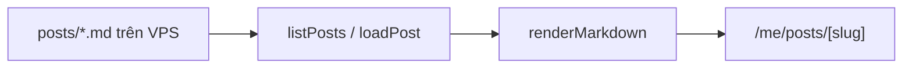

Đoạn này là excerpt — phần trước `<!-- truncate -->`. Trang danh sách chỉ hiện phần
này, trang chi tiết hiện cả bài.

<!-- truncate -->

## Frontmatter

Cố ý **tương thích blog public** (`slug`, `title`, `author`, `tags`, `date`, `image`),
thêm `visibility`. Bài nào muốn công khai về sau chỉ cần `git mv` sang `blog/` của repo
`pinit`, bỏ `visibility`, và thêm `image` (blog public cần cover).

Hai khác biệt so với blog public:

| | Blog public | Bài private |
|---|---|---|
| `image` (cover) | bắt buộc | tuỳ chọn |
| `visibility` | không có | `private` (mặc định) hoặc `public-candidate` |
| `slug` | lấy từ frontmatter | lấy từ **tên file** |

`slug` lấy từ tên file vì tên file là thứ quyết định URL — để frontmatter khai khác đi
là có hai nguồn sự thật.

## Markdown dùng được gì

Cùng pipeline với blog public, nên có GFM, mục lục, prism, và mermaid render thành SVG
ngay ở server:



```bash
# Chạy local với content ví dụ
PRIVATE_CONTENT_DIR=./private-content.example npm run dev
```
